# 绪论

## 一、暖通空调系统的含义

暖通空调的概念：采暖、通风与空气调节（HVAC）;

空气调节：根据每一空间中人员、生产过程或者产品要求，对温度、湿度、清洁的、空气品质和空气循环进行控制。

Carrier(1902)将空气湿度降低并维持在一定水平，标志了真正现在意义上环境控制的诞生。

> 单位与量纲

1.英式工程单位制或IP制

在标准大气压下，将1磅(1lb=0.454kg)水加热或者冷却，其温度升高或者降低华氏温度1度时，所加热或者除去的热量称为一个英热单位，符号为Btu(British Thermal Unit，1Btu=1.055kJ)

2.美国常用单位：

ton(=12000Btu/h=3.517kw) 冷吨（1冷吨就是使1吨0℃的水在24h内变为0℃的冰所需要的制冷量）

ton·h(=12000Btu) 冷量（冷吨·时）

3.民用空调

喜欢以P为单位，1P=0.735kw，一般COP取3.2，则制冷量为2.352kw

> 基本物理概念

1.供暖

供暖是指将空间温度升高至比原来高的温度，或者补充从空间散失到低温环境中的热量，从而使温度**维持**在理想的范围内。（如频繁地开关【成本低、波动大、影响使用寿命】、PID）

可通过向空间直接辐射或自然对流，或者直接加热强制通风的空气，使之与空间内温度较低的空气混合，或者向空间内的装置供电或供热水，用于直接加热室内空气或加热强制循环空气。

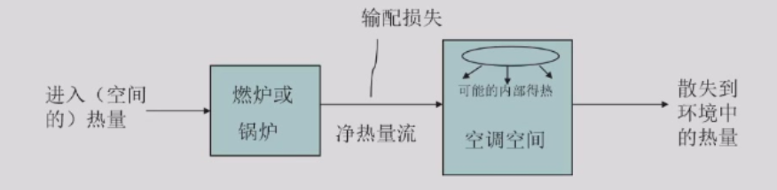

2.供冷

供冷指从空间或从对空间的送风中移走热量，以抵消空间获得的热量。

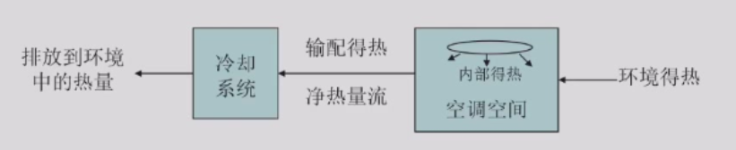

空气处理机组（空调箱）（Air Handling Unit）

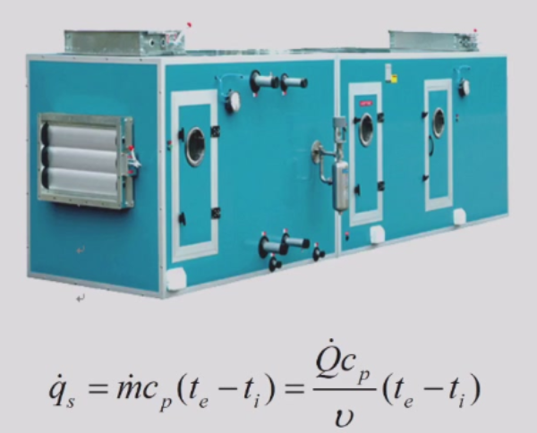

qs为空气获得的显热

**冷热盘管串联**

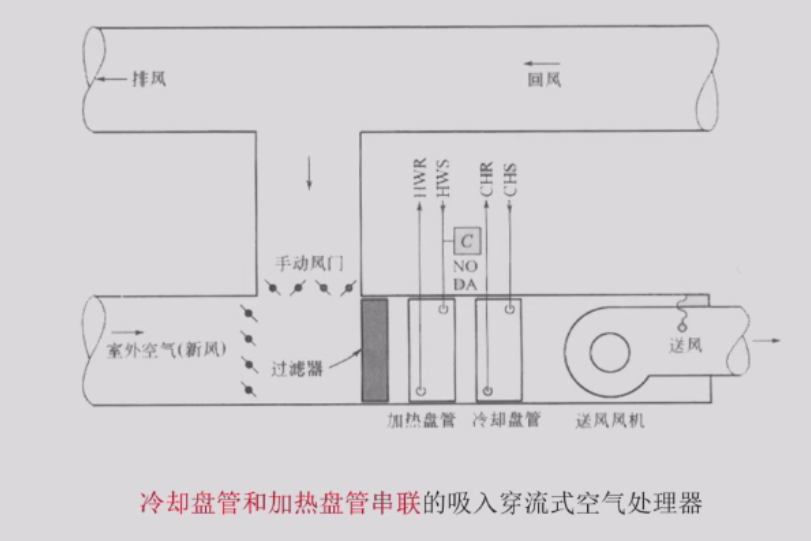

HWR(hot water return) HWS(hot water supply)

CHR(chilling return) CHS(chilling supply)

引入新风（新风量一般控制在5%~10%）提升环境空气品质，风阀调节进风量

回风的温湿度为设定值。

**冷热盘管并联**

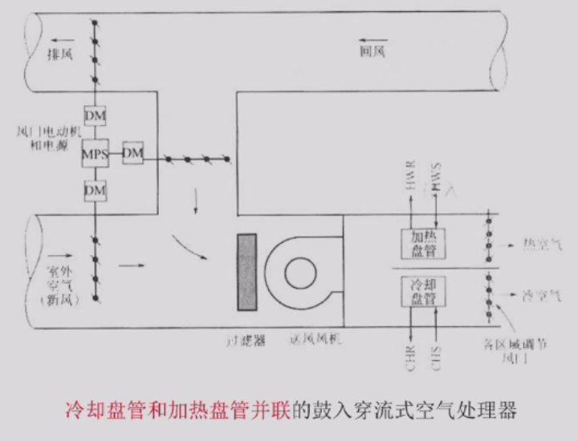

通过调节冷热空气比例，来精确控制送风温度、湿度。

3.减湿

减湿即减少空气流中的水蒸气，从而在空调空间中保持理想的湿度。（人体理想的湿度为50%~60%）

计算盘管提供的冷量包括显热和潜热冷量之和（减湿的冷量为潜热冷量，水由气态变为液态；显热包括空气温度变化）

4.加湿

天气较冷时，通常会向所送热风中加入水汽，这一过程叫作加湿。

这一传质过程存在热传递（潜热传递来指代所需潜热量），该过程一般是通过向循环热风中加蒸汽（蒸发湿润板或湿润盘中的水来获得）或喷微小液滴来实现。

先加热后加湿效率更高（加热器一般在加湿器前面）。还可以加入过热蒸汽，但能耗较高。

5.净化

净化=过滤，除去空气中颗粒、污染物和臭味。

6.设备控制

控制系统三个必要部分：传感器、控制器、受控系统。

## 二、HVAC系统的类型

主要部件与功能

1.末端（如空气处理机组）：实现加热、冷却、加湿、减湿、净化过滤和输配。

2.冷（热）源

3.输配系统

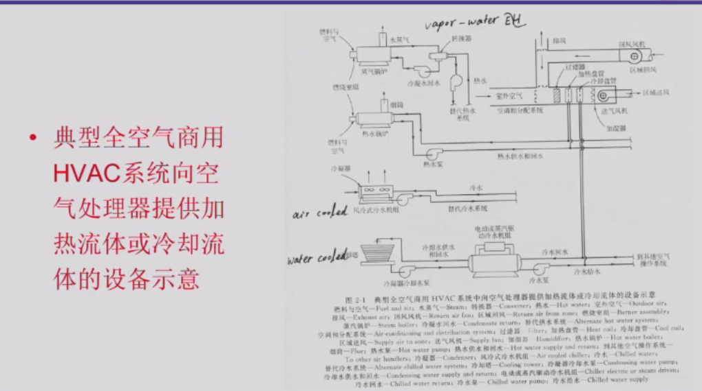

排风：exhaust air

热源：锅炉（常用的还有热泵）

冷源：冷水机组（水冷式[用水来冷却冷凝器]，风冷式[风来冷却冷凝器]，水冷效果好，国标规定产生的冷冻水以7度为标准）

输配系统：离心式风机、单侧进风直联离心泵

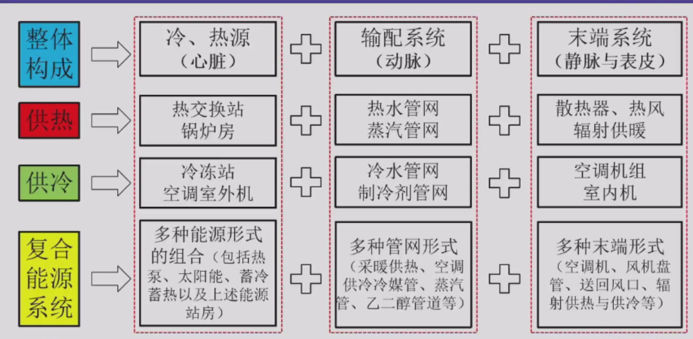

乙二醇管道可以用来蓄冷，同时也可以保证一定的流动性。

**HVAC系统的分类**

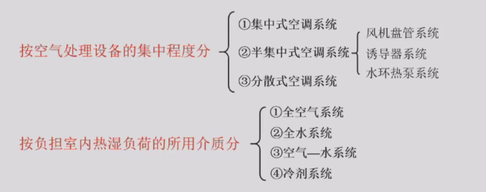

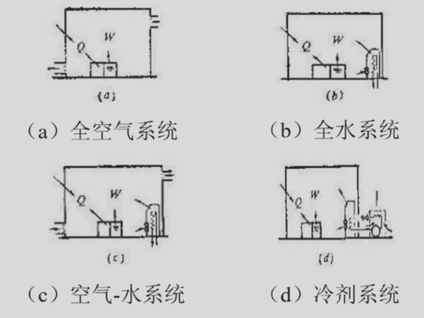

Q为热负荷，W为湿负荷。

**全空气系统**

全空气系统中，空调空间的所有要求（加热、加湿、冷却及减湿）都通过送风满足。

1.单区域系统

最简单的全空气系统，仅负责一种空间条件，仅限于在整个区域保持合适统一温度的地方应用。

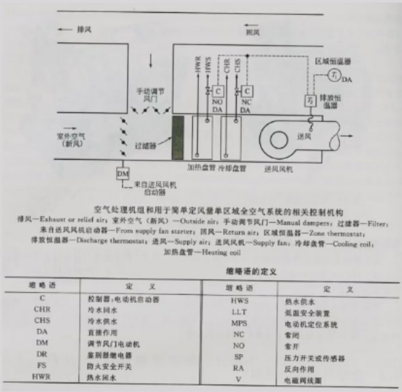

2.再热系统（reheat system）

是对单区域定风量系统的改进，目的是实现非等负荷区的区域或空间控制，或者实现对不同朝向的周边系统的供暖或供冷，该系统适用于需要保持较低湿度的情况。

会改变空气的温度和湿度，相对湿度减小（实际水汽压/饱和水汽压），绝对湿度（单位质量空气中有多少克水）不变。

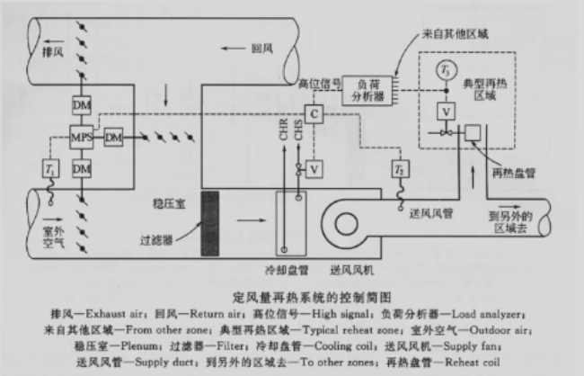

3.变风量系统（VAV，variable-volume system）

通过调节（节流）每个区域的送风量来平衡冷量需求的变化，通过单风管系统送风，每个区域都有各自的调节风门，独立的恒温器控制风门及送入每个区域的风量。

显著优点是初始投资和运行费用低，本质是一个冷却系统，往往使用节流阀（电磁膨胀阀）来控制风量。

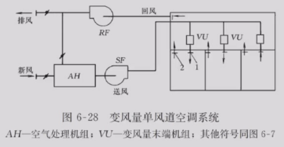

与之相似的还有，变制冷剂流量系统（VRV），多联机（一个室外机对应多个室内机）

4.双风管系统（dual duct system）

集中设备用一个风管送热空气，用另一个分管送冷风，各个空间内的温度通过按合适比例混合冷热空气进行调节。

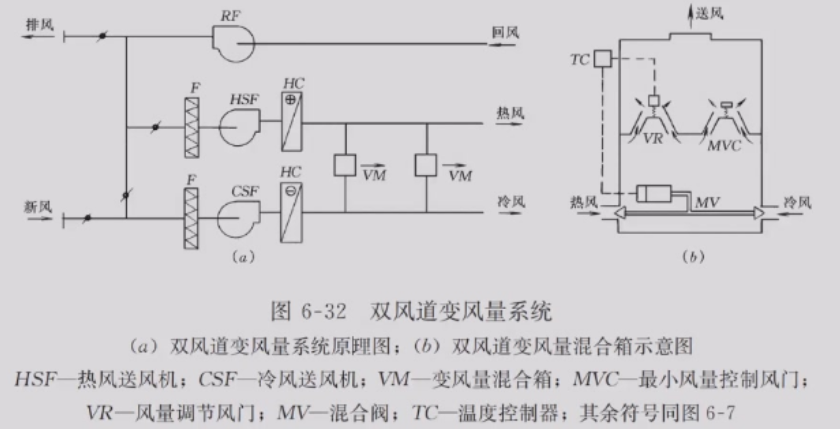

5.多区系统

与双风管系统相似，但冷热空气流在空气机组内按比例混合而非在每个服务空间内混合，每个区域空气在离开设备时就有了合适的温度以保证区域的舒适性。

风门的控制是非线性的。

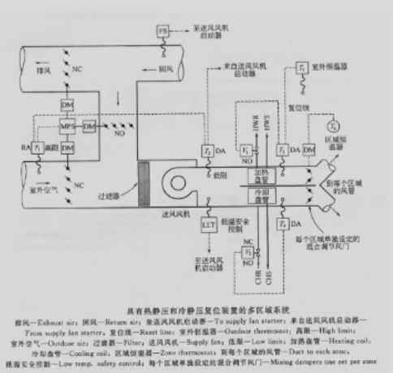

**空气-水系统**

冷水带走空调空间的大多数显热负荷，空气提供通风保证空气质量，冰带走空气潜热负荷生成的湿负荷。

优点：水的比热、密度大，输配管道空间比风管系统小。

**全水系统**

其中最常用的设备是风机盘管，相当于一个空调箱。

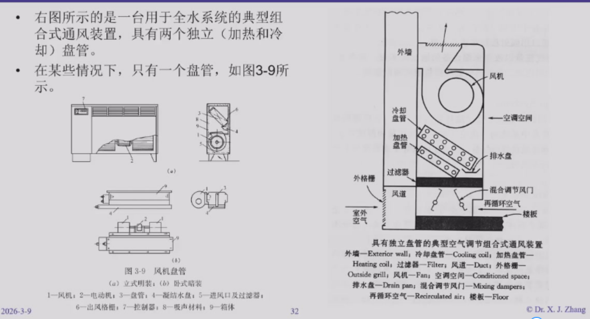

**分散式供冷或供暖**

包括窗式空调器和柜式空调器

**热泵系统**

大多数热泵系统中都有一个四通换向阀使得离开压缩机的制冷剂可以反向流动，从而蒸发器和冷凝器的角色实现实现互换。

空气源热泵、水源热泵、地源热泵。

**地源闭路系统**

组成：水循环路和多个独立的可逆制冷循环环路。

基本工作原理：热泵机组按供冷工况运行时，将排放多余的热量到水循环环路中，若热泵机组以供暖工况运行，则从水循环环路中吸收热量。各热泵机组所散发的多余热量与需补充的不足热量通过水循环环路给予传递，实现有效的热回收。	

**热回收系统**

回收排风中空气的热能或者冷能。

全热回收：吸收排风中的冷量或热量，以及排风中的水分。

显热回收：仅吸收排风中的冷量或热量。

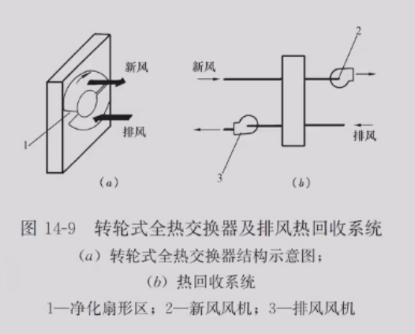

全热转轮上有干燥剂，转到排风吸收水汽，到新风处释放。

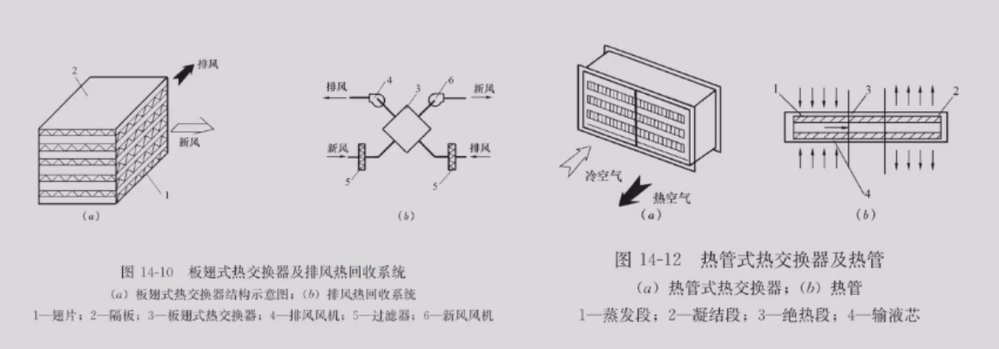

**蓄冷（thermal energy storage，TES）**

在非峰荷时间使用更多能源而在峰荷时间使用较少能源的系统，在非峰荷时间利用冷水机组制取水或冰进行存储，在峰荷时间利用水或冰的冷能实现冷却。

冰比水多了一部分潜热，冷->冰->冷其中有能量损失，效率不是特别高。

## 三、暖通空调系统的设计

设计依据

设计过程