# 热湿负荷

冷热负荷的概念：得热量、冷负荷、除热量（即为设备制冷量）

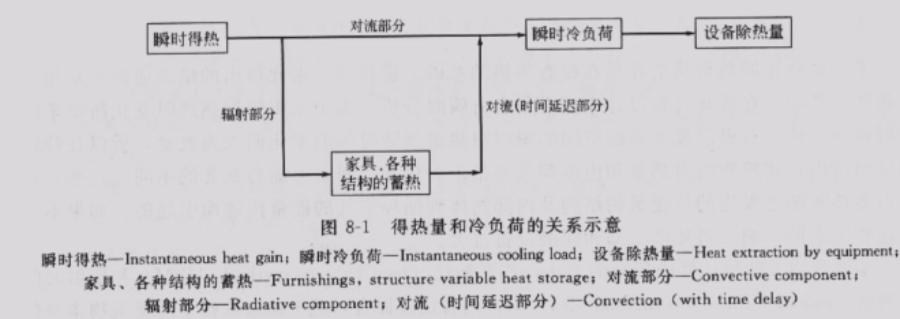

瞬时得热中的辐射部分经过时间延迟作用才能转变为热负荷。

冷负荷（为消除得热而供应的冷量）[kw]：冷负荷不等于得热量（稳态时，除热量等于冷负荷；通常，除热量大于冷负荷，所以制冷设备可以间歇或变工况运行）。

热负荷[kw]：为补偿失热而供应的热量。

冷负荷和热负荷可以统称为热负荷。

湿负荷[kg/s]：为维持相对湿度而出去的湿量。

## 空调系统冷负荷的确定

### 室内外空气计算参数

#### 1.室外空气计算参数

1. 夏季空调室外计算干、湿球温度（用于计算夏季新风负荷）

   - 夏季空调室外计算干球温度应采用历年平均不保证50h的干球温度（抛开50h极端）
   - 夏季空调室外计算湿球温度应采用平均不保证50h的湿球温度

2. 夏季空调室外计算日平均温度和逐时温度

   - 夏季空调室外计算日平均温度应采用历年平均不保证5d的日平均温度

   - 逐时温度：在15时出现室外温度最高值

     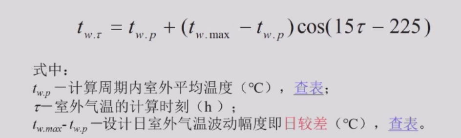

   历年不保证的例子（下例中可以总共不保证20d>18d，故取-11℃）：

   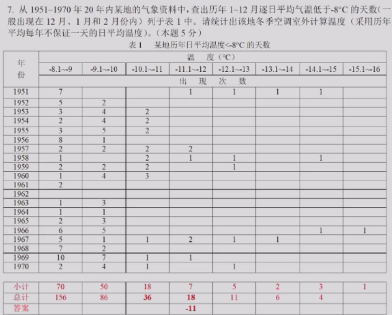

#### 2.室外空气综合温度

外表面单位面积上得到的热量

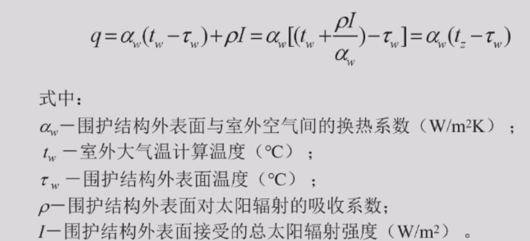

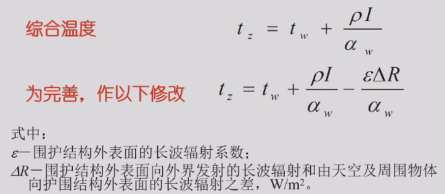

垂直表面：ΔR = 0；水平面εΔR/α_w = 3.5 ~ 4.0℃。

使用综合温度是为了使式子得到简化。

#### 3.室内空气计算参数

1.舒适性空调室内温、湿度标准：

夏季：

- 温度：应采用22~28℃
- 相对湿度：应采用40~65%
- 风速：不应大于0.3m/s（整个流场而非出风口）

冬季：

- 温度：应采用18~24℃
- 相对湿度：应采用30~60%
- 风速：不应大于0.2m/s（整个流场而非出风口）

2.工艺性空调室内温、湿度标准

工艺性空调可分为一般降温性空调、恒温恒湿空调和净化空调等。

### 空调负荷计算

#### 1.室外扰量形成的负荷

1)太阳辐射热：

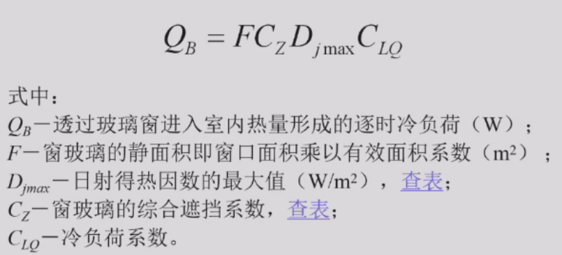

如果算房间的负荷，不需要乘上冷负荷系数，而此处算的是空调的负荷，故需要乘上一个冷负荷系数（大约在1.0左右）。

2)室内外温差的传热量：

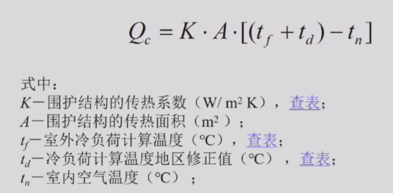

3)补充新鲜空气带来的负荷：

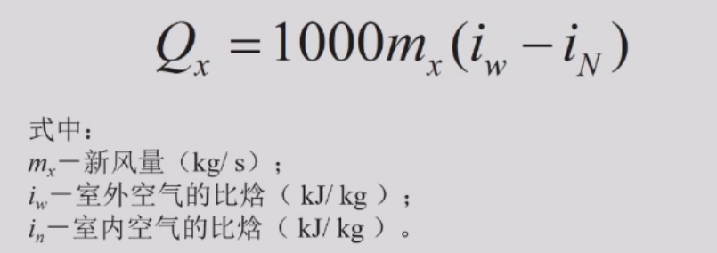

#### 2.室内扰量形成的负荷

1)人体的散热：

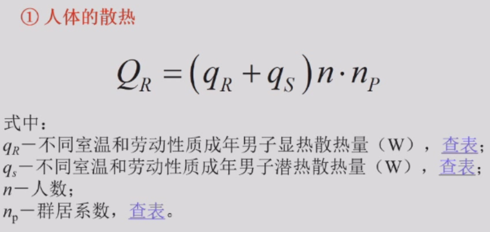

q_s为潜热负荷，与湿负荷有区别（单位），应与人体排汗相关。

2)照明灯具散热：

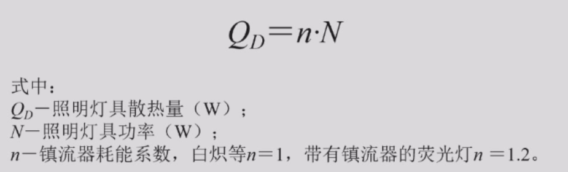

3)用电设备散热：

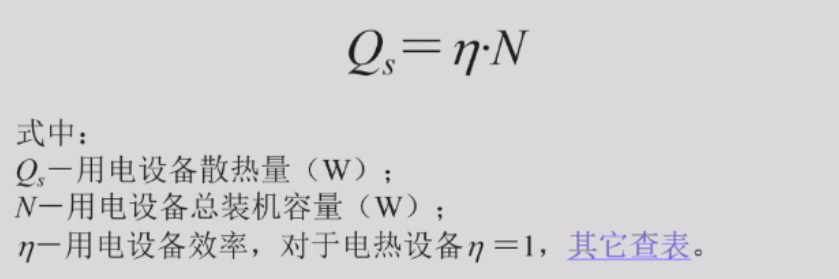

设备、照明和人体在室内散热形成室内冷负荷Q'

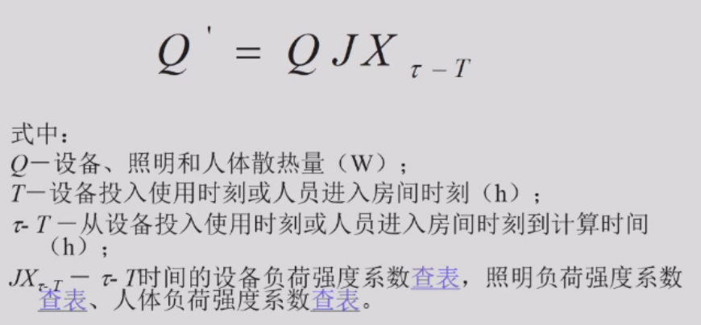

#### 3.再热负荷、新风负荷

1)再热负荷：

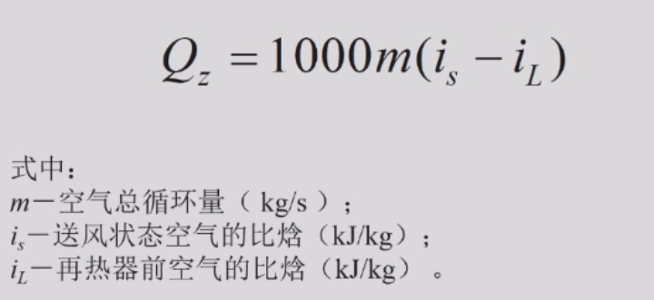

再热器进出口焓差乘上流量。

2)新风负荷：

#### 4.室内湿源散湿形成的湿负荷

室内湿源包括人体散湿和工艺设备散湿，由此形成空调房间湿负荷。

不同温度下成年男子散湿量可查表得到。

1)敞开水槽表面散湿量：

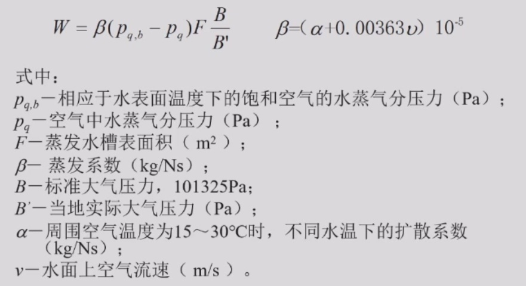

本质是一个传质过程，有压差引起。

#### 5.室内冷负荷与制冷系统冷负荷

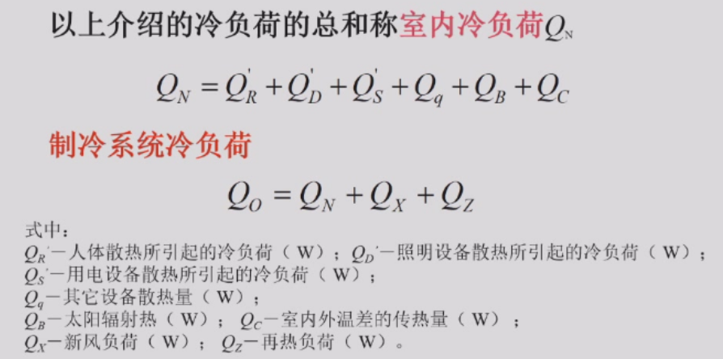

空调的负荷≠房间的负荷

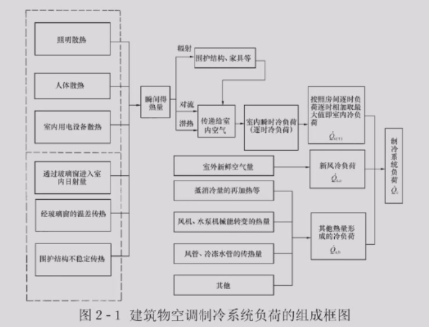

#### 6.空调负荷的概算指标

1.夏季空调制冷系统负荷概算指标（空调负荷>热负荷，还包括再热负荷、新风负荷）[办公室、宿舍100w/m2]

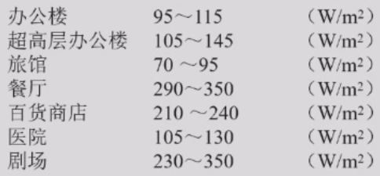

一匹空调=0.735kw，考虑COP=4，制冷量Q0≈3kw，再根据概算指标，可以估计选取空调的匹数。

2.冬季采暖负荷的概算指标[70w/m2]

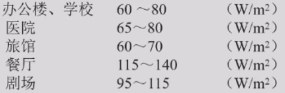

> 为什么空调系统夏季冬季负荷不同？

- 室内外空气计算参数不同
- 室内得热量的处理相反（人体散热...）
- 空调冷负荷大于采暖热负荷，主要是因为空调设计要考虑新风负荷。（例如，北京冬天酒店窗打不开，没有新风负荷）