# 空气调节

## 湿空气的概念

大气由一定量的干空气和一定量的水蒸气（过热状态）混合而成，我们称其为湿空气。

水蒸汽（饱和状态，两相）

## 湿空气的基本状态参数

**Pv=RT**

1.压力：

湿空气的总压力p = p_g + p_q

2.密度：

湿空气的密度=干空气密度+水蒸气密度

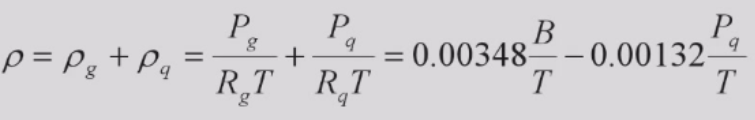

3.含湿量：

在湿空气中与1kg干空气同时并存的水蒸气量称为含湿量

d = m_q / m_a，那么含有1kg干空气的湿空气质量为1+d（溶液）

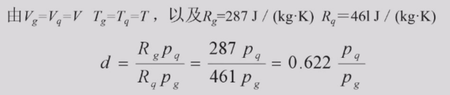

B为湿空气的压力

4.相对湿度：

湿空气的水蒸气压力与同温度下饱和湿空气的水蒸气压力之比。

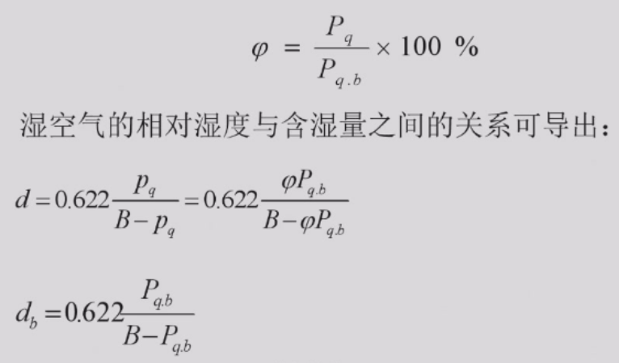

d_b时相对湿度为1。

5.焓：

湿空气的焓=干空气的焓+水蒸气的焓

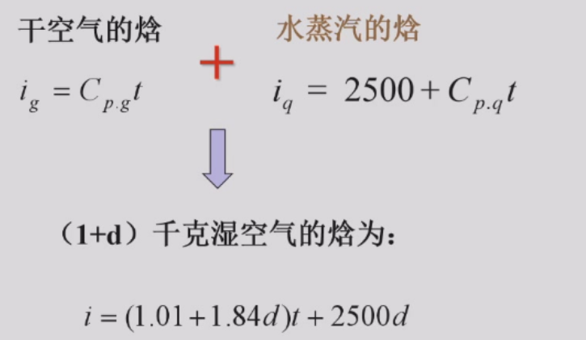

t为摄氏温度，即焓的零点为0摄氏度。

6.露点温度：

温度下降到使得空气的d值等于某一饱和含湿量d_b值时，这个d_b所对应的温度称为该未饱和空气的露点温度。

换言之，露点温度就是当湿空气下降到一定时，有凝结水出现的温度t_l。

例子：冬季开车内窗有水雾，怎么样快速出去（空调加热，ac冷空调，新风）

答案：ac冷空调，相当于除湿，降低了露点温度；加热要使得玻璃温度高于露点温度时间较长；新风需要外界空气干燥。

燃油车的空调加热是用发动机的余热加热，电动车的空调加热是使用热泵或者电辅热。

## 湿空气的焓湿图

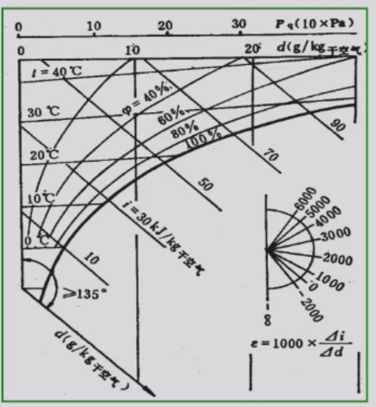

在大气压B下，湿空气的焓湿图。

横坐标为含湿量值，纵坐标是焓值。

ε是斜率，称为热湿比。

ε为0，等焓过程，空气的蒸发冷却是一个等焓过程（温度降低，湿度上升）。

热负荷与湿负荷是平行的，热负荷又包括显热和潜热负荷，潜热负荷与湿负荷有关，两者并不等价。

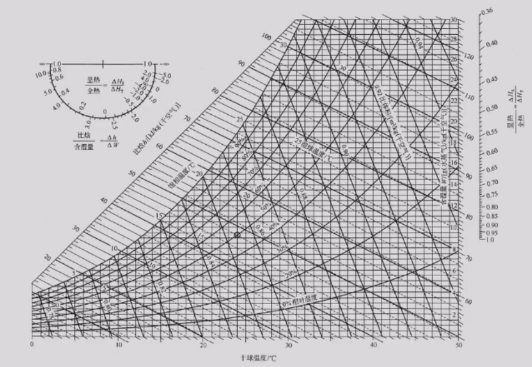

空气状态变化在i-d图上的表示：

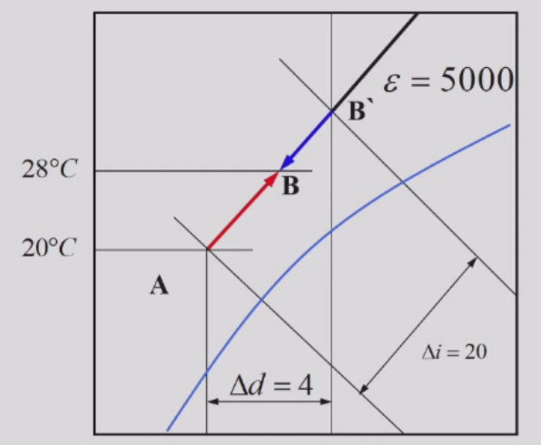

## 湿球温度（湿球温度近似等焓斜着找，露点温度竖着找）

湿球温度是在定压绝热条件下，空气与水直接接触达到热湿平衡时的绝热饱和温度，也称为热力学绝热温度。

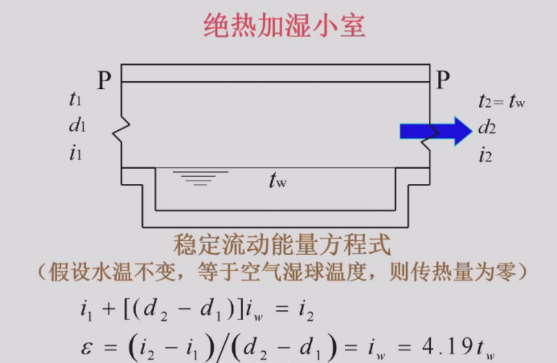

ε接近0，4.19t_w很小，通常小于100，认为基本等焓。i_w为水带入空气的焓。

蒸发冷却最多做到湿球温度

干球温度 > 湿球温度 > 露点温度

## 焓湿图的应用

仅需要知道湿空气的2个参数，根据焓湿图可以得到其余参数。

湿空气状态变化过程：

1. 湿空气的加热过程
2. 湿空气的冷却过程

3. 等焓加湿过程
4. 等焓减湿过程

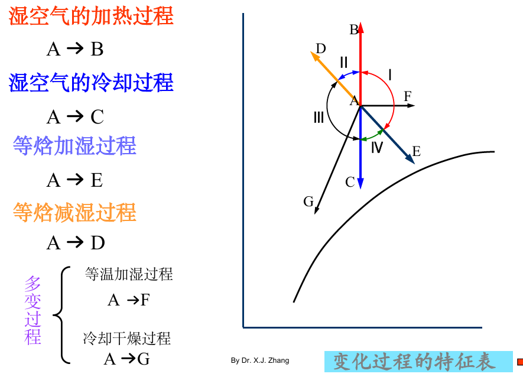

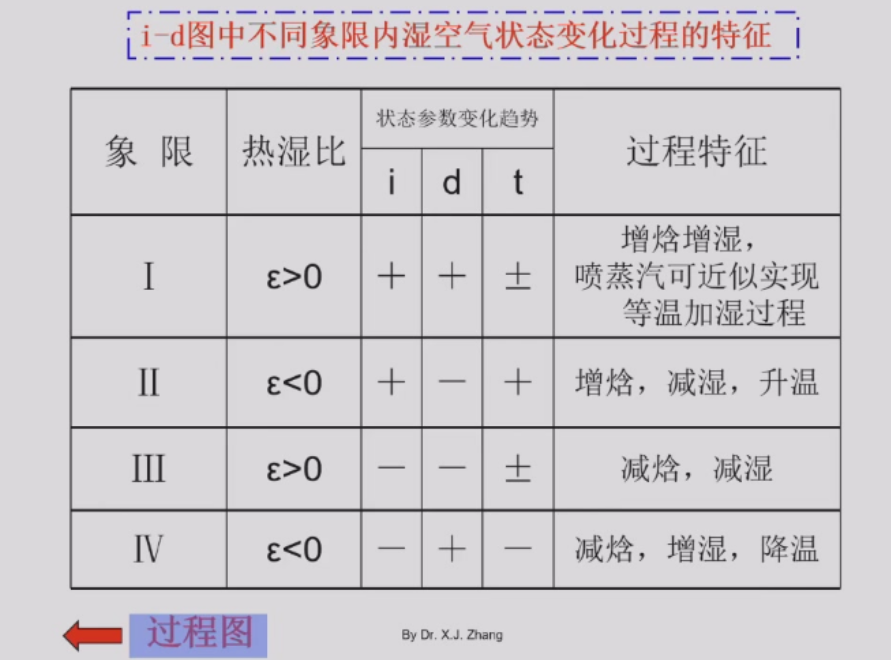

## 湿空气的加热或冷却过程（没有相变）

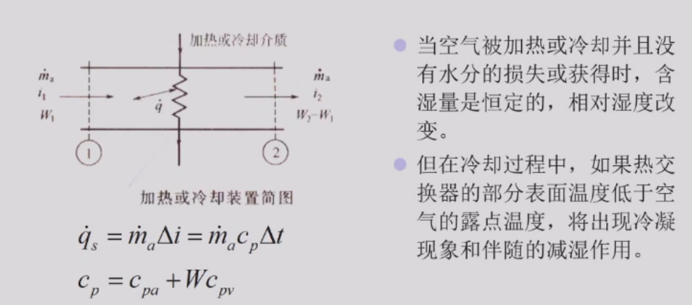

我们一般用m_a(dot)代表质量流量，用G代表体积流量（m3/h）

## 湿空气的冷却和减湿过程

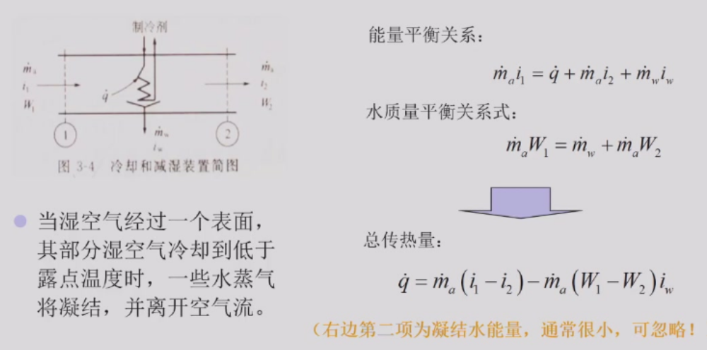

考虑湿空气的加热或冷却过程和减湿过程，由于水蒸气含量很少，可以近似都用空气焓差乘上质量流量来计算总传热量。

冷却和减湿过程同时包括潜热（1-3）和显热（3-2）交换，显热量与干球温度的降低有关，潜热量与含湿量的降低有关。

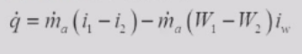

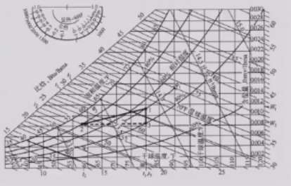

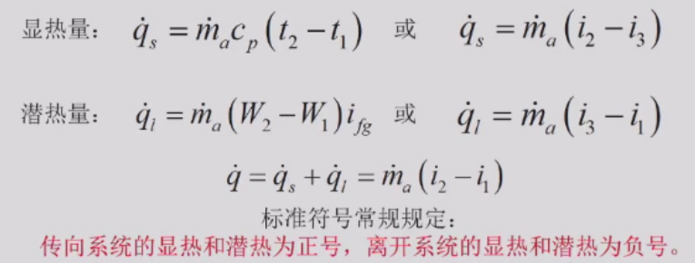

- 表冷器的显热负荷和潜热负荷（表冷器的能力）与房间的热、湿负荷（属性）不一样；

- 表冷器的潜热负荷不等于房间的湿负荷（单位不一样），两者有联系，房间的湿负荷越大表冷器提供的潜热负荷越大。

显热因子（Sensible heat factor，SHF）：全热中显热的占比，一般表冷器处理房间时，SHF一般为60%~70%（夏季），指的对象是表冷器。

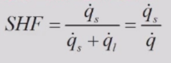

## 湿空气的加热加湿过程

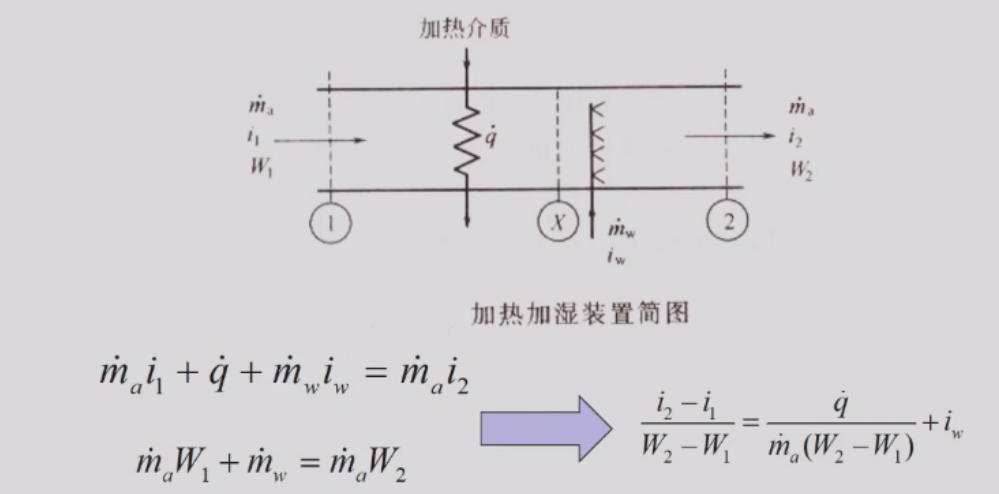

上面的式子为能量守恒，下面的式子为水的质量守恒。右式有点像热湿比的概念（但是描述对象为设备），同时注意要先加热后加湿。

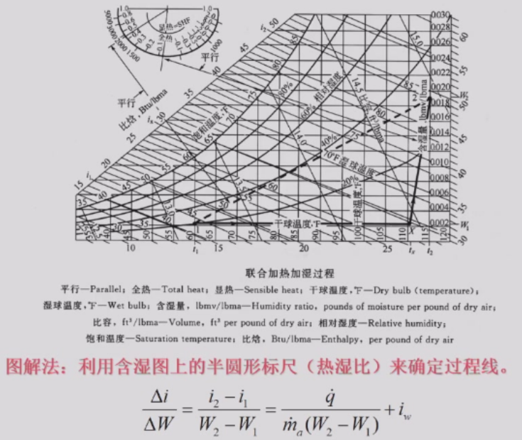

通过图中可以发现，加湿过程一般不为等温加湿，在加湿时还进行加热。

## 湿空气的绝热加湿过程

将水分加给湿空气而不加入热量（绝热加湿），吸收水分的热量均来自空气本身，可以看作一个等焓过程（蒸发冷却）。

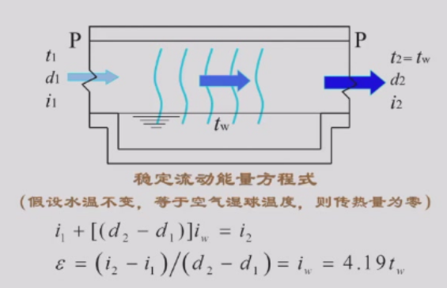

## 不同状态空气混合

不同状态空气的混合态在i-d图上的确定，焓差和湿差等于流量之比。

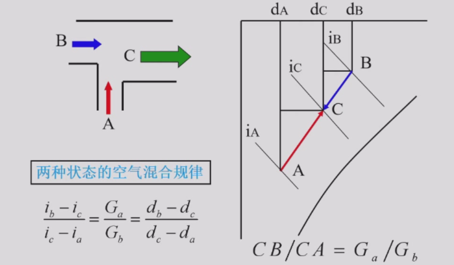

混合之后的C点一定在A、B的连线上（i-d图），具体在哪里由流量比决定。

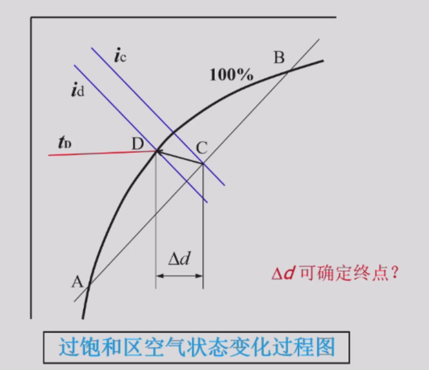

A、B均为饱和点，C为过饱和点，不稳定，会回到饱和点，具体怎么回由边界条件决定。

## 空气的热湿处理过程

为满足空调房间的送分温、湿度的要求，在空调系统中必须有相应的热湿处理设备（置换送风），以便对空气进行各种热湿处理，达到所要求的送风状态（送风量，温湿度）。

### 空气和水直接接触时的热湿交换原理（与边界层交换）

饱和空气边界层与水温度相同但是相对湿度为100%。

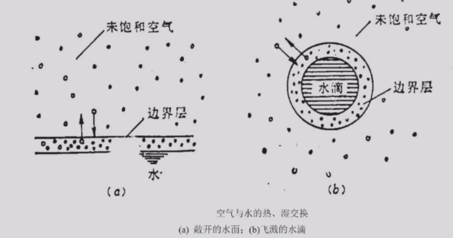

#### 传热传质机理

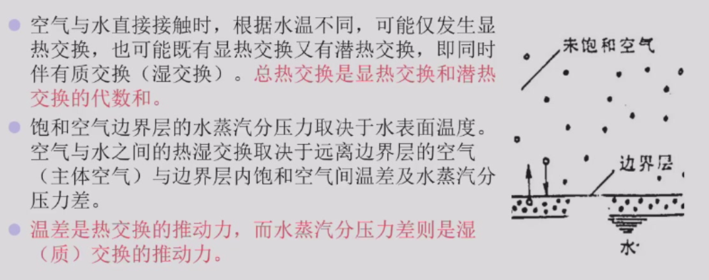

#### 空气与水直接接触时状态变化过程

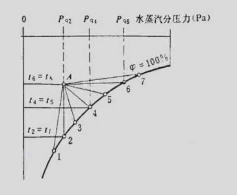

A-1：降温降湿

A-2：增湿和减湿的分界线

A-4：空气增焓和减焓的分界线

A-6：空气升温和降温的分界线

### 空气热湿处理设备

1. 接触式热湿交换设备：与空气进行热湿交换的介质直接与空气接触。
2. 表面式热湿交换设备：与空气进行热湿交换的介质不直接与空气接触，两者之间的热湿交换是通过分隔壁面进行的。根据热湿交换介质的温度不同，壁面的空气侧可能产生水膜（湿表面），也可能不产生水膜（干表面）。分隔壁面有平表面和带肋表面。

### 两个交换效率

（1）全热交换效率（第一交换效率）E：

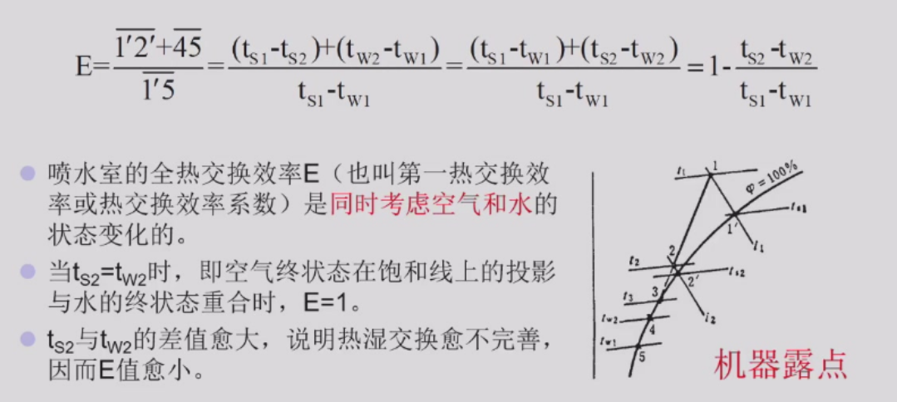

空气1->3，水5->3，此为理想状态。

机器露点：图中的2点，一般相对湿度在90%到95%，表冷器处理能达到的最佳状态。

（2）通用交换效率（第二交换效率）E'：

只考虑空气，3是2等焓线下来的点。

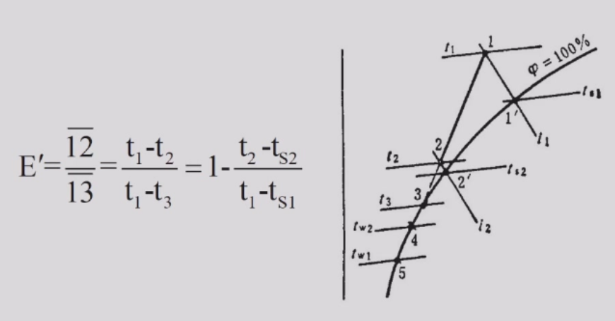

在绝热加湿时，E=E’，水的点不动（如下图）：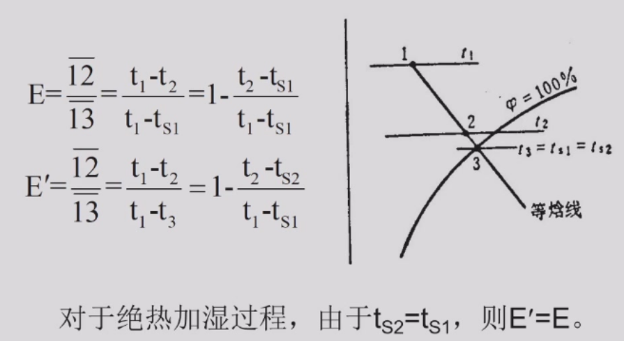

### 空气处理各种途径的方案说明

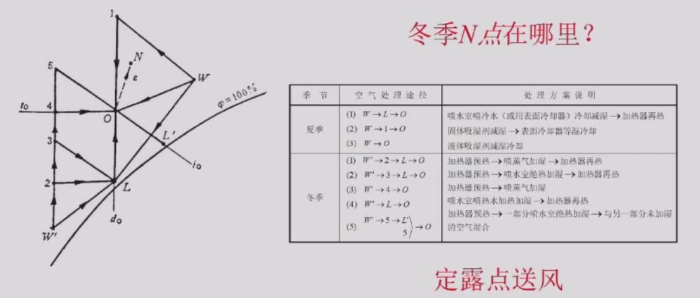

想要同时消除房间的热负荷和湿负荷，并且由于送风是个置换空气的过程，需要送入的风在房间的等热湿比线上（N点为室内），即我们要找到O点。

W->L冷却除湿；L->O再热。热湿耦合处理。

W->1，温度升高，湿度降低，固体吸湿剂减湿，放热；1->O，表冷器等湿冷却（可以提高冷冻水的温度）。该过程先除湿再降温，将热湿解耦合进行处理，热湿独立控制，节能，蒸发温度高，COP变高。

W->O，液体吸湿剂减湿冷却。液体吸湿剂腐蚀性。

冬季N点应该在W的右上方，即可看作W点移动到W‘。

W'->2，加热器预热，温度升高；2->L，喷蒸气加湿（等温加湿），L为定露点（此处L也是机械露点）；L->O，再热。

W->3，加热到等焓线（等湿球温度）；...

## 房间空气调节

这是一个置换过程。

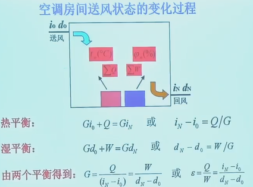

夏季送风量和送风状态：

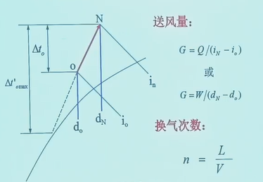

送风温差在国标中有规定，大概是10度左右。  

若送风温差大，送风量小；但是送风温差大，会导致局部区域温度不平衡，同时也会导致送风管道结露。

换气次数：每小时置换房间空间的空气次数；一般来说，空调要求的换气次数为10~15次。

冬季送风量和送风状态：

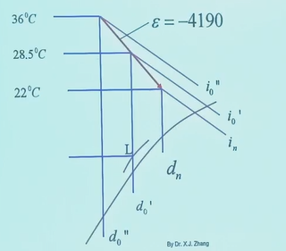

2.新风量

一般5%~10%。确定新风量的依据有下列因素：卫生要求；补充局部排风量（管道泄露）；保持空调房间的“正压”要求。使用回风为了节能，若新风太多，能耗太高。

**空调系统的空气平衡关系：**

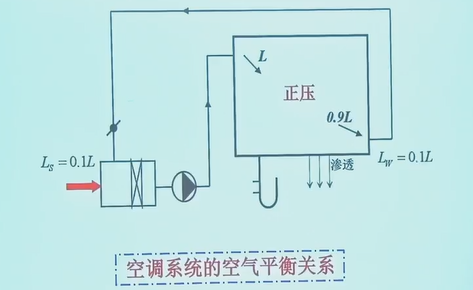

引入新风，一方面保证房间的空气平衡，质量平衡；另一方面，保证房间的正压，防止外界空气进入。