# 第1章：概论

## 什么是Internet

### 什么是互联网——从构成来看

网络包括结点和边构成的与大小、形状等无关的拓扑。

计算机网络也由节点和边构成。

> 节点

计算机网络中有两种节点，一是主机节点（用方形表示，包括主机及其上运行的应用程序），另一是数据交换节点（用圆形表示，包括路由器、交换机等网络交换设备）。

方节点（主机=端系统[host，end system]）：包括设备本身，支持这个设备能够通讯的网络操作系统还有在操作系统上能驻留的网络应用程序。

> 边：通信链路

计算机网络中的边也有两种，一是access，接入网链路（和方的相关，主机连接到互联网的链路），二是backbone，主干链路（圆和圆接在一起）。

光纤、同轴电缆、无线电、卫星

传输速率=带宽（bps）

> 协议

对等层的实体在通讯的过程当中应该遵守的规则的集合。协议定义了在两个或多个通信实体之间交换的报文格式和次序，以及在报文传输和/或接收或其他事件方面所采取的动作。

按层次不同可以区分成不同的协议。

互联网Internet：以TCP、IP为主的一簇协议来支撑工作的网络。

internet：与别人不连，也以TCP、IP为主，内部使用。

### 什么是互联网——从服务来看

互联网是分布式的应用进程和基础设施，基础设施向进程提供通信服务，应用层以下为基础设施。

基础设施提供的服务有两种，一种是面向连接的可靠服务（如TCP），另一种是无连接的不可靠服务（如UDP）。

## 网络边缘(edge)

主机

应用程序（客户端和服务器）

应用程序通信模式包括：

1.C/S模式（客户端/服务器）：主从模式，所有的资源来自于服务器，客户端向服务器发送请求。可扩展性比较差，随着请求载荷增加，达到一定阈值后能力断崖式下降。

2.p2p模式（peer-peer对等模式）：可扩展性好，分布式文件分发系统如迅雷大兴其道。

###  网络边缘：采用网络设施的面向连接服务

目标：在端系统之间传输数据

握手：在数据传输之前做好准备，两个通信主机之间为连接建立状态。（连接状态的维持只有端系统维持为面向连接，中间所有路径上节点都维持为有连接。）

TCP服务：向上层提供的服务为可靠的、保序的；流量控制（发送方不会淹没接收方）；拥塞控制：当网络拥塞时，发送方降低发送速率。

### 网络边缘：采用基础设施的无连接服务

目标：在端系统之间传输数据

UDP（User Datagram Protocol）用户数据报协议：无连接，不可靠数据传输，无流量控制，无拥塞控制。

## 网络核心

网络核心：路由器的网状网络

> 数据怎样通过网络进行传输？

1.电路交换：为每个呼叫预留一个专有电路（如电话网）

2.分组交换：将要传送的数据分成一个个单位：分组；将分组从一个路由器传到相邻路由器（hop），一段段最终从源端传到目标端；每段：采用链路的最大传输能力（带宽）。

### 网络核心：电路交换

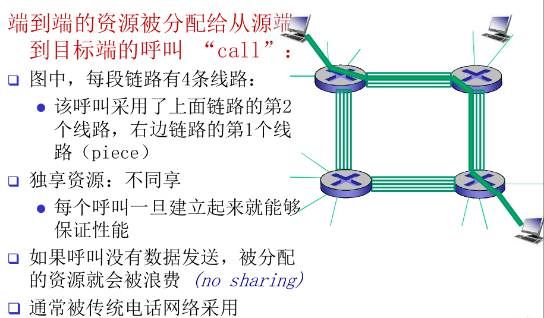

信令系统为想要通讯的两者之间分配一条独享的线路。独享：好处是性能保障，坏处是资源共享能力弱。

电路交换不适用于计算机网络：连接需要较长时间；独享性不适用于突发性发送（计算机之间的通信有突发性，如果使用线路交换，则浪费的片较多）；可靠性不高（核心节点被摧毁的话将影响到很多主机之间的联系）。

> 如何将带宽分为pieces?

频分（FDM）、时分（TDM）、波分（WDM）

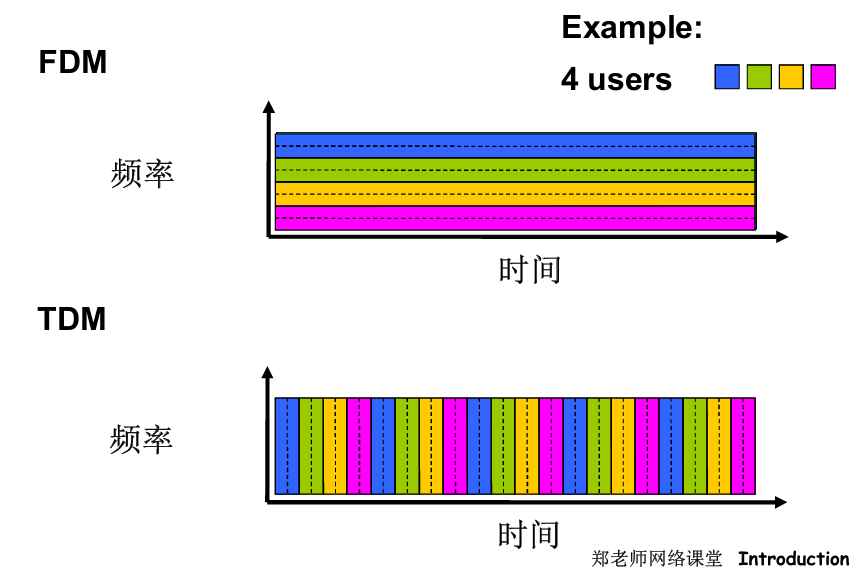

时隙（slot），WDM（用于光纤通信）的原理和FDM差不多

举例：

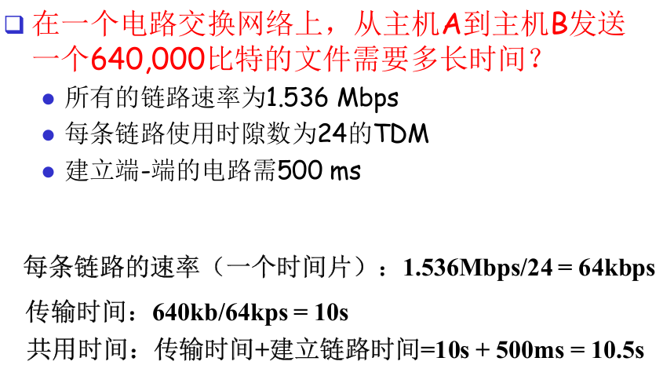

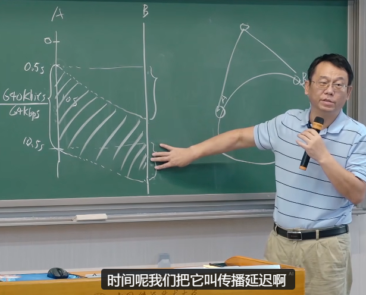

### 网络核心：分组交换

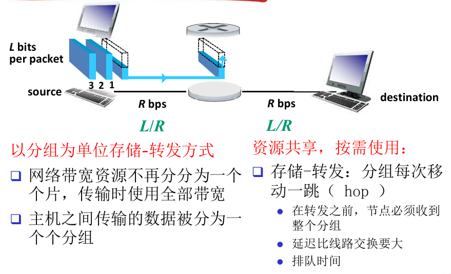

example:

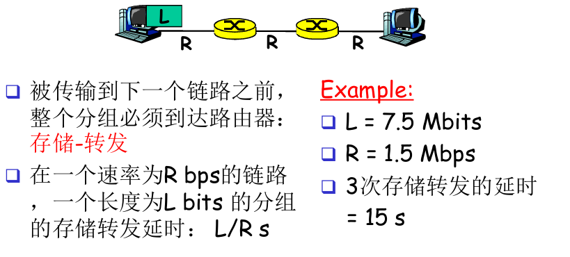

#### 排队延迟和丢失

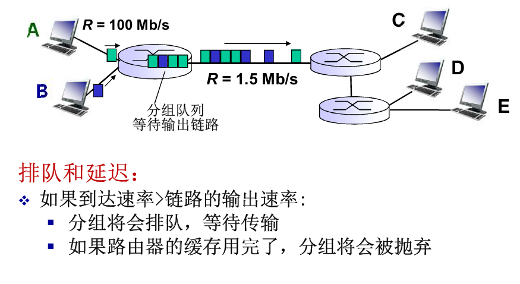

### 网络核心的关键功能

路由：决定分组采用的源到目标的路径（全局），通过路由算法算出；

转发：将分组从路由器的输入链路转移到输出链路（局部）

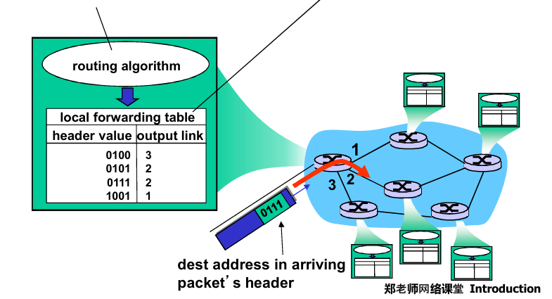

### 分组交换：统计多路复用

也是对于时间片的一个划分，只不过相对于TDM而言，其划分时间片的方式是随机的而非固定的。

### 分组交换 vs. 电路交换

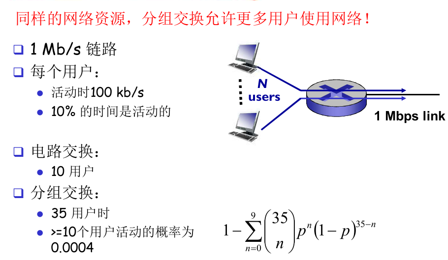

至于为什么求和从0到9，是因为没用裕量是要挂的。

过度使用分组交换（如35个用户变成3.5w个用户）会造成网络拥塞。

> 分组交换怎样提供类似电路交换的服务？

### 分组交换网络：存储-转发

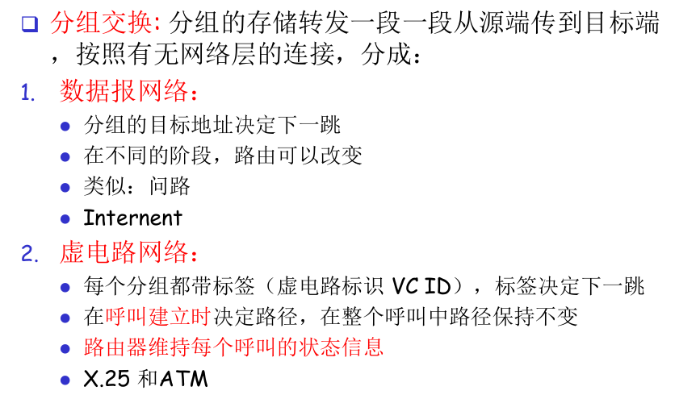

#### 数据报（datagram，无连接）

源主机发给目标主机的每一个分组都携带了目标主机的一个完整地址

两个主机在通讯之前不需要握手，不需要维护通讯状态

分组以存储转发的方式进行传递，每个分组之间的传递都是独立的

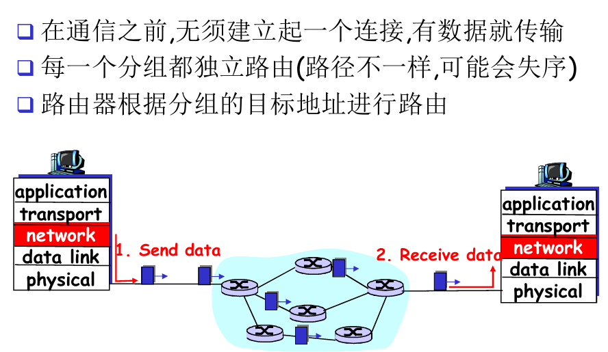

#### 虚电路（Virtual Circuit，有连接的）

每个交互节点之间保持通讯状态，不同于面向连接（仅端主机保持连接）。

虚电路靠信令系统建立。

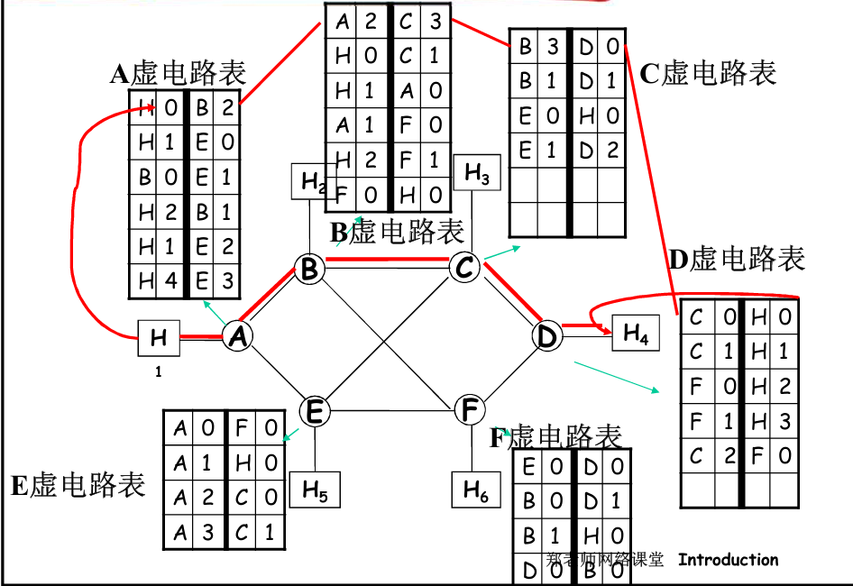

分为输入部分和输出部分，左边为输入，右边为输出，来自于哪（到哪去的）几号虚电路。

## 接入网和物理媒体

> 怎样将端系统和边缘路由器连接？

住宅接入网络、单位接入网络（学校、公司）、无线接入网络。

两个指标：接入网络的带宽（bps），共享/专用

### 住宅接入：modem

将上网数据调制加载音频信号上，在电话线上传输，在局端将其中的数据解调出来；反之亦然。（通过调频、调幅、调相位、综合调制）

拨号调制解调器：56Kbps 的速率直接接入路由器 (通常更低) ；不能同时上网和打电话，不能总是在线；

### 接入网：digital subscriber line (DSL)

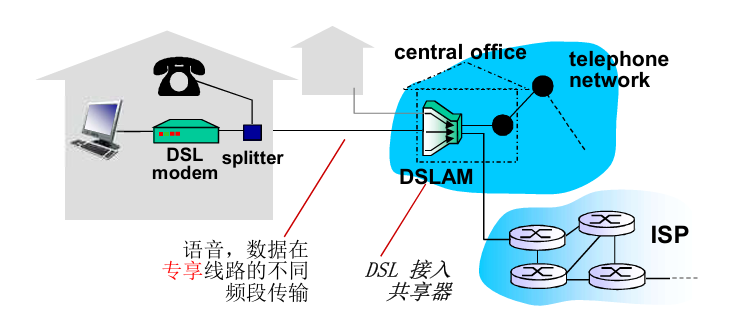

0~4kHz用于语音通信。

4kHz以上（按照非对称方式称为adsl)，有一段用于上行，有一段用于下行，仍然通过调制解调的方式来传递。

采用现存的到交换局DSLAM的电话线，DSL线路上的数据被传到互联网，DSL线路上的语音被传到电话网。

< 2.5 Mbps上行传输速率(typically < 1 Mbps)，< 24 Mbps下行传输速率(typically < 10 Mbps)。

### 接入网：线缆网络

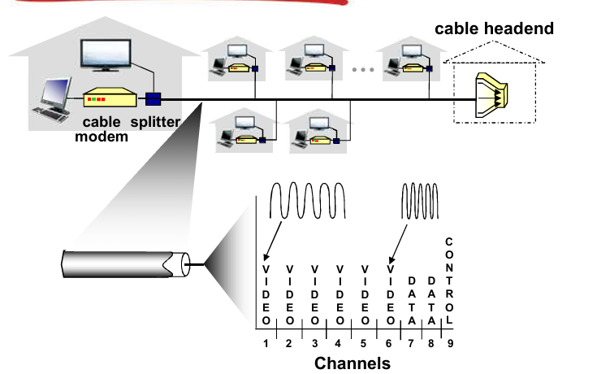

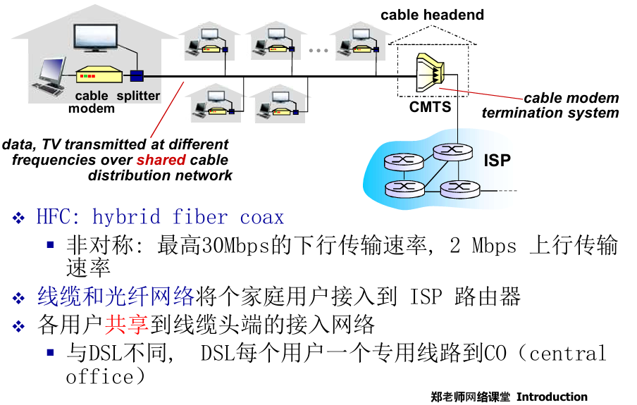

有线电视信号线缆双向改造，原有的只有下行传递。

FDM：在不同频段传输不同信道的数据，数字电视和上网数据（上下行），还有些带宽用于控制传输信令。

这种方式带宽是共享的。

实际上，也可以通过电力调制解调器连入电网来实现上网，但在我国使用较少。

### 住宅接入：电缆模式

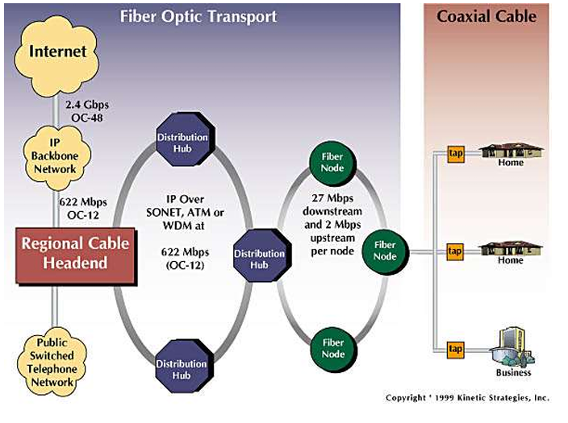

### 接入网：家庭网络

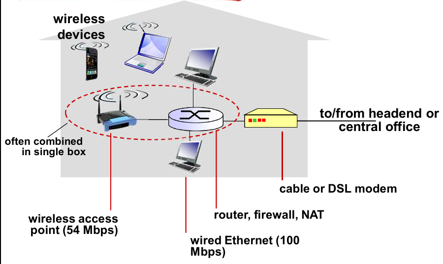

### 企业接入网络(Ethernet)

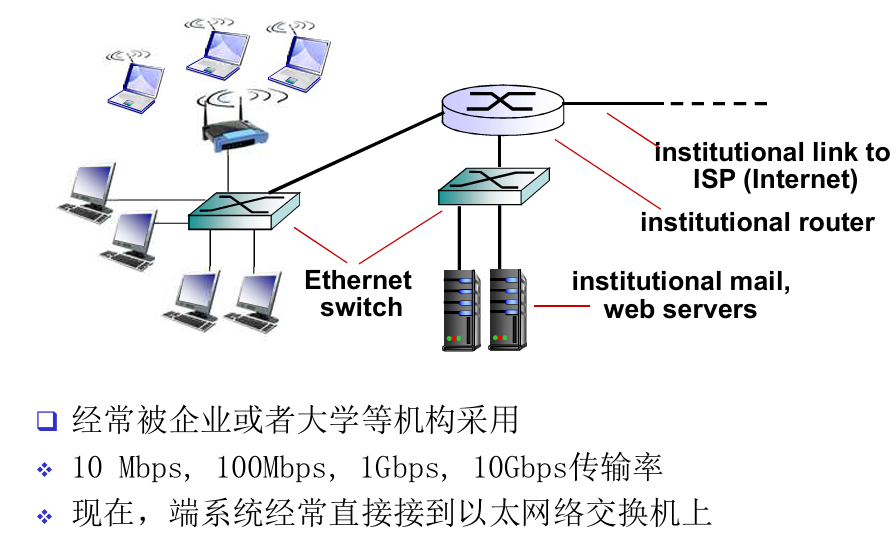

### 无线接入网络

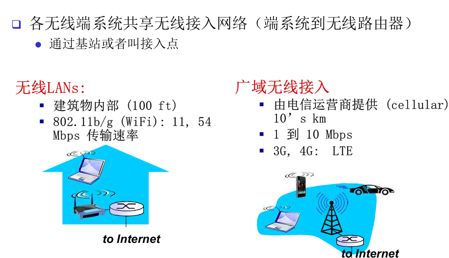

### 物理媒体

第0层，比特在发送-接收对间传播，物理链路指的是连接发送-接收对之间的物理介质/媒体，可以分为：

1. 导引型媒体：看得见，信号沿着固体媒介被导引：同轴电缆、光纤、双绞线
2. 非导引型媒体：开放的空间传输电磁波或者光信号，在电磁或者光信号中承载数字数据

信号在导引型媒体中传播距离更远，因为在非导引型媒体中传播信号衰减快。

#### 常见的导引型媒体

**双绞线：**

一对绝缘导线相互拧合在一起。

**同轴电缆：**

中间有铜芯，外面有铜网，形成同轴。

宽带有多个频段，窄带只有一个频段。

**光缆：**

带宽极宽，误码率极低（受电磁干扰小），安全。

#### 无线链路

无线链路是双向的，且受到环境影响

无线链路类型：地面微波、LAN、wide-area、卫星（同步轨道传播延迟不可忽略）

## Internet结构和ISP

### 互联网络结构：网络的网络

端系统通过*接入ISPs*(Internet Service Providers)连接到互联网

*接入ISPs*相应的必须是互联的，因此任何两个端系统可相互发送分组到对方

> 问题: 给定数百万接入ISPs，如何将它们互联到一起？
>
> 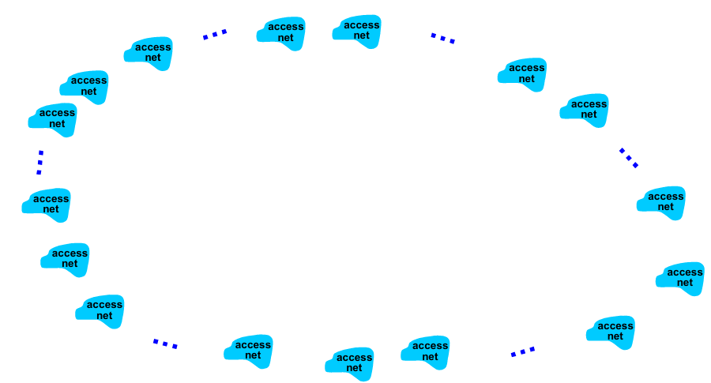

1. 全部互联：O(N2)，不可扩展

2. 选项: 将每个接入ISP都连接到全局ISP（全局范围内覆盖）？客户ISPs和提供者ISPs有经济合约

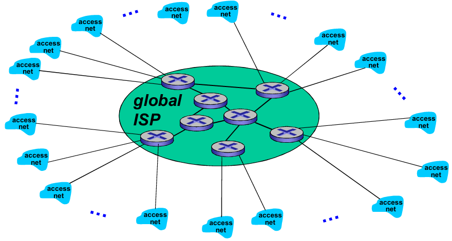

竞争：但如果全局ISP是有利可为的业务，那会有竞争者 

合作：通过ISP之间的合作可以完成业务的扩展，肯定会有互联，对等互联的结算关系

ISP之间有两种连接方式，一种是ISPA和ISPB各提供一个路由器，由光缆接在一起；另一种是ISPA、ISPB、ISPC都接入到IXP中进行交换（Internet exchange point）。

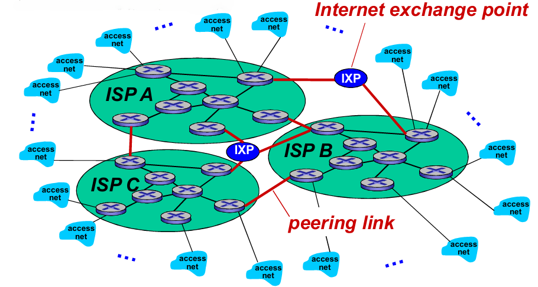

…然后业务会细分（全球接入和区域接入），区域网络将出现，用与将接入ISPs连接到全局ISPs

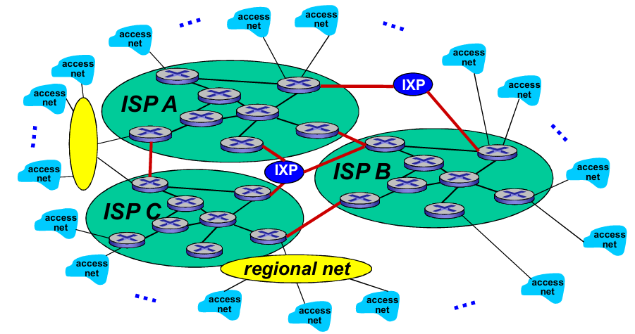

然后内容提供商网络ICPs(Internet Content Providers,e.g., Google, Microsoft, Akamai)可能会构建它们自己的网络（部署数据中心机房，通过专线连接），将它们的服务、内容更加靠近端用户，向用户提供更好的服务，减少自己的运营支出。

这些数据中心机房往往离一些核心ISP比较近的位置。

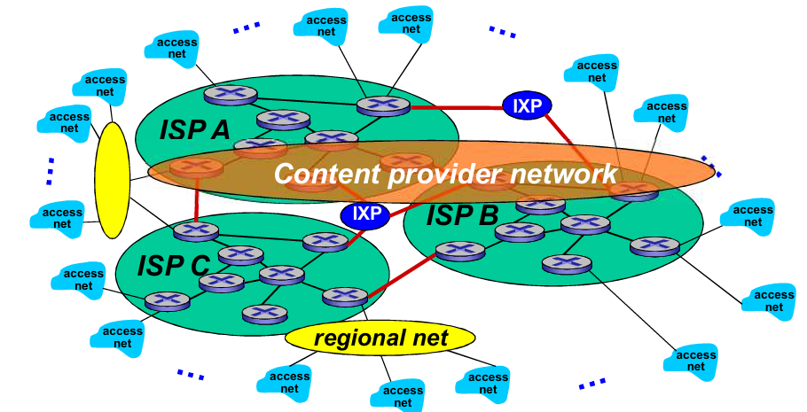

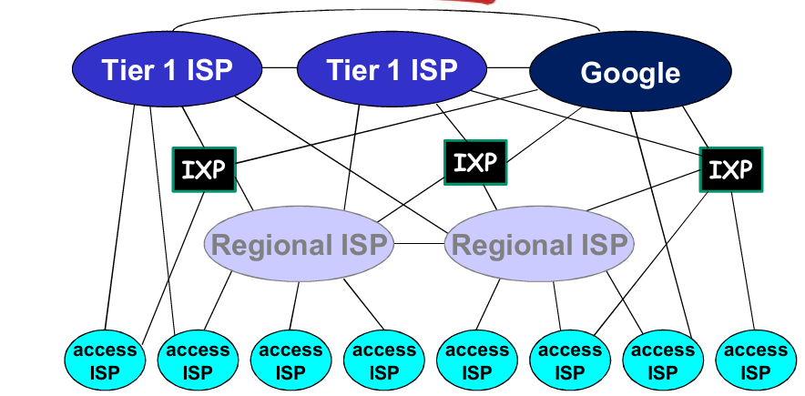

“tier-1”commercial ISPs (e.g., Level 3, Sprint, AT&T, NTT), 国家或者国际范围的覆盖

 content provider network (e.g., Google)

### Internet结构：network of networks

中心：第一层ISP（如UUNet, BBN/Genuity, Sprint,  AT&T）国家/国际覆盖，节点数不多，速率极高。

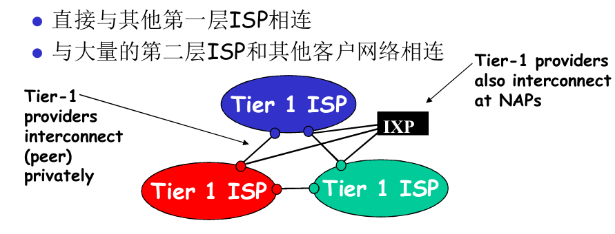

第二层ISP，更小些的(通常是区域性的) ISP：与一个或多个第一层ISPs也可能与其他第二层ISP连接。

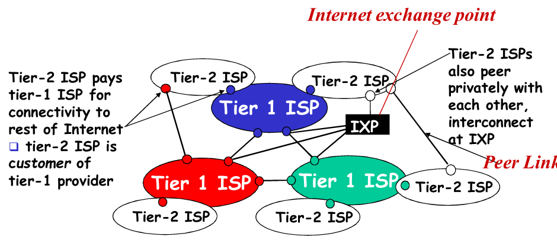

第三层ISP与其他本地ISP（local ISP）

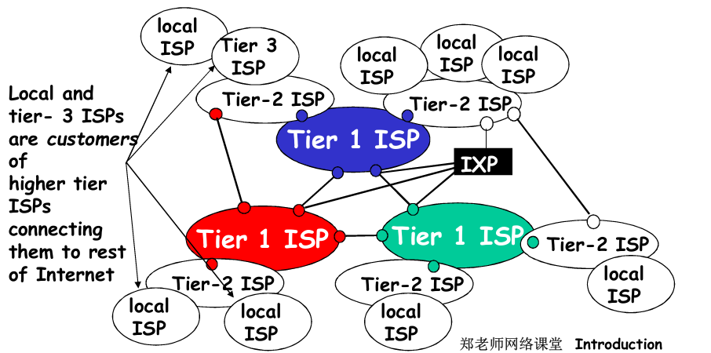

### ISP之间的连接

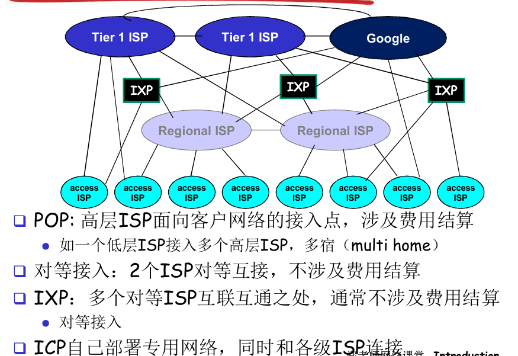

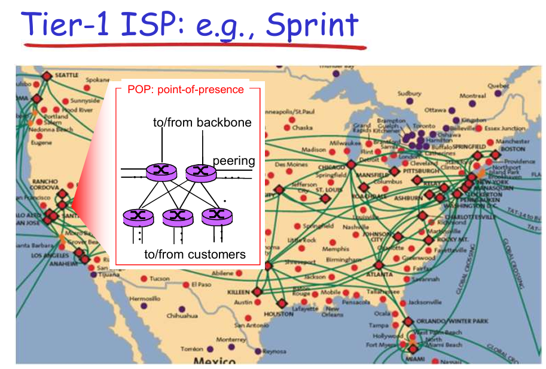

## 分组延时、丢失和吞吐量

### 分组丢失和延时是怎样发生的？

在路由器缓冲区的分组队列，分组到达的速率超过了链路输出的能力，此时分组等待排到队头、被传输。

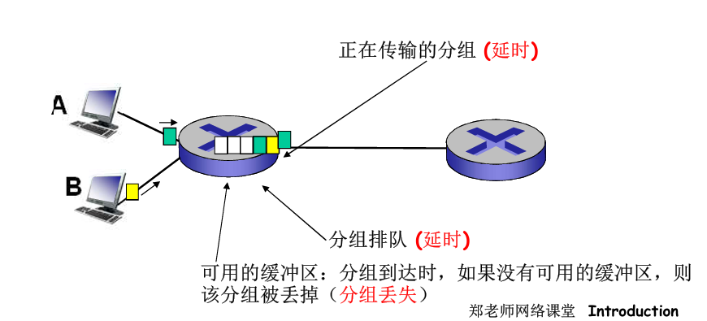

### 四种分组延时

1. 节点处理延时：检查bit级差错，检查分组首部和决定将分组导向何处。
2. 排队延时：随机的，依赖于路由器的拥塞程度，在输出链路上等待传输的时间。
3. 传输延时：设R=链路带宽（bps），L=分组长度（bits），将分组发送到链路上的时间=L/R。
4. 传播延时：设d=物理链路长度，s=媒体上传播速度（~2*10^8 m/s），传播延时=d/s。

d_total = d_proc + d_queue + d_trans + d_prop

### 信道容量

在LAN的情况下（d_prop小），发送方还未发完，接收方可能已经开始接收，信道容量小；

而在WAN中（d_prop >> d_trans），发送方发完好一会儿后接收方可能才开始接收，并且要等待一定的传输延时才能收完，信道容量大。

### 排队延时

设R=链路带宽(bps)，L=分组长度(bits)，a=分组到达队列的平均速率；

流量强度`i=La/R`

i ~ 0：平均排队延时很小

i ~ 1：延时变得很大

i > 1：比特到达队列的速率超过了从该队列输出的速率，平均排队延时将趋向无穷大！

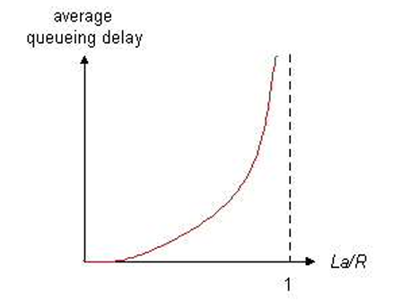

### Traceroute 测试原理

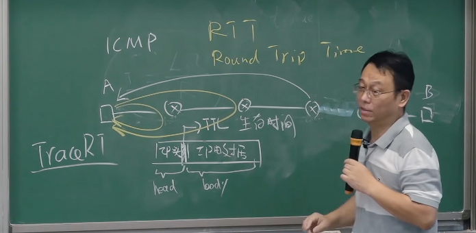

根据ICMP协议，当分组中一个叫作TTL的字段为0（没经过一跳就减一）时，分组会被丢弃，并且发送一个报文告诉源主机被丢弃处的ip地址。

于是沿着目的的路径，向每个路由器发送3个探测分组，每次增加TTL的值。源主机可以计时来获取RTT(Round Trip Time)。

当到达目标主机时，由于分组描述的目标端口没有应用进程守候，目标主机向源主机发送一个目标端口不可达的报文，此时测试结束。

发送回来的延迟为总路径的总延迟，会因为拥塞程度而可能随着节点先变大而后变小。

### 分组丢失

链路的队列缓冲区容量有限，当分组到达一个满的队列时，该分组将会丢失，丢失的分组可能会被前一个节点或源端系统重传，或根本不重传。

### 吞吐量

在源端和目标端之间传输的速率（数据量/单位时间），有效比特数量

瞬间吞吐量、平均吞吐量

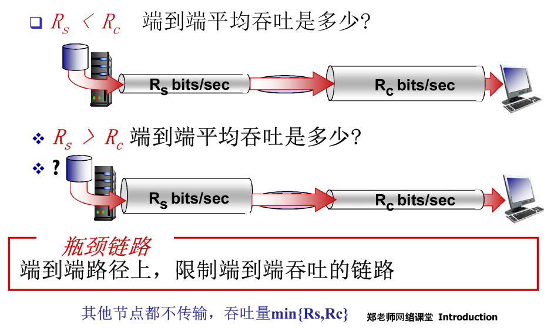

当某条链路（Rbps）同时有n个人在用，瓶颈链路将R/n纳入考虑。

## 协议层次和服务模型

**层次化方式实现复杂网络的功能：**

1. 将网络复杂的功能分成功能明确的层次，每一层实现了其中一个或一组功能，功能中有其上层可以使用的功能：服务
2. 本层协议实体相互交互执行本层的协议动作，目的是实现本层功能，通过接口为上层提供更好的服务。
3. 在实现本层协议的时候，直接利用了下层所提供的服务
4. 本层的服务：借助下层服务实现本层协议实体之间交互带来的新功能（上层可以利用的）+更下层所提供的服务。

### 服务和服务访问点

服务（Service）：低层实体向上层实体提供它们之间的通信能力。

- 服务用户（service user）
- 服务提供者（service provider）

服务访问点SAP（Service Access Point）：上层使用下层提供的服务通过层间的接口——**地点**；区分发送方和接收方。

- 地址（address）：下层的一个实体支撑着上层的多个实体， SAP有标志不同上层实体的作用。

原语（primitive）：服务用户采用什么形式来使用服务提供者提供的服务。上层使用下层服务的形式，高层使用低层提供的服务，以及低层向高层提供服务都是通过服务访问原语来进行交互的——**形式**。

### 服务的类型

#### 面向连接的服务（Connection-oriented Service）

握手 

#### 无连接的服务（Connectionless Service）

不需要握手

### 服务和协议

服务（Service）：低层实体向上层实体提供它们之间的通信能力，是通过原语来操作的，垂直。

协议：对等层实体之间在相互通信的过程中，需要遵循的规则的集合，水平。

本层协议的实现要靠下层提供的服务来实现，本层实体通过协议为上层提供更高级的服务。

### 数据单元（DU）

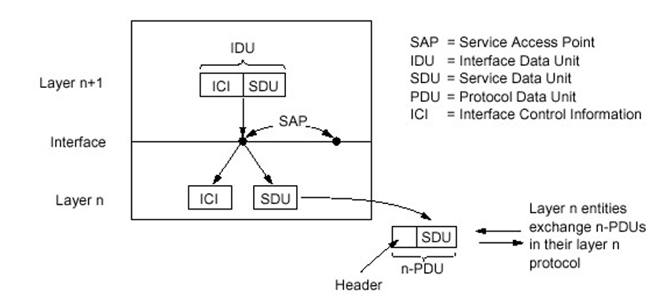

n+1层交给n层传输的数据是SDU，服务数据单元。

传SDU经过层间接口时所需要的一些控制信息为ICI，接口控制信息。

IDU = ICI + SDU.

1对1：上层来的SDU + 本层的一些控制信息（n-header），形成了本层的PDU(n-PDU)，也就是协议数据单元。

1对多：另一种情况，SDU比较大，进入n层后先分解成若干小块，每块加上n-header，形成若干个n-PDU。

多对1：还有一种情况，SDU非常小，进入n层后先合并成一个块，加上n-header，形成n-PDU。

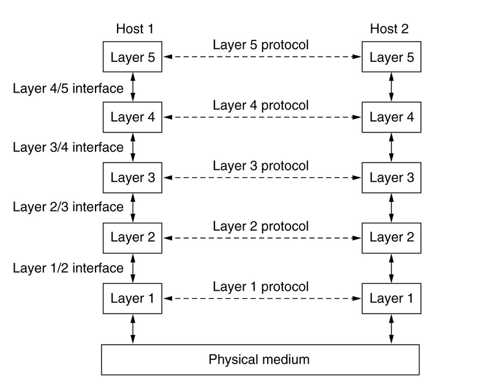

### 分层处理和实现复杂系统的好处

概念化：结构清晰，便于标示网络组件，以描述其相互关系。

结构化：模块化更易于维护和系统升级，改变某一层服务的实现不影响系统中的其他层次，便于采用新的技术。

坏处：交换信息效率较低。

### Internet协议栈

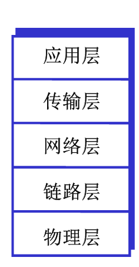

- [ ] 应用层：网络应用
  - 为人类用户或者其他应用进程提供网络应用服务
  - FTP，SMTP，HTTP，DNS
- [ ] 传输层：主机之间的数据传输
  - 在网络层提供的端到端的通信基础上，完成**进程到进程**的区分，将不可靠的通信变为可靠的通信。
  - TCP，UDP
- [ ] 网络层：为数据从源到目的选择路由
  - 主机主机之间的通信，**端到端**的通信，**不可靠**，传输单位是一个个分组。
  - IP，路由协议。
  - 转发，路由。
- [ ] 链路层：相邻网络节点间的数据传输
  - 传输以帧为单位的数据，需要区分哪些bit的组合是一个帧的开始，哪些bit的组合是一个帧的结束。
  - 在相邻两点之间的**点到点**的传输，服务可能是可靠的或者不可靠的。
- [ ] 物理层：将frame中的每一个bit一组一组转变成物理信号，通过介质传播，在接收端再把物理信号转变回数字信号。

### ISO/OSI参考模型

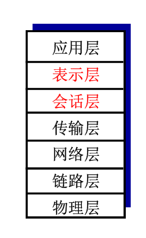

- [ ] 表示层：表示管理，表示转换。允许应用解释传输的数据，e.g.，加密，压缩，机器相关的表示转换。
- [ ] 会话层：会话管理（建立会话，拆会话，维持会话）。数据交换的同步，检查点，恢复。

在互联网协议栈中，这两层实现的功能是由应用层自己去做的。

### 封装和解封装

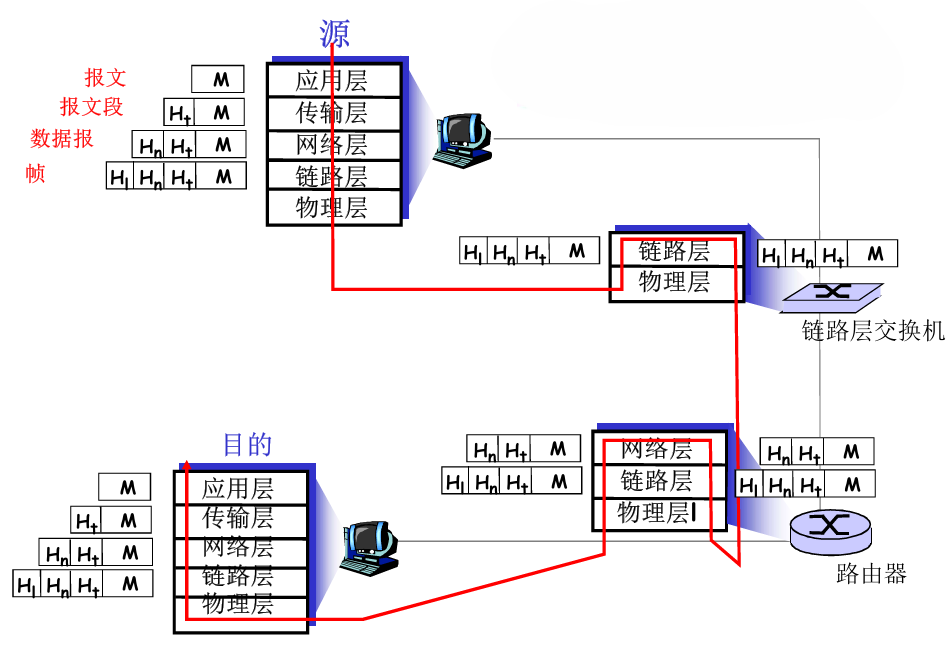

在源处做一个大的封装，经过两层交换设备（如交换机），进行一个两层的解封装再封装，经过三层交换设备（路由器）时，进行三层的解封装再封装，最后到达目的，进行一个大的解封装。

### 各层次的协议数据单元

应用层：报文（message）

传输层：报文段（segment）：TCP段，UDP数据报

网络层：分组packet（如果无连接方式：数据报datagram）

数据链路层：帧（frame）

物理层：位（bit）

## 历史

### 早期（1960前）计算机网路

线路交换网络，建立时间过长，独享性不适合突发性通信，可靠性不高。

### 1961 - 1972：早期分组交换概念

ARPAnet证明了分组交换的可行性。

NCP协议：相当于传输层和网络层在一起，支持应用开发。

### 1972 - 1980：专用网络和网络互联

网络互联的必要性

Cerf and Kahn采用覆盖的方式，一人发一个ip帽子，ip over everything，ip层以下为物理网络，以上为ip网络，路由器仅需要在软件层面做一个改变。

1974：网际互联的Cerf and Kahn体系结构，其互联原则：极简、自治；尽力而为服务模型；无状态的路由器；分布控制；

### 1980 - 1990：体系结构变化，网络数量激增，应用丰富

1983：TCP/IP部署，标记日。NCP分化成2个层次，TCP/IP，从而出现UDP。

1983：DNS 定义，完成域名到IP地址的转换。

1985：ftp 协议定义

1988：TCP拥塞控制

### 1990，2000's：商业化，Web，新的应用

UNIX 中TCP/IP的免费捆绑

1990年代初Web：

- [ ] hypertext [Bush 1945, Nelson 1960’s]
- [ ] HTML, HTTP：Berners-Lee，做完物理实验后数据放在web服务器上，当时还是命令行浏览器。
- [ ] 1994: Mosaic (Netscape，andreesen)，图形化浏览器和服务器，网景公司。

1990后期-21世纪：新一代杀手级应用（即时讯息，P2P文件共享，社交网络）

2001网络泡沫。

### 2005-现在

数百亿主机，移动互联。
