# 第2章 应用层

## 应用层协议原理

### 网络应用的体系结构

#### 客户-服务器（C/S）体系结构

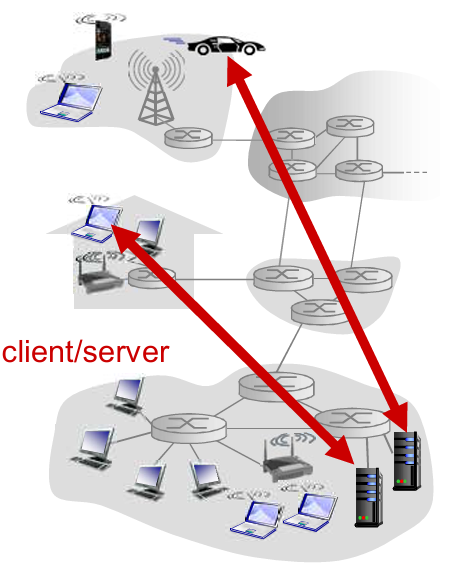

服务器：一直运行，比客户端先运行，IP地址是固定的，守候在知名端口上。

客户端：主动与服务器通信，可能是动态IP地址，与互联网有间歇性的连接，不直接与其他客户端通信。

服务器是中心，资源在服务器，服务器与客户端地位不平等；可扩展性差，可靠性差。

#### 对等体（P2P）体系结构

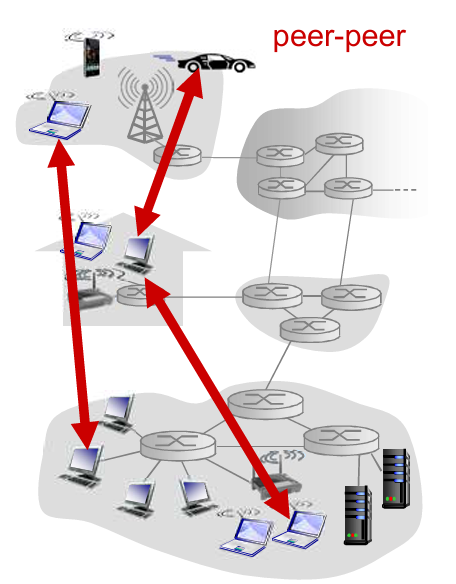

任意端系统之间可以进行通信，每个节点既请求别的节点的服务（是服务器），又根据它具有的资源为其他节点提供服务（是客户端）；自扩展性：新peer节点带来新的服务能力，当然也带来新的服务请求；几乎没有一直运行的服务器；参与的主机间歇性连接且可以改变ip地址。

管理比较困难，只有节点上线才能提供服务，需要知道上线下线情况。

#### C/S和P2P体系结构的混合体

Napster：

- 文件搜索：集中
  - 主机向中心服务器上注册其资源
  - 主机向中心服务器查询资源位置
- 文件传输：P2P
  - 任意peer节点之间

即时通信：

- 在线检测：集中
  - 当用户上线时，向中心服务器注册其ip地址
  - 用户与中心服务器联系，以找到其在线好友的位置
- 两个用户之间的聊天：P2P

### 进程通信

进程：在主机上运行的应用程序。

在同一个主机内，使用进程间通信机制通信（操作系统定义）；在不同主机，通过报文（Message）来通信：使用OS提供的通信服务，按照应用协议来交换报文（借助传输层提供的服务）。

客户端进程是发起通信的进程，服务器进程是等待连接的进程，P2P的应用也有这种分别。

### 分布式进程通信需要解决的问题

> 问题1：进程标示和寻址问题（服务用户，标志自己的不同和自己的地址）

进程为了接收报文，必须有一个标识即：SAP（发送也需要标示）

三个要素：1.主机：唯一的32位IP地址（但仅ip地址不能唯一标志一个进程）；2.所采用的传输层协议：TCP或UDP；3.端口号（Port Numbers）

知名端口号，HTTP：TCP 80

一个进程由ip地址和端口号来标示，tcp和udp的端口的标示空间不同。

本质上，一对主机进程之间的通信由两个端节点（end point）构成。

> 问题2：传输层-应用层提供服务是如何（服务的地点（SAP）与形式（API））

**需要穿过层间的信息**

层间接口必须要携带的信息：

1. 要传输的报文（对于本层来说：SDU）
2. 谁传的：对方的应用进程的标示：IP+TCP(UDP)  端口
3. 传给谁：对方的应用进程的标示：对方的IP+TCP(UDP)端口号

传输层实体（tcp或者udp实体）根据这些信息进行TCP报文段（UDP数据报）的封装

**层间信息的代表**

socket：用个代号标示通信的双方或者单方，就像OS打开文件返回的句柄一样。

**TCP socket（TCP上的套接字）**

是一个整数，代表了一个4元组（源ip，源port，目标ip，目标port），具有本地意义（对方不知道，网络层及以下不知道），唯一指定了两个进程之间的会话关系。发送时根据这个socket查表可以获得对方的ip和port，接收时根据4元组找到socket，找到哪个应用进程创建了这个socket。

TCP服务，两个进程之间的通信需要之前要建立连接，两个进程通信会持续一段时间，通信关系稳定，在建立连接时可以创建socket。

简单，便于管理，同时减少层间传输的信息量。

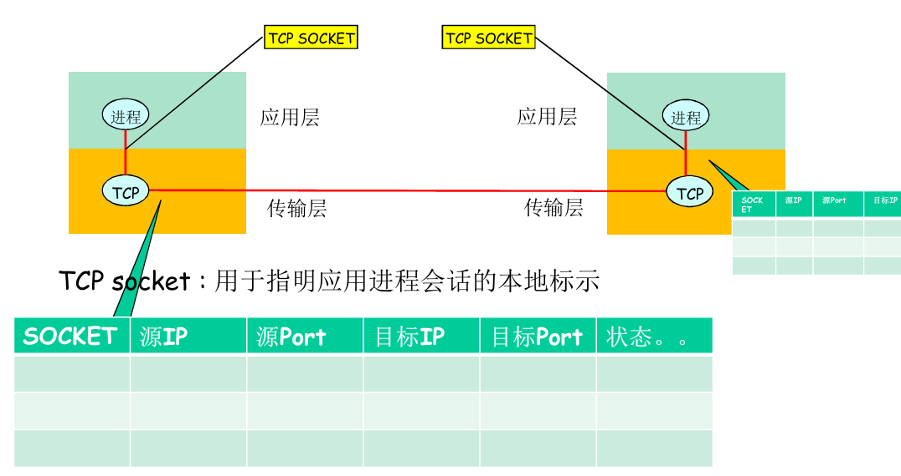

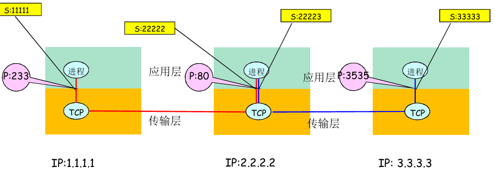

**UDP socket**

UDP服务，每个报文都是独立传输的，哪怕前后的ip，port相同，前后报文可能传给不同的分布式进程。

UDP socket：是一个代表本地ip与port的二元组（本地意义上的，UDP套接字指定了应用所在的一个端节点[end point]），目的是使得穿过层间的信息量最小，但是在传输报文时，还必须提供对方的ip和port。

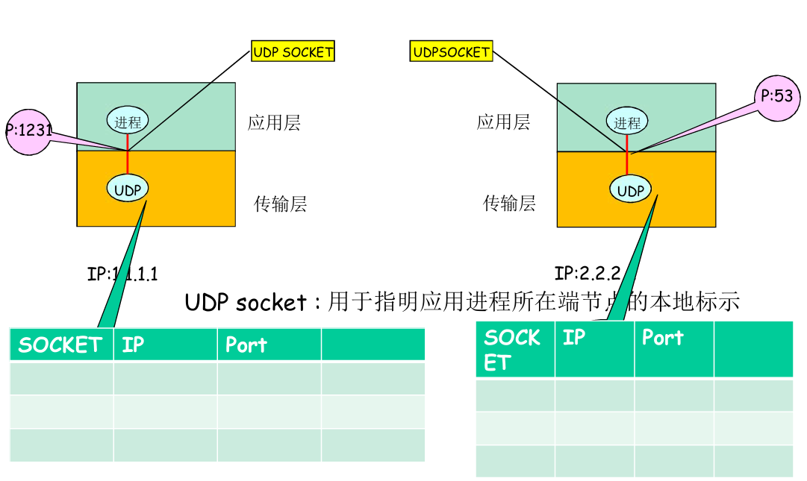

socket <-> 门户

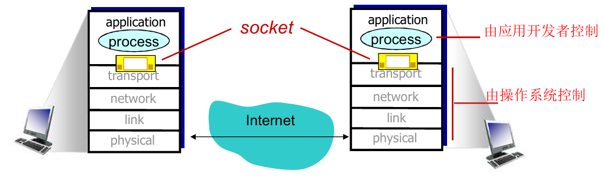

> 问题3：如何使用传输层提供的服务，实现应用进程之间的报文交换，实现应用（用户使用服务，协议）

**应用层协议**

有公开的，也有私有的，规定了报文格式，解释，时序，应用协议仅仅是应用的一个组成部分。

**衡量应用层提供服务的标准**

数据丢失率、延迟、吞吐、安全性。

**TCP**

可靠，流量控制（发送方不会淹没接受方），拥塞控制（当网络出现拥塞时，能抑制发送方），不能提供的服务（时间保证、最小吞吐保证和安全），面向连接（要求在客户端进程和服务器进程之间建立连接）。

**UDP**

不可靠数据传输，不提供的服务（可靠，流量控制、拥塞控制、时间、带宽保证、建立连接）

**UDP存在的必要性**

- 能够区分不同进程，在ip提供的主机端到端功能的基础上；
- 不需建立连接，适合事务性应用
- 不做可靠性工作，检错重发需要时空代价；
- 没有拥塞和流量控制，应用能够按照设定的速度发送数据（在TCP上的应用，应用发送数据的速度和主机向网络发送的实际速度是不一致的）

有的实时多媒体跑在TCP之上，有些机构接入网络的防火墙会把UDP分组过滤掉。

**TCP&&UDP**

都没有加密，明文通过互联网传输，甚至密码

**SSL**

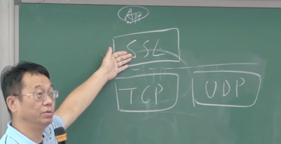 

SSL在TCP上实现，运行在应用层，应用层采用SSL的库，SSL库使用TCP通信，https跑在SSL之上。

## Web && HTTP

### 一些术语

Web页：由一些对象组成

对象：可以是HTML文件，JPEG图像，Java小程序、声音剪辑文件等

Web页含有一个基本的HTML文件，该文件又包含若干对象的引用（链接）

通过URL对每个对象进行引用：访问协议，用户名，口令字，端口等。

URL格式：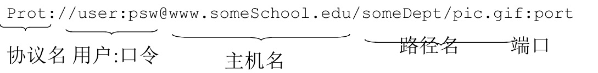

### HTTP概况

超文本：文本之间任意的指向关系。

HTTP：超文本传输协议，应用层协议。

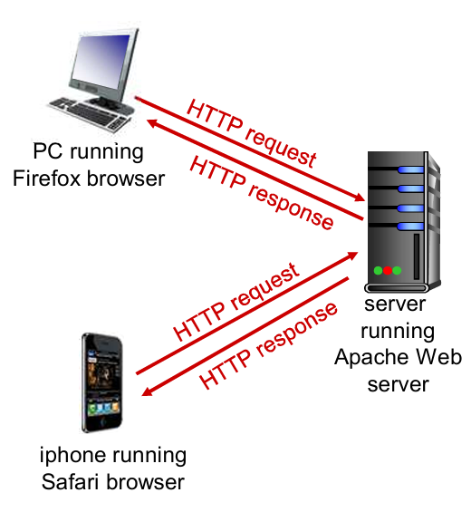

使用TCP：客户发起一个与服务器的TCP连接(建立套接字) ，端口号为80，服务器接受客户的TCP连接，在浏览器(HTTP客户端)与Web服务器(HTTP服务器server)交换HTTP 报文(应用层协议报文) ，TCP连接关闭；

HTTP：是无状态的，服务器并不维护关于客户的任何信息。（维护状态的协议很复杂，需要维护历史信息，保证服务器和客户端之间信息的一致，因此无状态的服务器能够支持更多的客户端）

### HTTP连接

#### 非持久HTTP（HTTP/1.0使用）

最多只有一个对象在TCP连接上发送，下载多个对象需要多个TCP连接。

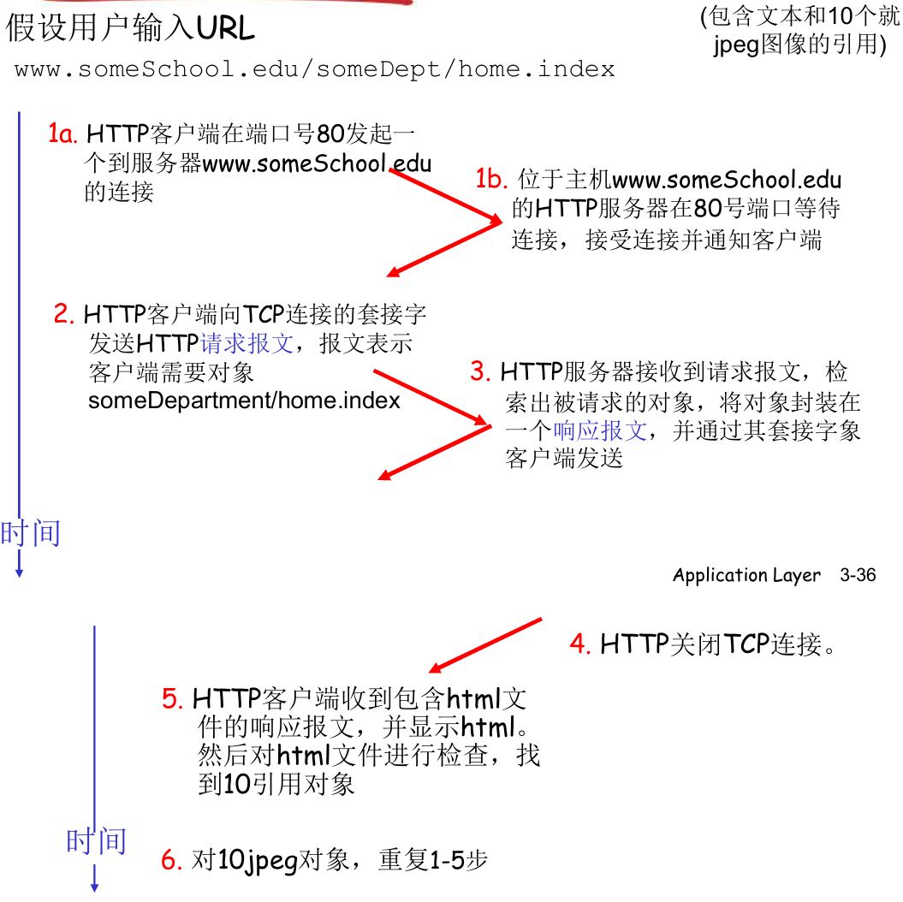

缺点：每个对象要2个RTT（概念见下），操作系统必须为每个TCP连接分配资源，但浏览器通常打开并行TCP连接以获取引用对象。

#### 响应时间模型

往返时间RTT（round-trip-time）：一个小的分组从客户端到服务器，再到客户端的时间（传输时间忽略）。

响应时间：2RTT+传输时间。

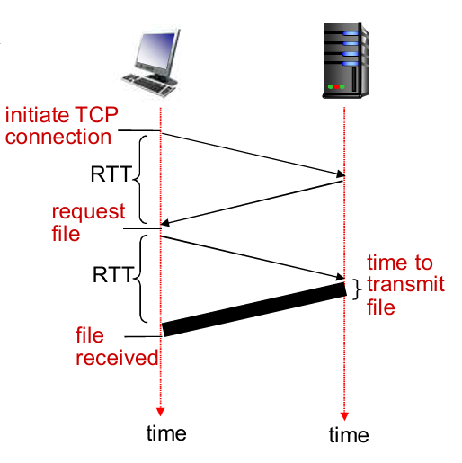

#### 持久HTTP

服务器在发送响应后，仍保持TCP连接，在相同客户端和服务器之间的后续请求和响应报文通过相同的连接进行传送，客户端在遇到一个引用对象的时候，就可以尽快发送该对象的请求。

持久HTTP又可以分为以下两种类型：

- 非流水方式的持久HTTP：客户端只能在收到前一个响应后才能发出新的请求。每个引用对象花费一个RTT。
- 流水方式的持久HTTP：HTTP/1.1的默认模式，客户端遇到一个引用请求就立即产生一个请求，所有引用（小）对象只花费一个RTT是有可能的。

### HTTP请求报文

ASCII码可读的。

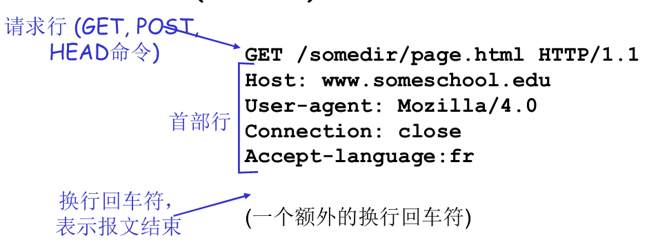

GET从服务器请求，POST上载，HEAD取出html文件的头（搜索引擎拿到头可以建索引）

HOST：主机名

User-agent：用户代理的程序，浏览器

Connection：close代表请求对象回来使得连接关闭，1.1默认是维护连接的。

通用格式：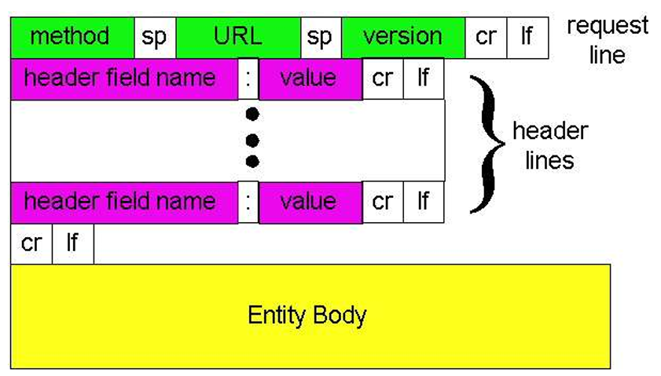

#### 提交表单输入

- [ ] POST方式：网页通常包括表单输入，包含在实体主体(entity body )中的输入被提交到服务器。
- [ ] URL方式：GETmethod，输入通过请求行的url字段上载。

URL方式的例子：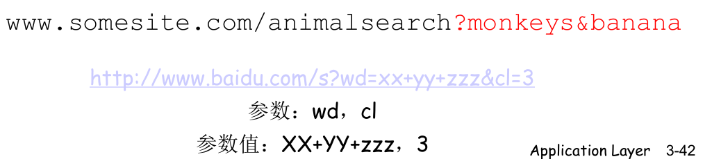

#### 方法类型

HTTP/1.0：

GET、POST、HEAD

HTTP/1.1：

GET、POST、HEAD

PUT：将实体主体中的文件上载到URL字段规定的路径

DELETE：删除URL字段规定的文件

PUT（上载对象）和DELETE（删除对象）往往是网络管理员管理网页向服务器发送的命令

### HTTP响应报文

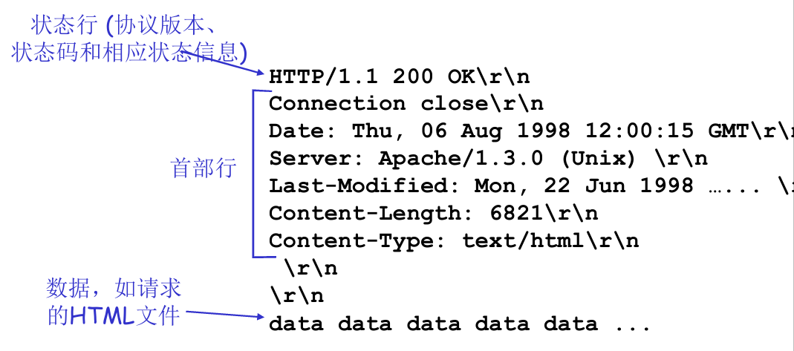

Server：服务器

Last-Modified：返回对象的最后一次修改时间，相当于一个版本号

tcp向上提供的是一个字节流的服务（bite stream），采用tcp这样的应用层协议，得自己维护报文和报文的界限（例如服务器传下来两个15k字节，tcp向上交给客户端可能就是一个30k字节），Content_Length就告诉对方应用实体后面还需读取多少字节的内容。

#### HTTP响应状态码

位于服务器向客户端发出的响应报文中的首行。

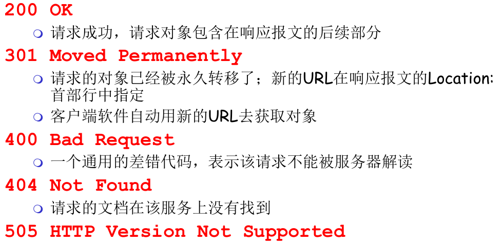

### 用户-服务器状态：cookies

http是无状态的协议，通过cookie能维护服务器与客户端之间的状态。

cookie的4个组成部分：

- 在HTTP响应报文中有一个cookie的首部行。
- 在HTTP请求报文含有一个cookie的首部行。
- 在用户端系统中保留有一个cookie文件，由用户的浏览器管理。
- 在Web站点有一个后端数据库。

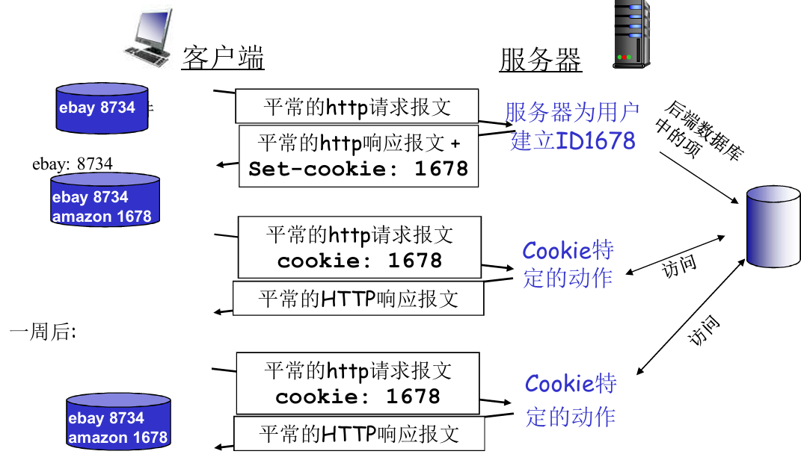

cookie能带来什么：用户验证、购物车、推荐、用户状态。

Cookies允许站点知道许多关于用户的信息，可能将它知道的东西卖给第三方。

使用重定向和cookie的搜索引擎还能知道用户更多的信息（如通过某个用户在大量站点上的行为，了解其个人浏览方式的大致模式），广告公司从站点获得信息。

### Web缓存（代理服务器）

目的：不访问原始服务器，就满足客户的需求。

用户设置浏览器：通过缓存访问Web，浏览器将所有的HTTP请求发给缓存（<u>对象在缓存中</u>（hit），缓存直接返回对象；对象不在缓存中，缓存请求<u>原始服务器</u>（original），然后再将对象返回客户端）。

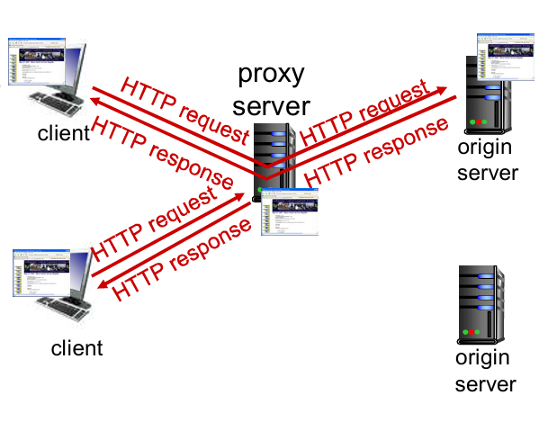

缓存既是客户端又是服务器，通常缓存是由ISP安装。

缓存能降低客户端的请求响应时间，可以大大减少一个机构内部网络与Internent接入链路上的流量，互联网大量采用了缓存：可以使较弱的ICP也能够有效提供内容。

**缓存例子：**

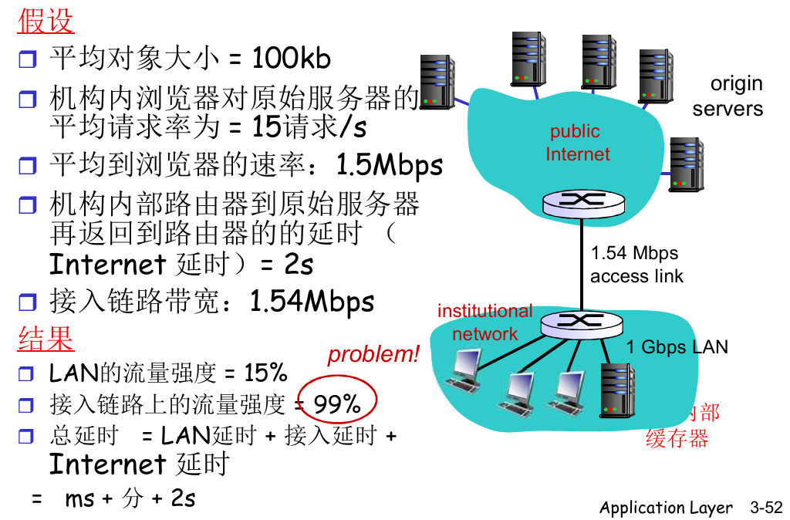

~~解决方法1：更宽的接入链路~~

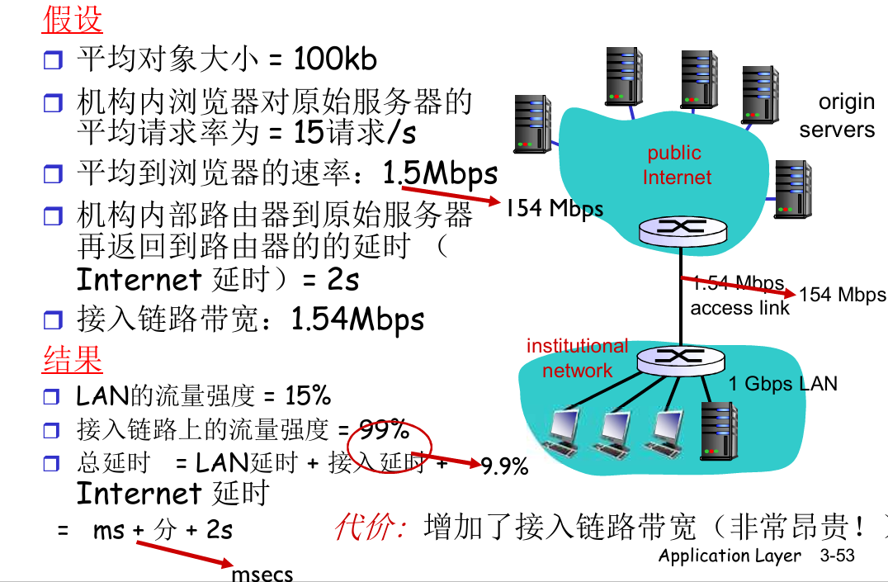

解决方法2：安装缓存

排队延迟=L/R * i/(1-i)，i为接入带宽利用率

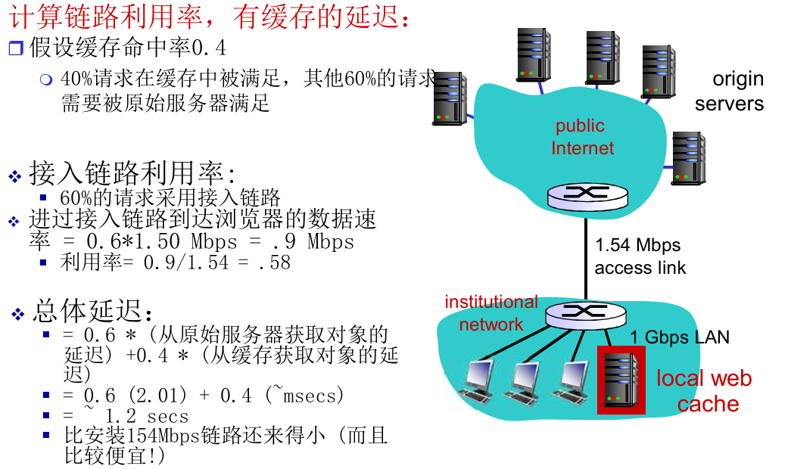

### Conditional GET

目标：如果缓存器中的对象拷贝是最新的，就不要发送对象。

缓存器: 在HTTP请求中指定缓存拷贝的日期 `If-modified-since: <date>`

服务器: 如果缓存拷贝陈旧，则响应报文没包含对象: HTTP/1.0 304 Not Modified

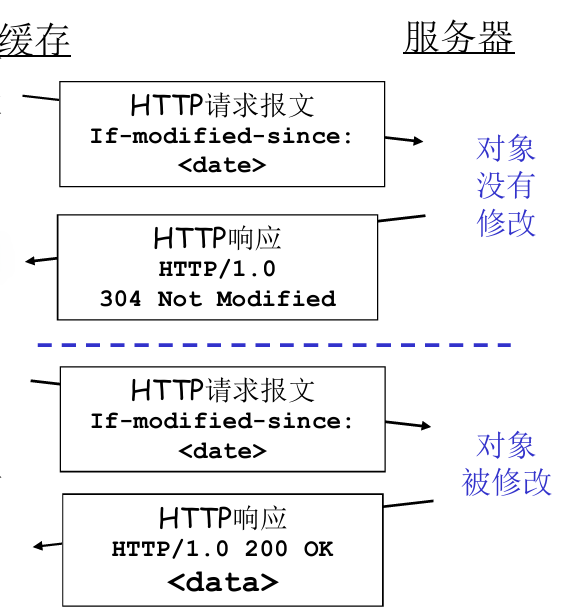

## FTP

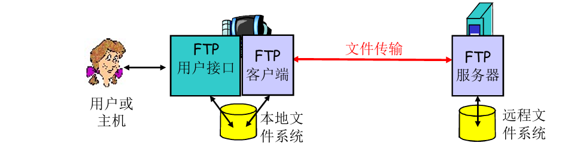

C/S模式

ftp服务器：端口号为21

### FTP: 控制连接与数据连接分开

1. FTP客户端与FTP服务器通过端口21联系，并使用TCP为传输协议；

2. 客户端通过控制连接获得身份确认；

3. 客户端通过控制连接发送命令浏览远程目录；

4. 收到一个文件传输命令时，**服务器打开一个到客户端的数据连接（服务器向客户端发送连接请求）**，运行在TCP的port 20；

5. 一个文件传输完成后，服务器关闭连接。

控制连接又称为带外（out of band）传送，数据连接是带内的。

FTP协议是有状态的协议：FTP服务器维护用户的状态信息（当前路径、用户帐户与控制连接对应）。

### FTP命令、响应

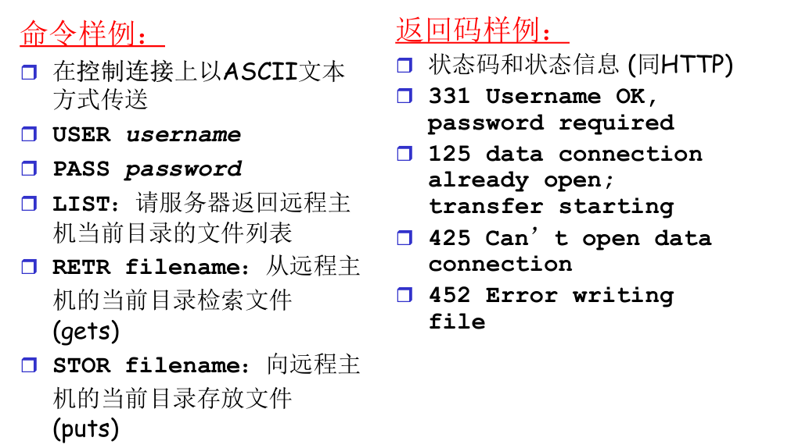

## 电子邮件（EMail）

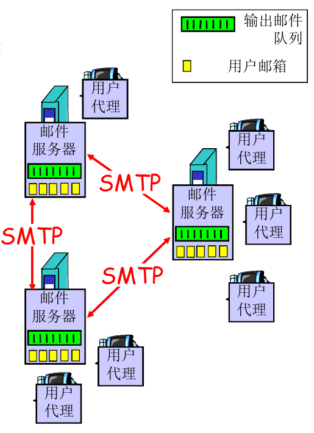

3个组成部分：用户代理、邮件服务器、简单邮件传输协议SMTP。

用户代理：又名邮件阅读器，撰写、编辑和阅读邮件，如Outlook、Foxmail，输出和输入邮件保存在服务器上。

邮件服务器：邮箱中管理和维护发送给用户的邮件，输出报文队列保持待发送邮件报文。

发送的时候用户代理发送给邮件服务器（SMTP），邮件服务器发送给目标邮件服务器（SMTP），用户代理通过存取协议从邮件服务器中的用户邮箱中拉取相应的内容。

### SMTP

使用TCP在客户端和服务器之间传送报文，端口号为25。直接从发送方服务器传输到接收方服务器。传输有三个阶段：握手，传输报文，关闭。命令为ASCII文本，相应包含状态码和状态信息。报文必须为7位ASCII码。

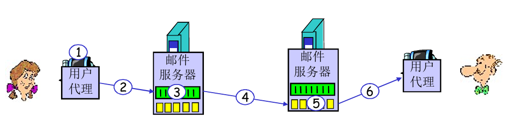

SMTP使用持久连接（一次连接中，所有的邮件都传完后才关闭连接），SMTP服务器使用CRLF.CRLF决定报文的尾部。

与HTTP比较：

1. HTTP是拉的（pull），SMTP是推的（push）。
2. 命令、相应交互、状态码都是ASCII的形式。
3. HTTP中每个对象封装在各自的相应报文中，SMTP中多个对象包含在一个报文中。

### 邮件报文格式

首部行：To，From，Subject...

主体：报文，只能是ASCII。

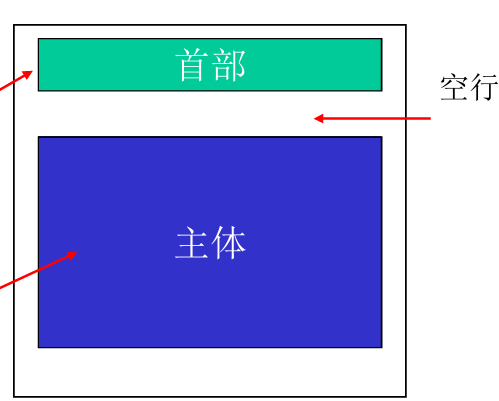

#### 报文格式的拓展

MIME：多媒体邮件扩展（multimedia mail extension），在报文首部用额外的行申明MIME内容类型。

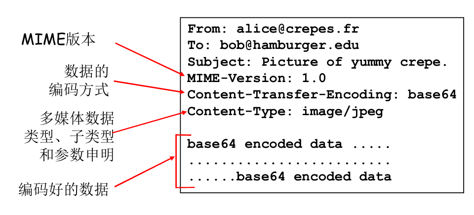

采用base64等编码手段可以ASCII的形式传送中文，可执行文件等，收件方再进行解码即可。

### ”第三跳“

邮件第三跳中采用拉的协议，有POP3，IMAP，HTTP。

POP：邮局访问协议，用户身份确认(代理<-->服务器) 并下载

IMAP：Internet邮件访问协议，比POP具有更多特性、更复杂（如远程目录的维护...），在服务器上处理存储的报文。

HTTP：方便，Hotmail , Yahoo! Mail等。

#### POP3（包含两个阶段）

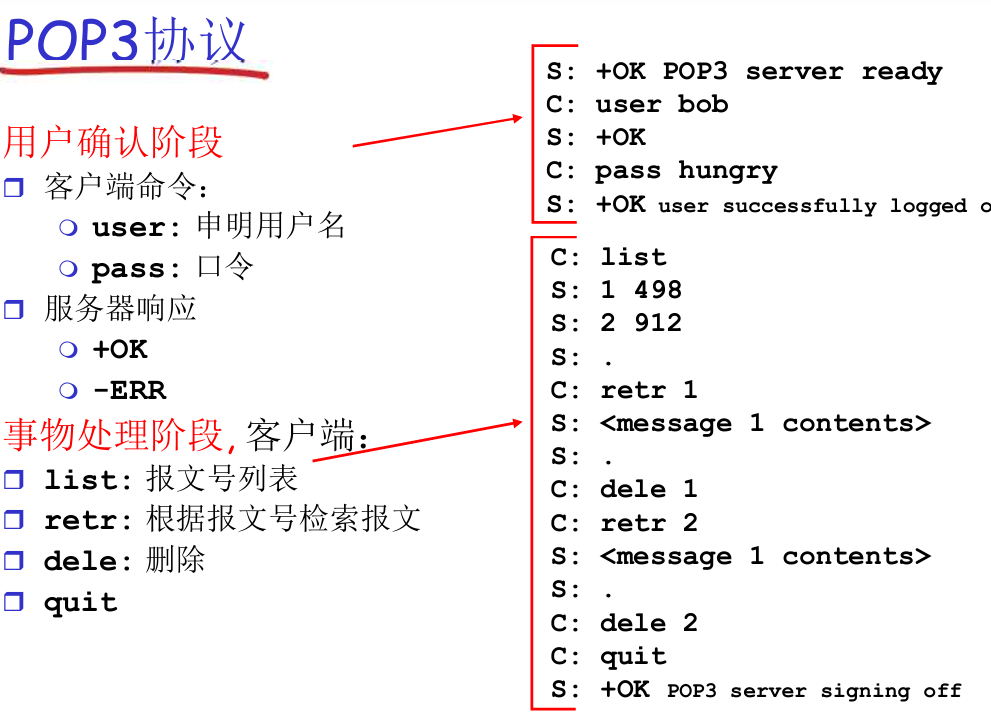

下载并删除模式，如果改变客户机将不能阅读邮件，下载并保留则仍然可以，因为邮件仍然在邮箱中。

POP3在会话中是无状态的。

#### IMAP

IMAP服务器将每个报文与一个文件夹联系起来，允许用户用目录来组织报文，允许用户读取报文组件。

IMAP在会话中保留用户状态（目录名、报文ID与目录名之间映射）。

## DNS（Domain Name System）

IP地址用于标示和寻址，ipv4是4个字节，ipv6是16个字节，但是IP地址不好记忆。

由DNS负责将域名转换成二进制地网络地址。

### 需要解决的问题

1. 如何命名设备，同时需要解决一个重名的问题？（层次化命名）
2. 如何完成名字到IP地址的转换？（分布式数据库维护）
3. 如何进行维护：增删一个域，需要在域名系统中做哪些工作？

### DNS的总体思路和目标

- [ ] 主要思路：
  - 分层的、基于域的命名机制
  - 若干分布式的数据库完成名字到IP地址的转换
  - 运行在UDP之上的53号端口的应用服务
  - 互联网的核心功能，但是是在网络边缘中的应用层实现的

- [ ] 主要目标：
  - 实现主机名-IP地址的转换（name/IP translate）
  - 主机别名（方便用户访问，www.baidu.com）到规范名字（便于管理，xx西海岸xx机房xx服务器）的转换：Host aliasing
  - 邮件服务器别名到邮件服务器的正规名字的转换：Mail server aliasing
  - 负载均衡：Load Distribution

### 问题1：DNS名字空间（The DNS Name Space）

Internet根被划为几百个顶级域（top lever domains）：

- 通用的（generic）：.com; .edu; .gov; .int; .mil; .net; .org; .firm; .hsop; .web; .arts; .rec;
- 国家的（countries）：.cn; .us; .nl; .jp

每个（子）域下面可划分为若干子域（subdomains），像一颗倒着生长的树，树叶是主机。

#### DNS：根名字服务器

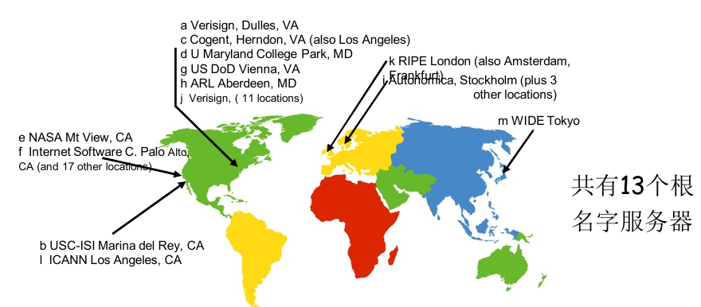

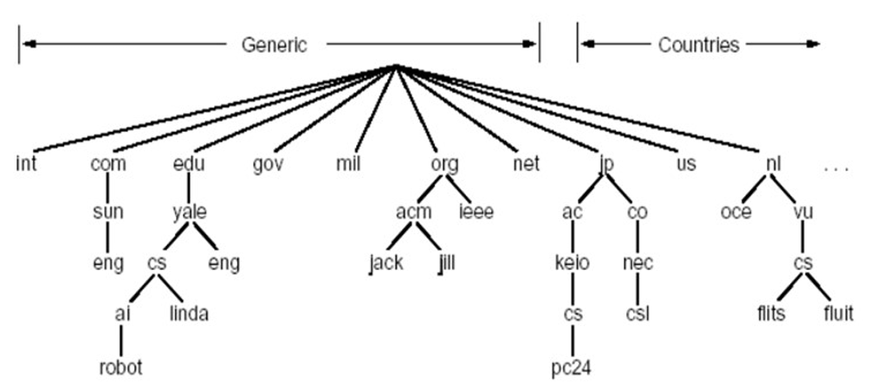

子域的命名由其上的顶级域来决定，一个域管理其下的子域，创建一个新的域，必须征得它所属域的同意。

主机的域名：从树叶开始往上走，直到树根，中间用逗点隔开；

域的域名：从树枝开始往上走，直到树根，中间用逗点隔开。

域与物理网络无关：域遵从组织界限，而不是物理网络（一个域的主机可以不在一个网络，一个网络的主机不一定在一个域）；域的划分是逻辑的，而不是物理的。

### 问题2：解析问题-名字服务器（Name Server）

单个名字服务器会存在诸多问题。

区域的划分有区域管理者自己决定，将DNS名字空间划分为互不相交的区域，每个区域都是树的一部分。

名字服务器：每个区域都有一个名字服务器，维护着它所管辖区域的权威信息(authoritative record)；名字服务器允许被放置在区域之外，以保障可靠性。

权威DNS服务器：组织机构的DNS服务器，提供组织机构服务器（如Web和mail）可访问的主机和IP之间的映射；组织机构可以选择实现自己维护或由某个服务提供商来维护。

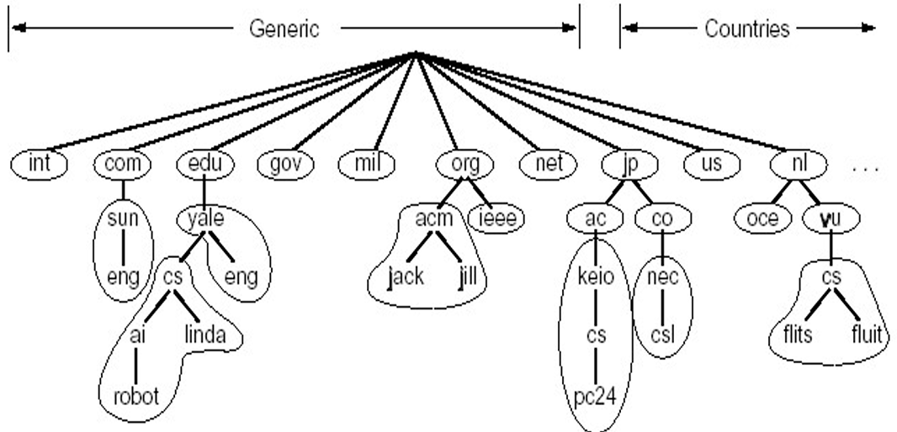

#### TLD服务器

顶级域(TLD)服务器：负责顶级域名（如com, org, net, edu和gov）和所有国家级的顶级域名（如cn, uk, fr, ca, jp ）

Network solutions 公司维护com TLD服务器，Educause公司维护edu TLD服务器。

#### 区域名字服务器维护资源记录

- 资源记录（resource records）：维护域名-IP地址(其它)的映射关系，位于Name Server的分布式数据库中。
- RR格式：(domain_name, ttl, type,class,Value)
  - Domain_name: 域名
  - Ttl: time to live : 生存时间(权威记录永久，缓冲记录有限一般2天)，储存缓存记录是为了方便查询，删除缓存记录为了保持一致性（服务器可能更改ip）
  - Class 类别：对于Internet，值为IN，对于别的网络可能不为IN
  - Value 值：可以是数字，域名或ASCII串
  - Type 类别：资源记录的类型，具体见下

**Type：**

Type=A：Name为主机（域名），Value为IP地址；

Type=CNAME：Name为规范名字的别名（www.ibm.com 的规范名字为 servereast.backup2.ibm.com），Value为规范名字；

Type=MX：Name为邮件服务器的别名，Value为别名对应的规范名字；

Type=NS：Name为子域的名字，Value为权威名字服务器的域名。

所以说，上层要知道下层域的信息需要两条资源记录，一条Type=NS，另一条Type=A。

#### DNS工作过程

一台设备想要上网，必须具备以下4个信息：ip地址，子网掩码，default gateway（发向子网外的分组）以及name server，这几个信息自动配或者手工配。

大致工作过程如下：应用调用解析器（resolver），解析器作为客户向name server发出查询报文（封装在UDP段中），name server返回响应报文（name/ip）。

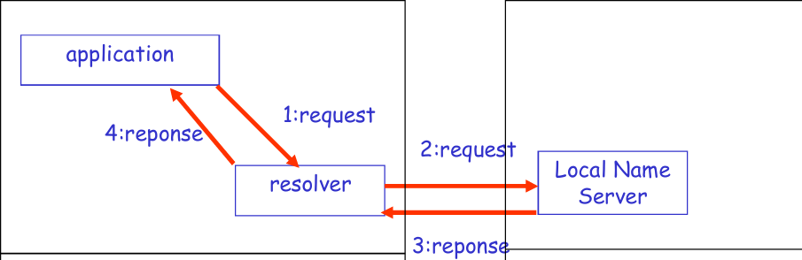

#### Local Name Server

上述过程用户可以指定任何一个name server作为name server，但一般指定一个比较近的作为名字服务器（同一个子网内，传输快），因此称为local name server。

local name server并不严格属于层次结构，每个ISP都有一个本地DNS服务器（也称为“默认名字服务器”），当一个主机发起一个DNS查询时，查询被送到其本地DNS服务器（起着代理的作用，将查询转发到层次结构中）

#### 名字解析过程

（1）目标名字在local name server中（查询的名字在该区域内部 or cashing）

（2）当与本地名字服务器不能解析名字时，联系根名字服务器顺着**根-TLD**一直找到权威名字服务器。

#### 递归查询

名字解析负担都放在当前联络的名字服务器上，但是根服务器的负担太重（可以采用迭代查询）。

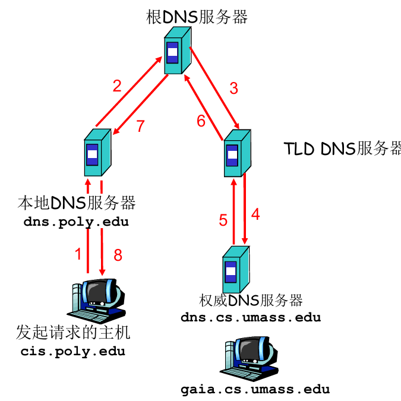

#### 迭代查询

例如，主机cis.poly.edu想知道主机gaia.cs.umass.edu的IP地址，根（及各级域名）服务器返回的不是查询结果，而是下一个DNS的地址，最后由权威名字服务器给出解析结果。

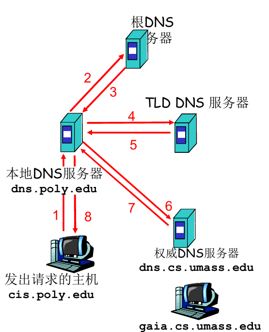

#### DNS协议、报文

DNS协议：查询和响应报文的报文格式相同。

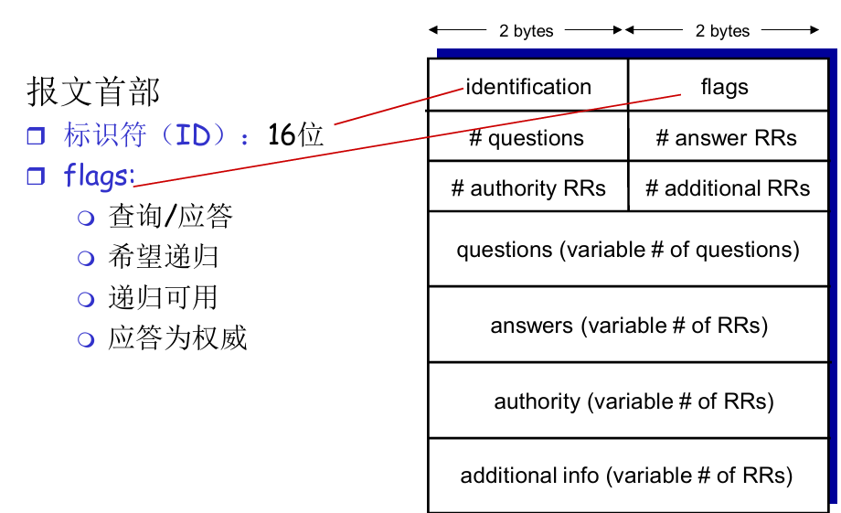

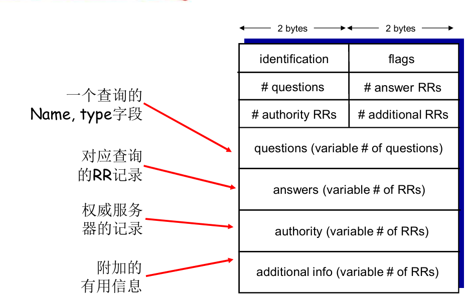

### 问题3：维护问题，新增一个域

在上级域的名字服务器中增加两条记录，指向这个新增的子域的域名和域名服务器的地址（Type=NS，Type=A[名字服务器]）；在新增子域的名字服务器上运行名字服务器（需包含Type=A[新增子域]的资源记录），负责本域的名字解析：名字->IP地址。

删改也是如此。

### 攻击DNS

总的来说，DNS比较健壮。

DDos攻击、重定向攻击、利用DNS基础设施进行DDoS。

## P2P应用

这里介绍的是一类应用，如文件分发（BitTorrent）、流媒体（KanKan）、VoIP（Skype，互联网电话）。

### 文件分发的案例

> 从一台服务器分发文件（大小F）到N个peer需要多少时间？

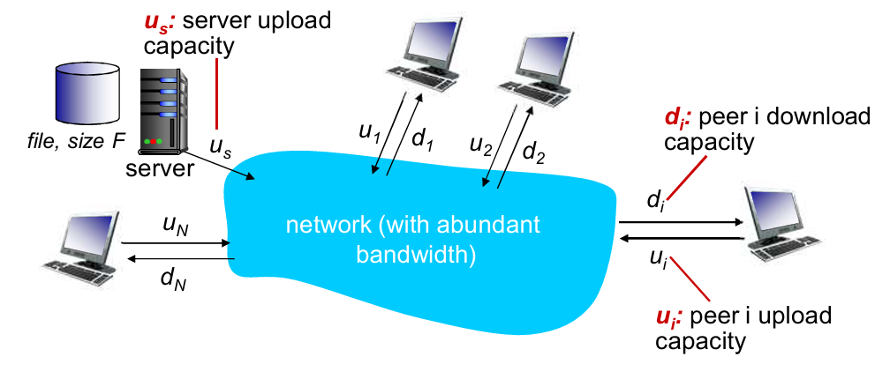

**C/S模式：**

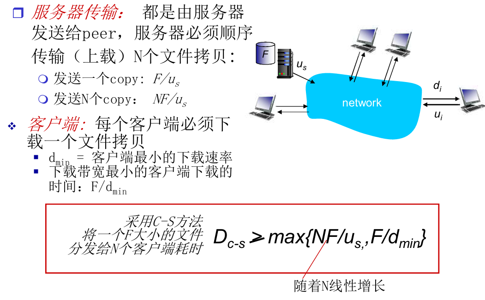

**P2P模式：**

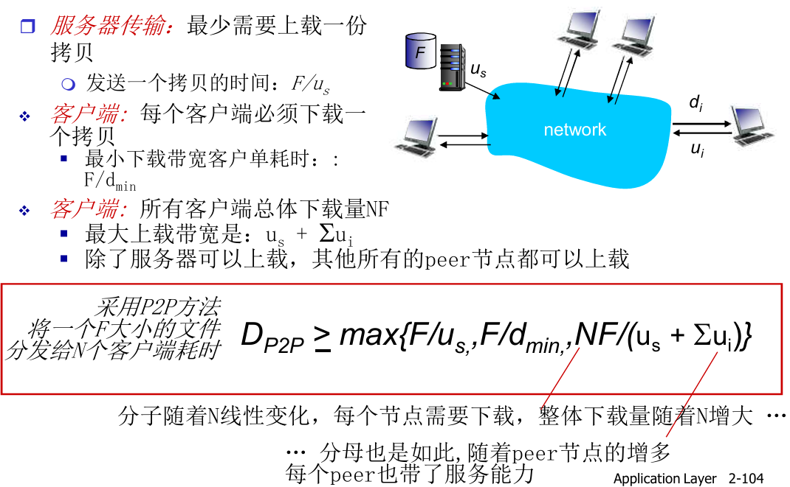

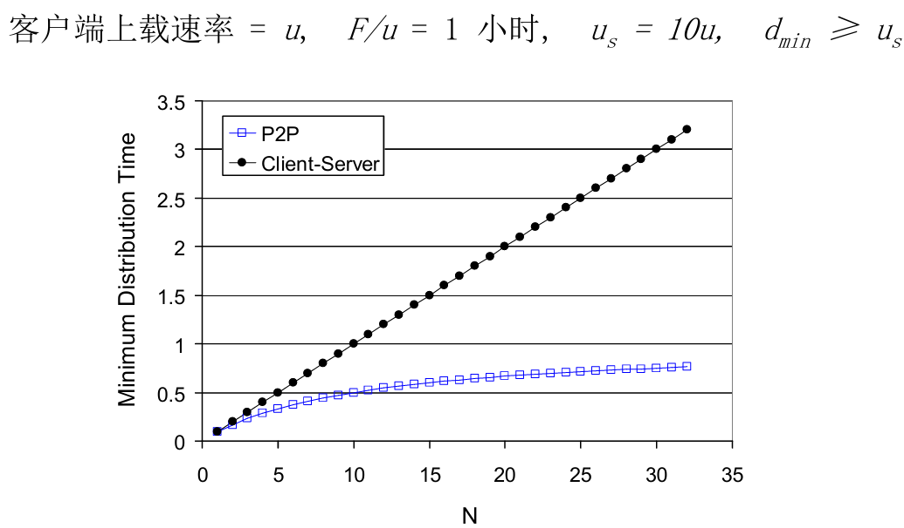

### P2P的分类

任意两个Peer节点形成一个邻居关系（边），称为overlay，覆盖网，是应用层上的逻辑的网络。

**非结构化P2P：**Peer节点形成的overlay是随意的。

- 集中式目录：Napster，问题有若目录服务器故障；很多客户端请求查询；集中式目录服务器容易被定位，存在版权问题。
- 完全分布式：Gnutella，所有的节点形成一个覆盖网络进行泛洪式的查询（flooding），可以通过设置ttl、使中转节点不多次转发同一节点的查询请求来限制泛洪。
  - 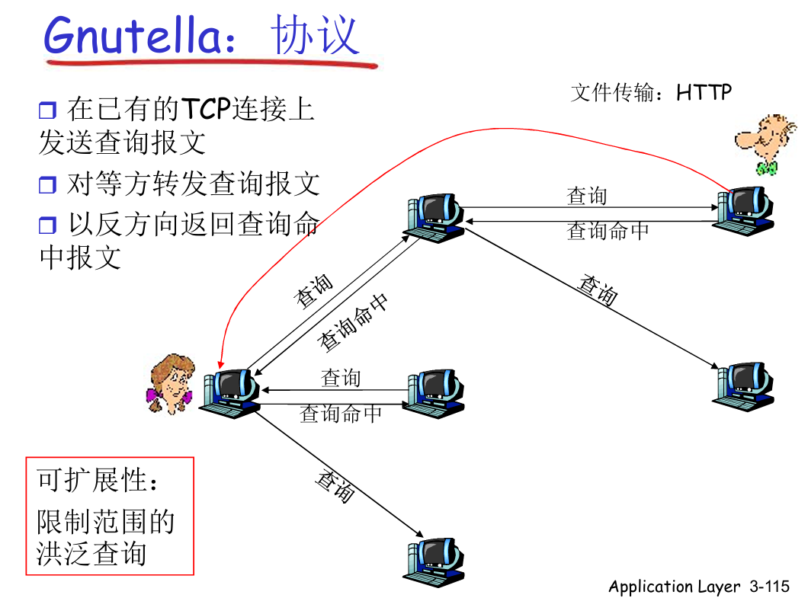
  - 覆盖网络建立：
    - 新节点加入：下载软件后有一张死党列表（经常开机的对等方的IP），新的节点（源节点）向死党列表发出ping，收到ping的节点一方面向源节点发出pong，另一方面向与其连接的节点发出ping；如此往复下，源节点收到众多pong回复，选取若干个作为其邻居建立连接。
    - 节点删除：要退出节点的网络向与之连接的节点发出报文，与之连接的节点删除该连接并选取其他节点建立连接以满足连接强度要求。
- 混合体：KaZaA，每个对等体要么是一个组长，要么隶属于一个组长；组长之间是分布式（Gnutella），一个组之内是集中式的（Napster）。
  - 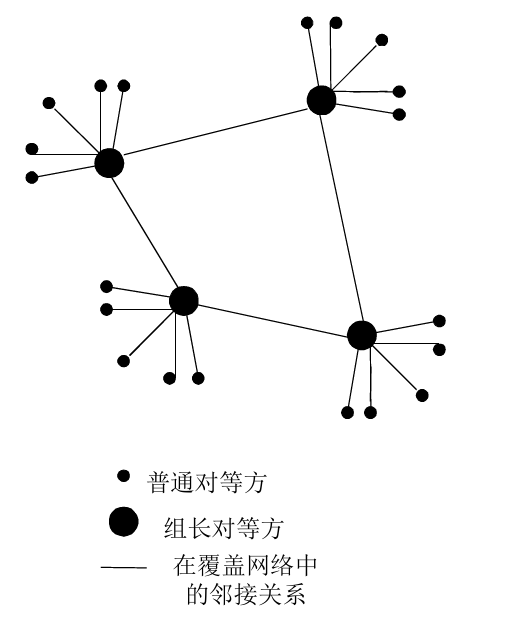
  - 
  - 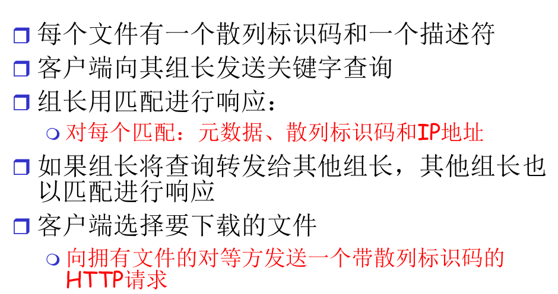
  - 查询时根据文件的描述进行匹配，然后把文件的哈希值作为唯一id来进行请求。
  - 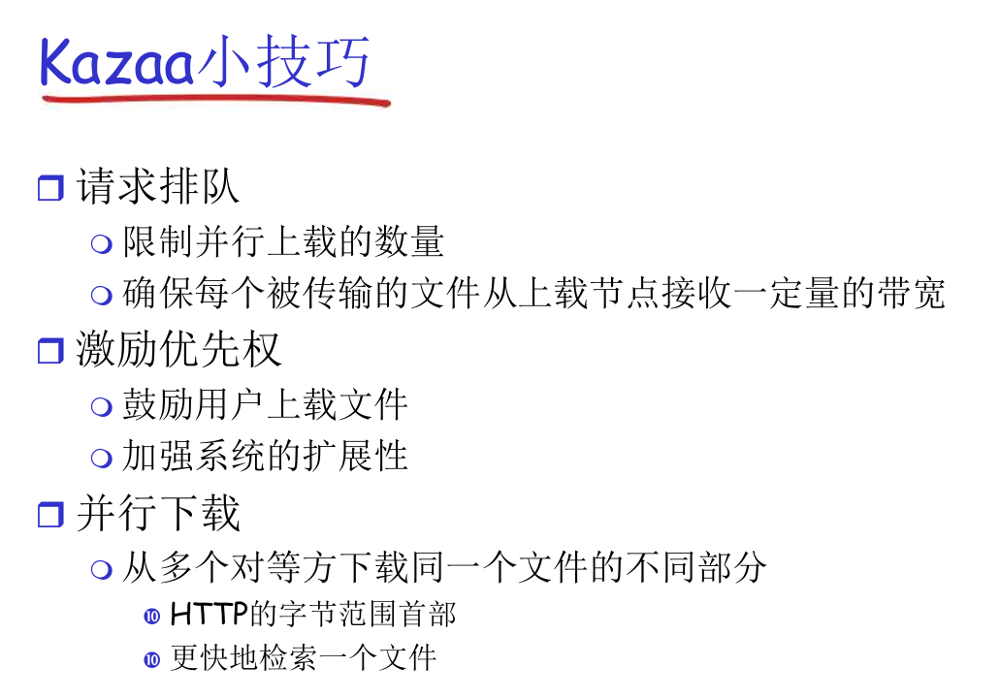

**DHT(结构化)P2P：**overlay是有序的，可以形成环或树。

### P2P文件分发：BitTorrent


文件被分为一个个块256kB，同时使用一个bitmap来记录节点是否具有每个256kB(例如bitmap中一个bit是1为具有，是0为不具有)。

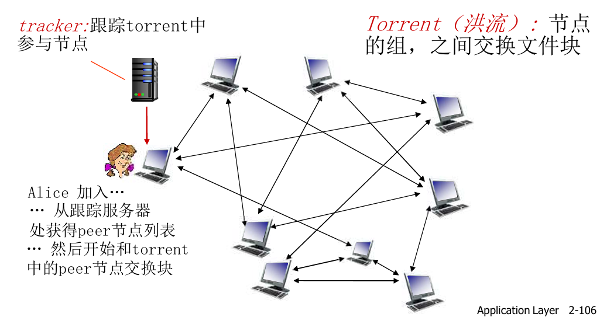

Alice通过检索引擎匹配内容，下载相应的torrent文件，torrent文件中包含tracking server（跟踪服务器，管理哪些节点正在进行该文件的上下载），Alice向tracking server发送想要加入的信令，得到回复（peer节点列表），Alice加入洪流中称为吸血鬼，和部分peer节点构成邻居关系。

请求块：Alice首先先随机获取其中四块，向其他节点提供服务；其后再请求洪流中稀缺的块。

当peer下载时，该peer可以同时向其他节点提供上载服务。Peer可能会变换用于交换块的peer节点。peer节点可能会上线或者下线（扰动churn）。

发送块：Alice向4个peer节点发送块，这些块向Alice提供最大带宽的服务。（其他peer被Alice阻塞，将不会从Alice处获得服务；Alice每10秒重新评估一次：选取为自己提供最大带宽服务的前4位）除此之外，每30秒Alice随机选择其他peer节点，向这个节点发送块。（称为“优化疏通”这个节点，新选择的节点可以加入这个top 4）。

优化疏通的好处：tit-for-tat

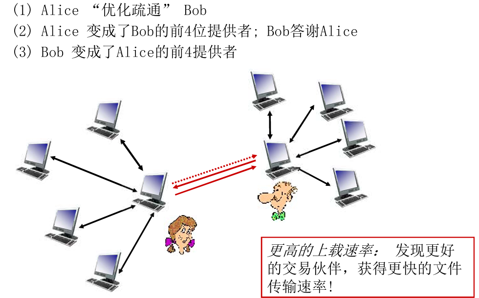

当一个节点获取到文件的所有块时，它从吸血鬼变成了种子：它会（自私的）离开或者保留（利他主义）在torrent中。

### 结构化P2P（Distributed Hash Table (DHT)）

每个节点将其ip地址作一个hash，根据hash值和一定规则形成有序的拓扑（环...），对于文件也作一个hash，按照一定规则储存在某个节点。

查询时，根据规则可以很快得到所需文件在何处。

不需要很多的副本也能实现快速查询。

## CDN

视频流量占据着互联网大部分的带宽，存在如下挑战：如何服务数量庞大的用户；用户具有异构性。

### 多媒体：视频

视频是以固定速率显示的图像序列。

网络视频的特点：高码率（10倍于音频，具有较高的网络带宽需求），可以被压缩，90%以上的网络流量是视频。

数字化图像：像素的阵列，每个像素被若干bits表示。

编码：使用图像内（空间）和图像间（时间）的冗余来降低编码的比特数。

- CBR（constant bit  rate）：以固定速率编码
- VBR（variable bit  rate）：视频编码速率随时间的变化而变化

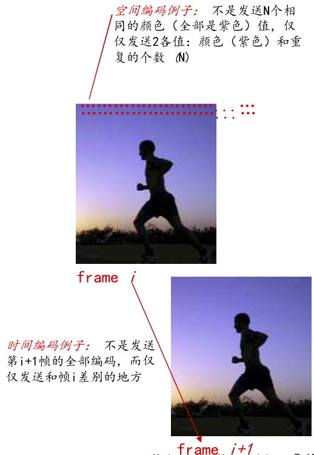

### 存储视频的流化服务

由于缓冲区的存在，用户可以一边下载一边观看网络视频（播放器不断从缓冲区中提取并解析），play out delay很低。

#### DASH

Dynamic, Adaptive Streaming over HTTP，流媒体播放协议

服务器：

- 将视频文件分割成多个块
- 每个块独立存储，编码于不同码率（8-10种）
- 告示文件（manifest file）: 提供不同块的信息以及URL

客户端：

- 先获取告示文件
- 周期性地测量服务器到客户端的带宽
- 查询告示文件，在一个时刻请求一个块，HTTP头部指定字节范围
- 智能化的客户端可以有客户端自适应决定什么时候请求块，请求什么编码速率的块，去哪里请求块。

### Content Distribution Networks

> 服务器如何通过网络向上百万用户同时流化视频内容(上百万视频内容)？

选择1：单个的、大的超级服务中心“mega-server”

- [ ] 服务器到客户端跳数比较多，受到瓶颈链路的制约。
- [ ] 单点故障
- [ ] 二八定律决定了网络同时充斥着同一个视频的多个拷贝，效率低。

综合来看，这种方式的可扩展性差。

选择2：通过CDN，全网部署缓存节点，存储服务内容，就近为用户提供服务，提高用户体验

- [ ] enter deep：将CDN服务器深入到许多接入网
  - 更接近用户，数量多，离用户近，管理困难
  - Akamai
- [ ] bring home：部署在少数(10个左右)关键位置，如将服务器簇安装于POP（接入点）附近（离若干1st ISP POP较近）
  - 采用租用线路将服务器簇连接起来
  - Limelight

在CDN节点中存储内容的多个拷贝，用户从CDN中请求内容，重定向请求内容。CDN的cache节点运行在应用层，网络边缘（**Over The Top**），互联网络主机-主机之间的通信作为一种服务（内容加速）向用户提供。

OTT挑战：如何在在拥塞的互联网上复制内容（在不同条件下在哪个节点中获取内容，部署策略）

### CDN：“简单”内容访问场景

Bob（客户端）请求视频`http://netcinema.com/6Y7B23V`，视频存储在CDN，位于`http://KingCDN.com/NetC6y&B23V`。

Bob先得到这个视频的url，询问local DNS；local DNS问到netcinema的权威名字服务器，获得一个重定向的url（CDN）；通过KingCDN的权威名字服务器，解析这个重定向的url，得到一个最佳的cache节点（CDN簇选择策略）的ip。

### 案例学习：Netflix（网飞）

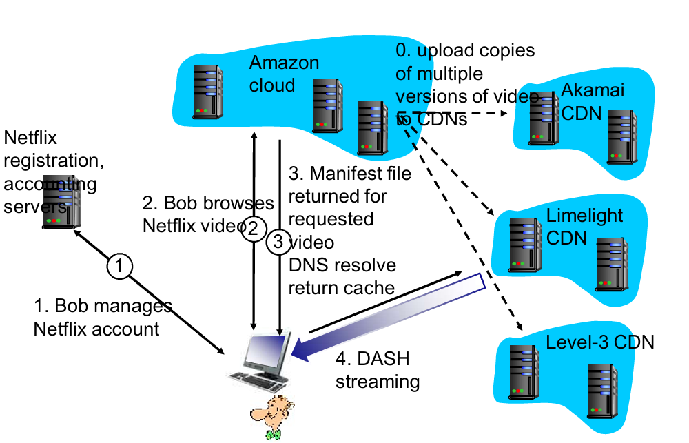

## TCP套接字编程

### socket回顾

socket（套接字）：分布式应用进程之间的门，传输层协议提供的端到端服务接口。

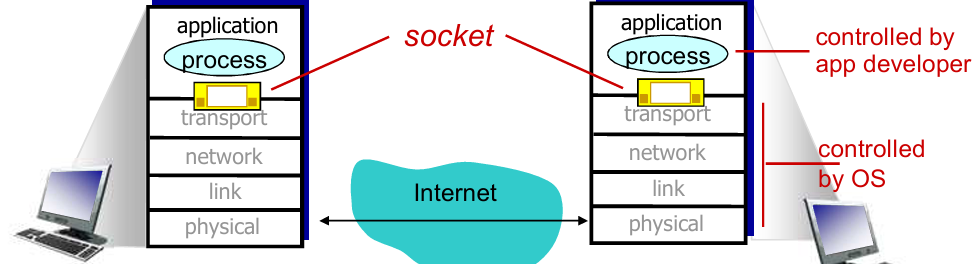

socket编程：

-  TCP：可靠的，字节流的服务，从一个进程向另一个进程可靠地传输字节流
- UDP：不可靠（数据UDP数据报）服务

### TCP套接字编程

服务器首先运行，等待连接建立。

1：服务器进程必须先处于运行状态

- 创建欢迎socket（welcome socket）
- 和本地端口捆绑
- 在welcome socket上阻塞式等待接收用户的连接

客户端主动和服务器建立连接。

2：创建客户端本地套接字（隐式捆绑到客户端本地的port）

- 指定服务器进程的IP地址和端口号，与服务器进程连接

3：当与客户端连接请求到来时

- 服务器接受来自用户端的请求，解除阻塞式等待，返回一个新的socket（与welcome socket不一样），与客户端通信
  - 允许服务器与多个客户端通信
  - 使用源IP和源端口来区分不同的客户端

4：连接API调用有效时，客户端与服务器建立了TCP连接

### 数据结构

#### sockaddr_in

IP地址和port捆绑关系的数据结构（标示进程的端节点）

```c
struct sockadrr_in {
    short sin_family; // AF_INET，地址簇，常数代表用于tcp ip的通信还是ipx的通信
    u_short sin_port; // port
    struct in_addr sin_addr; //IP address, unsigned long
    char sin_zero[8]; // align
}
```

#### hostent

域名和IP地址的数据结构

```c
struct hostent {
    char *h_name; // 指向主机的域名
    char **h_aliases; // 指向一系列主机的别名
    int h_addrtype; 
    int h_length; // 地址长度
    char **h_addr_list; // ip地址的列表,指向该主机的所有IP地址,通常我们取第一个使用。
    #define h_addr h_addr_list[0]; // ip[0]
}
```

作为调用域名解析函数时的参数，返回后，将IP地址拷贝到sockaddr_in的IP地址部分。

### 一个案例

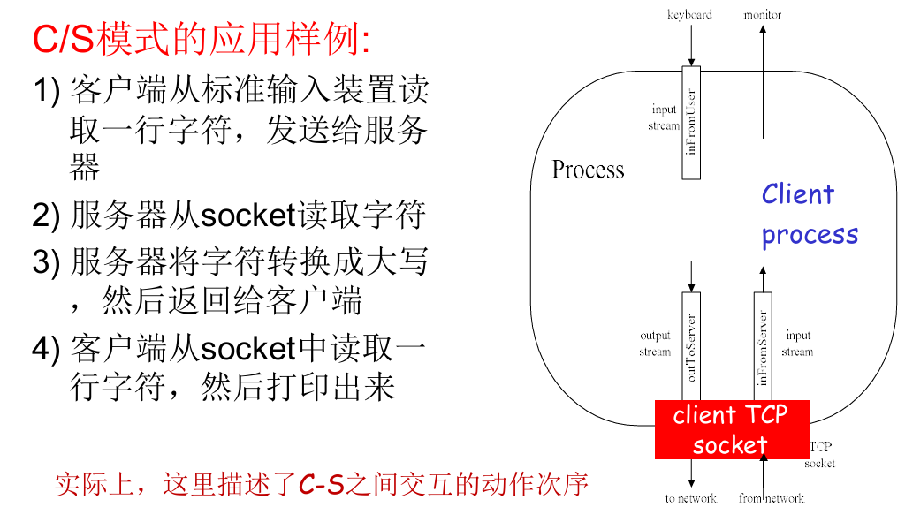

 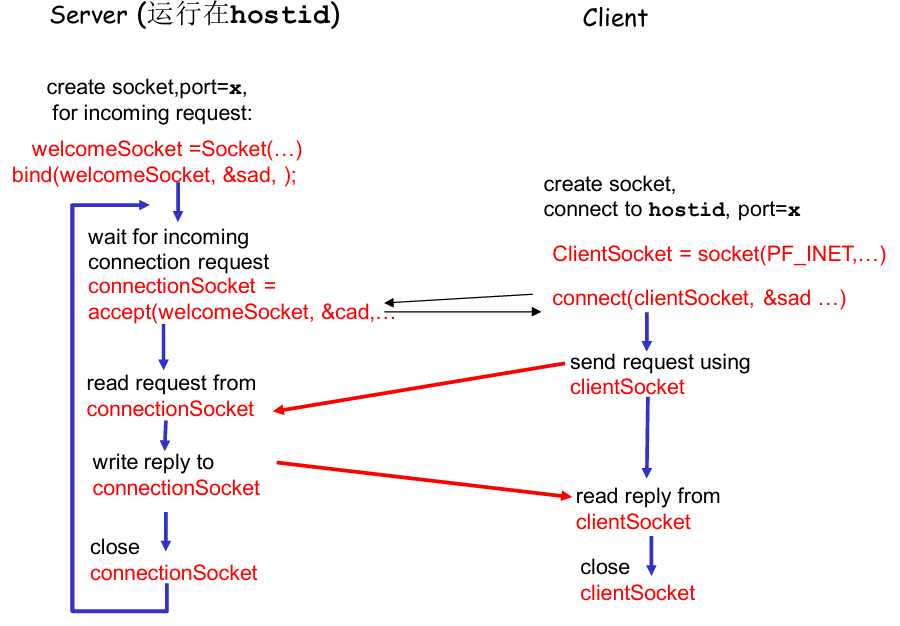

```c
// client.c
#include<stdio.h>

void main(int argc, char *argv[]) {
    struct sockaddr_in sad; // structure to hold an IP address of server
    int clientSocket; // socket descriptor
    struct hostent *ptrh; // pointer to a host table entry
    
    char Sentence[128];
    char modifiedSentence[128];
    
    host = argv[1];
    port = atoi(argv[2]);
    
    clientSocket = socket(PF_INET, SOCK_STREAM, 0);
    memset((char *)&sad, 0, sizeof(sad));
    sad.sin_family = AF_INET; // set family to Internet
    sad.sin_port = htons((u_short)port);
    ptrh = gethostbyname(host); // convert host name to ip address，调用解析器
    memcpy(&sad.sin_addr, ptrh->h_addr, ptrh->h_length); // copy ip address to sad.sin_addr
    connect(clientSocket, (struct sockaddr*)&sad, sizeof(sad));
    gets(Sentence); //get input from user
    n = write(clientSocket, Sentence, strlen(Sentence)+1);
    n = read(clientSocket, modifiedSentence, sizeof(modifiedSentence));
    printf("FROM Server: %s\n", modifiedSentence);
    close(clientSocket); // close connection
}

```

```c
// server.c

#include <stdio.h>

void main(int argc, char *argv[]) {
    struct sockaddr_in sad; // structure to hold an IP address of server
    struct sockaddr_in cad; // client
    int welcomeSocket, connectionSocket; // socket descriptor
    struct hostent *ptr; // pointer to a host table entry
    
    char clientSentence[128];
    char capitalizedSentence[128];
    
    port = atoi(argv[1]);
    
    welcomeSocket = socket(PF_INET, SOCK_STREAM, 0);
    memset((char *)&sad, 0, sizeof(sad));
    sad.sin_family = AF_INET;
    sad.sin_addr.s_addr = INADDR_ANY;
    sad.sin_port = htons((u_short)port);
    bind(welcomeSocket, (struct sockaddr *)&sad, sizeof(sad));
    
    listen(welcomeSocket, 10);
    
    while(1) {
        connectionSocket = accept(welcomeSocket, (struct sockaddr*)&cad, &alen);
        n = read(connectionSocket, clientSentence, sizeof(clientSentence));
        
        /* capitalize Sentence and store the result in capitalizedSentence*/
        
        n = write(connectionSocket, capitalizedSentence, strlen(capitalizedSentence)+1);
        
        close(connectionSocket);
    }
}
```

## UDP套接字编程

没有握手，发送端在每个报文中明确地指定目标地IP地址和端口号，服务器必须从收到的分组中提取出发送端的IP地址和端口号。传送的数据可能乱序，也可能丢失。

### 一个案例

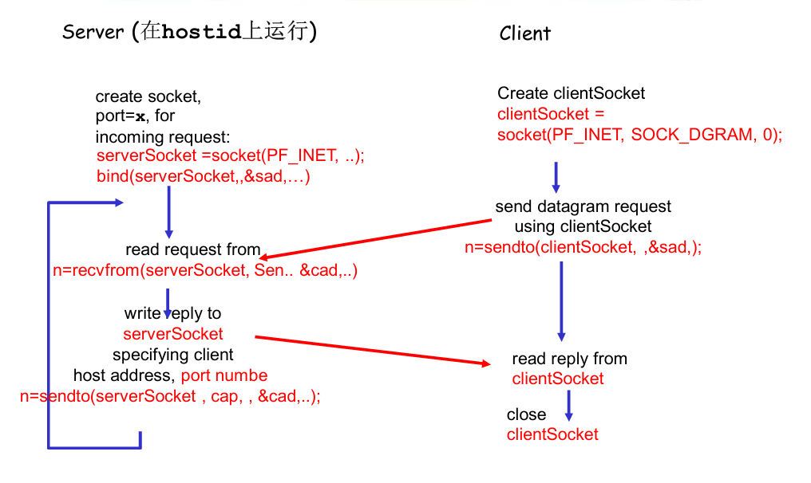

```c
// client.c
void main(int argc, char *argv[]) {
    struct sockaddr_in sad; // structure to hold an IP address
    int clientSocket; // socket descriptor
    struct hostent *ptrh; // pointer to a host table entry
    
    char Sentence[128];
    char modifiedSentence[128];
    
    host = argv[1];
    port = atoi(argv[2]);
    
    clientSocket = socket(PF_INET, SOCK_DGRAM, 0);
    
    // determine the server's address
    memset((char *)&sad, 0, sizeof(sad));
    sad.sin_family = AF_INET;
    sad.sin_port = htons((u_short)port);
    ptrh = gethostbyname(host);
    memcpy(&sad.sin_addr, ptrh->h_addr, ptrh->h_length);
    
    gets(Sentence);
    addr_len = sizeof(struct sockaddr);
    n = sendto(clientSocket, Sentence, strlen(Sentence)+1, (struct sockaddr *)&sad, addr_len); //使用strlen为了更好地节省空间，因为可能小于128个有效字符
    n = recvfrom(clientSocket, modifiedSentence, sizeof(modifiedSentence), (struct sockaddr*)&sad, &addr_len);
    
    printf("FROM SERVER: %s\n", modifiedSentence);
    
    close(clientSocket);
}
```

```c
// server.c
void main(int argc, char *argv[]) {
    struct sockaddr_in sad;
    struct sockaddr_in cad;
    int serverSocket;
    struct hostent *ptrh;
    
    char clientSentence[128];
    char capitalizedSentence[128];
    
    port = atoi(argv[1]);
    
    serverSocket = socket(PF_INET, SOCK_DGRAM, 0);
    memset((char *)&sad, 0, sizeof(sad));
    sad.sin_family = AF_INET;
    sad.sin_addr.s_addr = INADDR_ANY; // set the local IP address
    sad.sin_port = htons((u_short) port);
    bind(serverSocket, (struct sockaddr*)&sad, sizeof(sad));
    
    while(1) {
        n = recvfrom(serverSocket, clientSentence, sizeof(clientSentence), (struct sockaddr *)&cad, &addr_len);
        
        /* capitalize the Sentence */
        
        n = sendto(serverSocket, capitalizedSentence, strlen(capitalizedSentence)+1, (struct sockaddr*)&cad, addr_len);
    }
}
```

