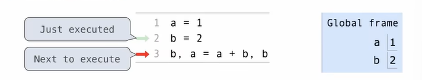

# Function

## Task 1:

```python
>>> f = min
>>> f = max
>>> g, h = min, max
>>> max = g
>>> max(f(2, g(h(1, 5), 3)), 4)
>>> ?
## what's the value of '?' ?
```

answer:


here gives an example

```python
a = 1
b = 2
b, a = a + b, b
```




The execution rule:

1. A name can only be bound to one value in a frame.

2. Evaluate  all expressions to the right of ''='' from left to right.

3. Bind all names to the left of ''='' to the resulting values in the current frame. (Note that the older bond was lost. As in task 1, max was once a built-in function, but after executing "max = g", max was rebound to g, where g is bound to the built-in function min)

## Procedure for calling/applying user-defined functions:

1.  Add a local frame, forming a new environment
2.  Bind the function's formal parameters to its arguments in that frame
3. Execute the body of the function in that new environment

exp:


## Looking up names in environments

An environment is a sequence of frames.

Every expression is evaluated in the context of an environment.

So far, the current environment is either:

The global frame alone, or A local frame followed by the global frame.

A name evaluates to the value bond to that name in the earliest frame of the current environment in which that name is found.

exp:

