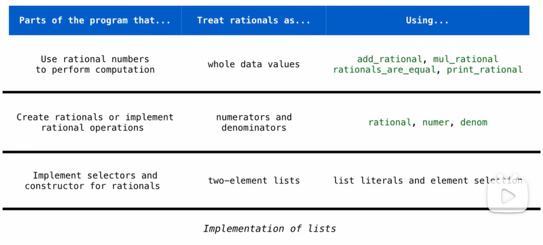

# Data Abstraction

Constructor: rational (n, d) returns a rational number x

Selectors: numer(x) returns the numerator of x

​                  denom(x) returns the denominator of x

```python
def mul_rational(x, y):
    return rational(numer(x) * numer(y). denom(x) * denom(y))

def add_rational(x, y):
    nx, dx = numer(x), denom(x)
    ny, dy = numer(y), denom(y)
    return rational(nx * dy + ny * dx, dx * dy)

def equal_rational(x, y):
    return numer(x) * denom(y) == numer(y) * denom(x)
# rational(n, d), numer(x) and denom(x) implement abstract data type for rational number.

def print_rational(x):
    print(numer(x), "/", denom(x))

from fractions import gcd

# use lists to implement rational number(just one way)
def rational(n, d):
    g = gcd(n, d)
    return [n//g, d//g]

def numer(x):
    return x[0]

def denom(x):
    return x[1]

# another way
def rational(n,d):
    g = gcd(n,d)
    def select(name):
        if name == 'n':
            return n//g
        elif name == 'd':
            return d//g
    return select

def numer(x):
    return x('n')

def denom(x):
    return x('d')

```


## Abstraction Barriers




When writing your code, you should avoid violating abstraction barriers, for the sake of easily modifying your code. Like the exp above, although we use different ways to implement selectors and constructors, the rational operations can always work.

## Dictionaries

Dictionaries are unordered collections of key-value pairs.

```python
>>> {'I': 1, 'V': 5, 'X' : 10}
{'X': 10, 'V': 5, 'I': 1}
# dictionaries don't have an order inherently, they do establish a relationship between keys and values, however, they don't establish a relationship between keys and keys, values and values, so python is free to shuffle them around.
>>> numerals['X']
10
>>> numerals.keys()
dict_keys(['X', 'V', 'I'])
>>> numerals.values()
dict_values([10, 5, 1])
>>> numerals.item()
dict_items([('X', 10), ('V', 5), ('I', 1)])
>>> items = [('X', 10), ('V', 5), ('I', 1)]
>>> dict(items)
{'X': 10, 'V': 5, 'I': 1}
>>> dict(items)['X']
10
>>> 'X' in numerals
True
>>> 'X-ray' in numerals
False
>>> numerals.get('X', 0) # 0 is default value
10
>>> numerals.get('X-ray', 0)
0
>>> {x:x*x for x in range(10)}
{0:0, 1:1, 2:4, 3:9, 4:16, 5:25, 6:36, 7:49, 8:64, 9:81}
>>> squares = {x:x*x for x in range(10)}
>>> squares[7]
49
>>> {1: 2, 1: 3}
{1: 3}
>>> {1: [2, 3]}
{1: [2, 3]}
>>> {[1]: 2}
Traceback (most recent call last):
    File "<stdin>", line 1, in <module>
TyperError: unhashable type: 'list'
```

