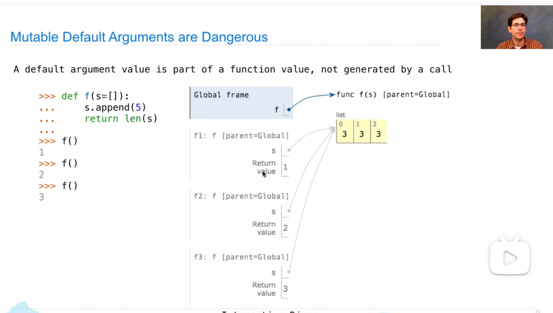
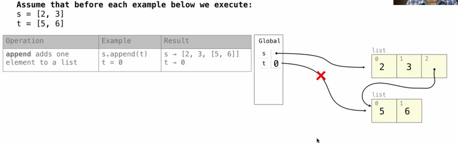

# Mutable Values

## Objects

```python
>>> from datetime import date
>>> date
<class 'datetime.date'>
>>> today = date(2015, 2, 20)
>>> today
datetime.date(2015, 2, 20)
>>> freedom = date(2015, 5, 12)
>>> str(freedom - today)
'81 days, 0:00:00'
>>> today.year
2015
>>> today.month
2
>>> today.strftime('%A %B %d')
'Friday February 20'
```

* Objects represent information
* They consist of data and behavior, bundled together to create abstractions
* Objects can represent things, but also properties, interactions, & processes
* A type of object is called a class; classes are first-class values in Python
* Object-oriented programming:
  * A metaphor for organizing large programs
  * Special syntax that can improve the composition of programs
* In Python, every value is an object
  * All objects have attributes
  * A lot of data manipulation happens through object methods
  * Functions do one thing; objects do many related things

## Strings

```python
>>> s = 'Hello'
>>> s.upper() # methods
'HELLO'
>>> s.lower() # methods
'hello'
>>> s.swapcase() # methods
'hELLO'
>>> s
'Hello'
```


```python
>>> a = 'A'
>>> ord(a)
65
>>> hex(ord(a))
'0x41'
```


```python
>>> from unicodedata import name, lookup
>>> name('A')
'LATIN CAPITAL LETTER A'
>>> lookup(baby)
'👶'
>>> lookup('BABY').encode()
b'\xf0\x9f\x91\xb6'
>>> 'A'.encode()
b'A'
```

## Mutation(used to indicate the change of an object) Operations

```python
>>> suits = ['coin', 'string', 'myriad']
>>> original_suits = suits
>>> suits.pop() # remove the last and returns the value poped
'myriad'
>>> suits.remove('string')
>>> suits
['coin']
>>> suits.append('cup')
>>> suits.extend(['sword', 'club'])
>>> suits
['coin', 'cup', 'sword', 'club']
>>> suits[2] = 'spade'
>>> suits[0:2] = ['heart', 'diamond']
>>> suits
['heart', 'diamond', 'spade', 'club']
>>> original_suits
['heart', 'diamond', 'spade', 'club']
```


```python
>>> numerals = {'I': 1, 'V': 5, 'X': 10}
>>> numerals['X']
10
>>> numerals['X'] = 11
>>> numerals['L'] = 50
>>> numerals.pop('V')
>>> numerals
{'I': 1, 'X': 11, 'L': 50}
>>> numerals.get('V')
# nothing
```


## Tuples(Inmutable Sequences)

```python
>>> (3, 4, 5, 6)
(3, 4, 5, 6)
>>> 3, 4, 5, 6
(3, 4, 5, 6)
>>> ()
()
>>> tuple()
()
>>> tuple(2)
TypeError: 'int' object is not iterable
>>> tuple([2, 4, 5, 6]) # the argument should be a sequence
(3, 4, 5, 6)
>>> (2)
2
>>> 2,
(2,)
>>> (2,)
(2,)
>>> (3, 4) + (5, 6)
(3, 4, 5, 6)
>>> 5 in (3, 4, 5)
True
# Since tuple is inmutable values, it can be used in a dictionary
>>> {(1, 2): 3}
{(1, 2): 3}
>>> {[1, 2]: 3}
TypeError: unhashable type: 'list'
>>> {(1, [2]): 3}
TypeError: unhashable type: 'list'
```


## Identity Operator

**Identity**

<exp0> **is** <exp1>

evaluates to True if both <exp0> and <exp1> evaluate to the same object

**Equality**

<exp0> == <exp1>

evaluates to True if both <exp0> and <exp1> evaluate to equal values

```python
>>> [10] == [10]
Ture
>>> [10] is [10]
False
>>> a = [1]
>>> c = a
>>> c.extend([2])
>>> c is a
>>> True
```



## Lists in Environment Diagrams

**Append:**



**Extend:**


**Addition and Slicing:**


**list():**


**Slice Assignment:**


**Lists Shrink:**


**More Examples:**

