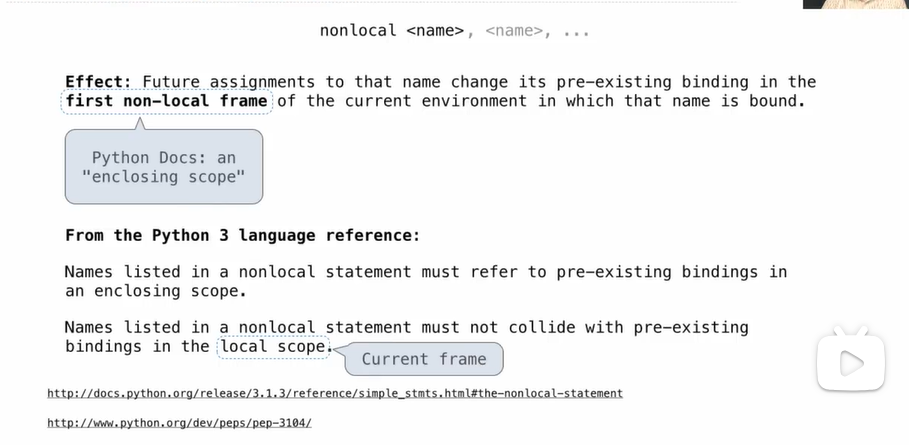
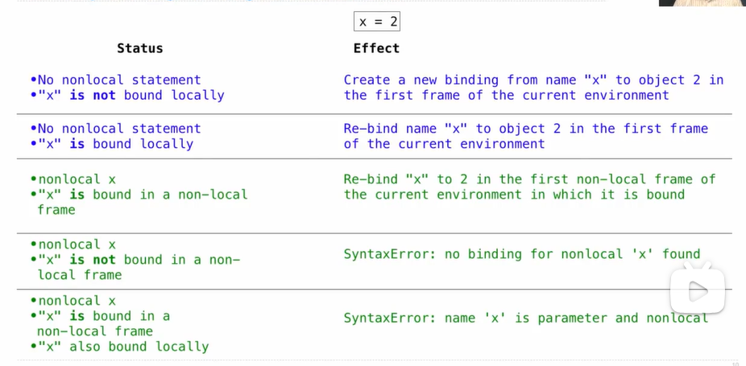

# Mutable Functions

## Bank Example


## How to implement?

**Non-Local Assignment & Persistent Local State**

```python
def make_withdraw(balance):
    """Return a withdraw function with a starting balance."""
    def withdraw(amount):
        nonlocal balance # Declare the name 'balance' nonlocal at the top of the body of the function in which it is re-assigned.
        if amount > balance:
            return 'Insufficient funds'
        balance = balance - amount # Re-bind balance in the first non-local frame in which it was bound previously
        return balance
    return withdraw
```

## The Effect of Nonlocal Statement



## The Many Meanings of Assignment Statements



## Python Particulars

* Python pre-computes which frame contains each name before executing the body of a function.
* Within the body of a function, all instances of a name must refer to the same frame.

```python
def make_withdraw(balance):
    """Return a withdraw function with a starting balance."""
    def withdraw(amount):
        if amount > balance: # Error found here: UnboundLocalError: local variable 'balance' referenced before assignment
            return 'Insufficient funds'
        balance = balance - amount
        return balance
    return withdraw

wd = make_withdraw(20)
wd(5)
```

## Another way of implementation: Mutable Values & Persistent Local State

* Mutable values can be changed without a nonlocal statement.

```python
def make_withdraw(balance):
    b = [balance]
    def withdraw(amount):
        if amount > b[0]:
            return 'Insufficient funds'
        b[0] -= amount
        return b[0]
    return withdraw
withdraw = make_withdraw_list(100)
withdraw(25)
```


## Referential Transparency


*Exp:*

```python
def f(x):
    x = 4
    def g(y):
        def h(z):
            nonlocal x
            x += 1
            return x + y + z
        return h
    return g
a = f(1)
b = a(2)
total = b(3) + b(4) # we can calculate that b(3) is 10 and b(4) is 12. However, we cannot change the exp to total = 10 + b(4), because referencial transparency is lost due to the mutable function.
```

## Exp

```python
# Implement combo, which takes two non-negetive integers a and b. It returns the smallest integer that contains all of the digits of a in order, as well as all the digits of b in order.
def combo(a, b):
    """Return the smallest integer with all of the digits of a and b (in order)
    
    >>> combo(531, 432)
    45321
    >>> combo(531, 4321)
    45321
    >>> combo(1234, 9123)
    91234
    >>> combo(0, 321) # The number 0 has no digits, so 0 is not in the result.
    321
    """
    if a == 0 or b == 0:
        return a + b
    if a % 10 == b % 10:
        return 10 * combo(a//10, b//10) + a % 10
    return min(10 * combo(a//10, b) + a % 10, 10 * combo(a, b//10) + b % 10)
```

