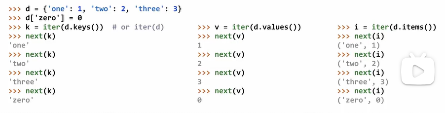

# Iterations

## Iterators


```python
>>> s = [[1, 2], 3, 4, 5]
>>> s
[[1, 2], 3, 4, 5]
>>> next(s)
TypeError: 'list' object is not an iterator
>>> t = iter(s)
>>> next(t)
[1, 2]
>>> next(t)
3
>>> list(t)
[4, 5] # [1, 2] & 3 have been used up
>>> next(t)
StopIteration # it is at the end
```

## Dictionary Iteration

### Views of a Dictionary

An `iterable` value is any value that can be passed to **iter** to produce an iterator

An `iterator` is returned from **iter** and can be passed to **next**; all iterators are mutable

A dictionary, its keys, its values, and its items are all iterable values

- The order of items in a dictionary is the order in which they were added (Python 3.6+)
- Historically, items appeared in an arbitrary order (Python 3.5 and earlier)



```python
>>> d = {'one': 1, 'two': 2}
>>> k = iter(d)
>>> next(k)
'one'
# When you change the shape of the dictionary, you cannot use the iterator created previously. If you just change the value and don't change the shape, you can.
>>> d['zero'] = 0
>>> next(k)
RuntimeError: dictionary changed size during iteration
>>> k = iter(d)
>>> next(k)
'one'
>>> next(k)
'two'
>>> d['zero'] = 5
>>> next(k)
'zero'
```

## For Statement

```python
>>> r = range(3, 6)
>>> list(r)
[3, 4, 5]
>>> for i in r:
... 	print(i)
...
3
4
5
>>> for i in r:
... 	print(i)
...
3
4
5
>>> ri = iter(r)
>>> ri
<range_iterator object at 0x10d247a20>
>>> next(ri)
3
>>> for i in ri:
... 	pirnt(i)
...
4
5
>>> r
range(3, 6)
>>> ri = iter(r)
>>> for i in ri:
... 	print(i)
...
3
4
5
>>> for i in ri:
...		print(i)
... # nothing printed, for the marker have gone to the end
>>>
```

## Built-in Functions For Iteration

Many built-in Python sequence operations return iterators that compute result lazily (the reseult is only computed when it is requested) .

```python
def double(x):
    print('**', x, '=>', 2*x, '**')
    return 2 * x
f = lambda y: y >= 10
```

> map(func, iterable): Iterate over func(x) for x in iterable

```python
>>> bcd = ['b', 'c', 'd']
>>> [x.upper() for x in bcd]
['B', 'C', 'D']
>>> map(lambda x: x.upper(), bcd)
<map object at 0x10237aef0> # a map object is a special kind of iterator
>>> m = map(lambda x: x.upper(), bcd)
>>> next(m)
'B'
>>> next(m)
'C'
>>> next(m)
'D'
>>> m = map(double, [3, 5, 7])
>>> next(m)
** 3 => 6 **
>>> next(m)
** 5 => 10 **
>>> next(m)
** 7 => 14 **
```

> filter(func, iterable): Iterate over x in iterable if func(x)

```python
>>> m = map(double, range(3, 7))
>>> t = filter(f, m)
>>> next(t)
** 3 => 6 **
** 4 => 8 **
** 5 => 10 **
10
>>> next(t)
** 6 => 12 **
12
>>> list(t)
[]
```

> zip(first_iter, second_iter): Iterate over co-indexed(x, y) pairs

```python
>>> d = {'a': 1, 'b': 2}
>>> d
{'b': 2', a': 1}
>>> items = iter(d.items())
>>> next(items)
('b', 2)
>>> next(items)
('a', 1)
>>> items = zip(d.keys(), d.values())
>>> next(items)
('b', 2)
>>> next(items)
('a', 1)
```

> reversed(sequence): Iterate over x in a sequence in reverse order

```python
t = [1, 2, 3, 2, 1]
>>> t
[1, 2, 3, 2, 1]
>>> reversed(t)
<list_reverseiterator object at 0x101b7ad30>
>>> reversed(t) == t
False
>>> list(reversed(t)) == t
True
# you have to compare a list and a list, or you get False
```

**# all built-in functions return iterator, and to view the contents of an iterator, place the resulting elements into a container**

> list(iterable): Create a list containing all x in iterable

```python
>>> list(filter(f, map(double, range(3, 7))))
** 3 => 6 **
** 4 => 8 **
** 5 => 10 **
** 6 => 12 **
[10, 12]
```

> tuple(iterable): Create a tuple containing all x in iterable

> sorted(iterable): Create a sorted list containing x in iterable

## Generator and Generator Functions

```python
>>> def plus_minus(x):
...		yield x
...		yield -x
>>> t = plus_minus(3)
>>> next(t)
3
>>> next(t)
-3
>>> t
<generator object plus_minus...>
```

- A `generator function` is a function that **yield**s values instead of **return**ing them
- A normal function **return**s once; a `generator function` can **yield** multiple times
- A `generator` is an iterator created automatically by calling a `generator function`
- When a `generator function` is called, it returns a `generator` that iterates over its yields

```python
def evens(start, end):
    even = start + start % 2
    while even < end:
        yield even
        even += 2
>>> e = evens(2, 6)
>>> e
<generator object evens at...>
>>> next(e)
2
>>> next(e)
4
>>> next(e)
StopIteration
```

**# When creating a generator by calling a generator function, the body of the function hasn't been executed until next is called. It keeps executing until a yield statement is reached, and execution pauses at that yied but remember all of the evironment of the function execution so that next time next is calle, it can continue where it left off.**

## Generators can Yield from(Python 3.3+) Itrators

- A **yield from** statement yields all values from an iterator or iterable

```python
>>> list(a_then_b([3, 4], [5, 6]))
[3, 4, 5, 6]
# implementation
def a_then_b(a, b):
    for x in a:
        yield x
    for x in b:
        yield x
# or
def a_then_b(a, b):
    yield from a
    yield from b
    
>>> list(countdown(5))
[5, 4, 3, 2, 1]
# implementation
def countdown(k):
    if k > 0:
        yield k
        yield from countdown(k-1)
    else:
        yield 'Blast off'
# or 
def countdown(k):
    if k > 0:
        yield k
        for x in countdown(k-1):
            yield x
"""
# if
def countdown(k):
    if k > 0:
        yield k
        yield countdown(k-1)
>>> t = countdown(3)
>>> next(t)
3
>>> next(t)
<generator object countdown...>
"""
def prefixes(s):
    if s:
        yield from prefixes(s[:-1])
        yield s

def substrings(s):
    if s:
        yield from prefixes(s)
        yield from substrings(s[1:])
```

