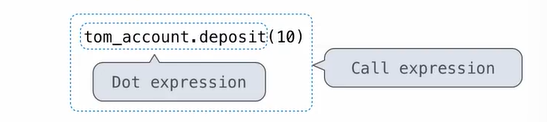

# Objects

## Class & Objects

- A class combines (and abstracts) data and functions
- An object is an instantiation（实例化） of a class
- A class is a definition, while an object is an actual thing that we can act on it


*String is a built-in class, append is a function*

*Int is a built-in class, + is a function*

```python
# Ball class
myball = Ball(10.0, 15.0, 0.0, -5.0)
""" constructor: Ball(x, y, vx, vy)
* allocate memory for a Ball object
* initializes the Ball object with values
* returns address of the Ball object
* similar to a list
"""
# use dot expression to get the data and functionality associated with that object
ball1 = Ball(5.0, 4.0, 3,0, 6.0)
print("the x-coordinate is", ball1.x) # 5.0
ball1.update_position(0.1)
print("the x-coordinate is", ball1.x) # 5.3
```

## Object-Oriented Programming


## Classes

> A class serves as a template for its instances.


## The Class Statement

> **class <name>:**
>
> ​    **<suite>**

The suite is executed when the class statement is executed.

A class statement creates a new class and binds that class to <name> in the first frame of the current environment.

Assignment & def statements in <suite> create attributes of the class (not names in frames)

```python
>>> class Clown:
...		nose = 'big and red'
...		def dance():
...			return 'No thanks'
...
>>> Clown.nose
'big and red'
>>> Clown.dance()
'No thanks'
>>> Clown
<class '__main__.Clown'>
```

## Object Construction


When a class is called:

1. A new instance of the class is created: `balance: 0    holder:'Jim'`
2. The `__init__` method of the class is called with the new object as its first argument (named **self**) , along with any additional arguments provided in the call expression.

```python
class Account:
    def __init__(self, account_holder):
        self.balance = 0
        self.holder = account_holder 
```

**`__init__` is called a constructor, and whenever a class is called, `__init__` is called automatically.**

## Object Identity


## Methods

Methods are defined in the suite of a class statement

```python
class Account:
    """An account has a balance and a holder."""
    def __init__(self, account_holder):
		self.balance = 0
        self.holder = account_holder
        
    def deposit(self, amount):
        self.balance += amount
        return self.balance
    
    def withdraw(self, amount):
        if amount > self.balance:
            return 'Insufficient funds'
        self.balance -= amount
        return self.balance
```

These def statements create function objects as always, but their names are bound as attributes of the class.

## Invoking Methods


## Dot Expression

Objects receive message via dot notation.

Dot notation accesses attributes of the instance or its class.

​					<expression> **.** <name>

The <expression> can be any valid Python expression.

The <name> must be a simple name.

Evaluates to the value of the attribute **looked up** by <name> in the object that is the value of the <expression>.



## Attributes

What's attributes anyway?

**Attributes are just data that stored in an instance or a class.**

### Accessing Attributes

> Using `getattr`, we can look up an attribute using a string
>
> Using `hasattr`, we can check whether an object has an attribute

```python
# bank example
>>> john = Account('John')
>>> john.balance
0
>>> getattr
<built-in function getattr>
>>> getattr(john, 'balance')
0
>>> john.desposit(100)
100
>>> getattr(john, 'balance')
100
>>> hasattr(john, 'balance')
True
>>> hasattr(john, 'lance')
False
```


## Methods and Functions

Python distinguishes between:

- *Functions*
- *Bound Methods*, which couple together a function and the object on which that method will be invoked.

**Object	+	Function	=	Bound Method**

```python
# bank example
>>> type(Account.deposit)
<class 'function'>
>>> type(tom_account.deposit)
<class 'method'>

>>> Account.deposit(tom_account, 1001)
1011
>>> tom_account.deposit(1000)
2011
```

## Looking Up Attributes by Name

> <expression> **.**  <name>

To evaluate a dot expression:

1. Evaluate the <expression> to the left of the dot, which yields the object of the dot expression.
2. <name> is matched against the instance attributes of that object; **if an attribute with that name exists,** its value is returned.
3. If not, <name> is looked up in the class, which yields a class attribute value.
4. That value is returned **unless it is a function,** in which case a bound method is returned instead.

## Class Attributes

Class attributes are "shared" across all instances of a class because they are attributes of the class, not the instance.

```python
class Account:
    
    interest = 0.02 # A class attribute
    
    def __init__(self, account_holder):
        self.balance = 0
        self.holder = account_holder
    
    # Additional methods woule be defined here
    
>>> tom_account = Account('Tom')
>>> jim_account = Account('Jim')
>>> tim_account.interest
0.02
>>> jim_account.interest
0.02
# interest is not part of the instance that was somehow copied from the class, instead it's always kept in the class
```

