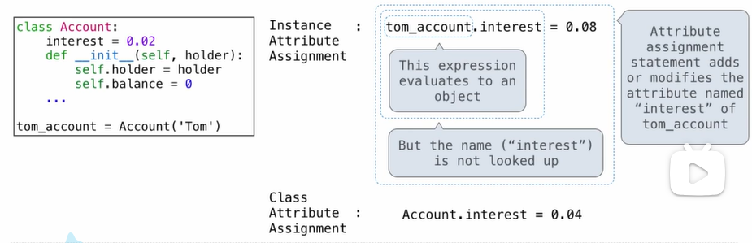
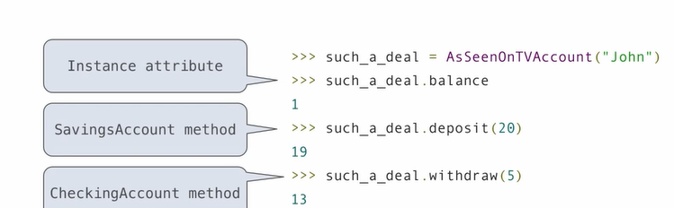
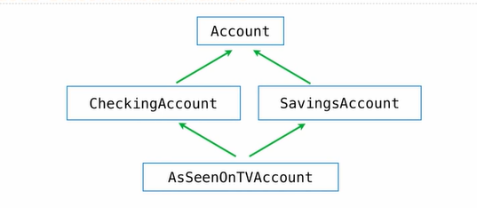

# Inheritance

## Review: Attributes, Functions, and Methods


## Assignment to Attributes

Assignment statements with a dot expression on their left-hand side affect attributes for the object of that dot expression

- If the object is an instance, then assignment sets an instance attribute.
- If the object is a class, then assignment sets a class attribute




##  Inheritance

Inheritance is a method for relating classes together.

A common use: Two similar classes differ in their degree of specialization.

The specialized class may have the same attributes as the general class, along with some special-case behavior.

> **class <name> (<base class>) :**
>
> ​	<suite>

Conceptually, the new *subclass* "shares" attributes with its base class.

The subclass may *override* certain inherited attributes.

Using inheritance, we may implement a subclass by specifying its differences from the base class.

*exp:*


```python
class CheckingAccount(Account):
    """A bank account that chages for withdrawls."""
    withdraw_fee = 1
    interest = 0.01
    def withdraw(self, amount):
        return Account.withdraw(self, amount+self.withdraw_fee)
```

## Looking Up Attributes Names on Classes

**Base class attributes aren't copied into subclass**

To look up a name in a class(it's a recursive process):

1. If it names an attribute in the class, return the attribute value.
2. Otherwise, look up the name in the base class, if there is one.
3. Since the base class is a class, do step 1 & 2 again until the name is found.


## Designing for Inheritance

Don't repeat yourself; use the existing implementations.

Attributes that have been overridden are still accessible via class object.

Look up attributes on instances whenever possible.


## Inheritance and Composition

Object-oriented programming shines when we adopt the metaphor.

Inheritance is best for representing *is-a* relationships.

​	E.g. , a checking account **is a** specific king of account.

​	So, CheckingAccount inherits from Account.

Composition is best for representing *has-a* relationships.

​	E.g. , a bank **has a** collection of bank accounts it manages.

​	So, A bank has a list of accounts as an attribute.

```python
class Bank:
    """A bank *has* accounts.
    
    >>> bank = Bank()
    >>> john = bank.open_account('John', 10)
    >>> jack = bank.open_account('Jack', 5, CheckingAccount)
    >>> john.interest
    0.02
    >>> jack.interest
    0.01
    >>> bank.pay_interest()
    >>> john.balance
    10.2
    >>> bank.too_big_to_fail()
    Ture
    """
    def ___init__(self):
        self.accounts = []
    
    def open_account(self, holder, amount, king=Account):
        account = kind(holder)
        account.deposit(amount)
        self.acounts.append(account)
        return account
    
    def pay_interest(self):
        for a in self.accounts:
            a.deposit(a.balance * a.interest)
    
    def too_big_to_fail(self):
        return len(self.accounts) > 1
```

## Inheritance and Attribute Lookup


## Multiple Inheritance

```python
class SavingsAccount(Account):
    deposit_fee = 2
    def deposit(self, amount):
        return Account.deposit(self, amount-self.deposit_fee)
```


```python
class AsSeenOnTVAccount(CheckingAccount, SavingsAccount):
    def __init__(self, account_holder):
        self.holder = account_holder
        self.balance = 1 # A free dollar!
```





**Be Careful with Multiple Inheritance!**