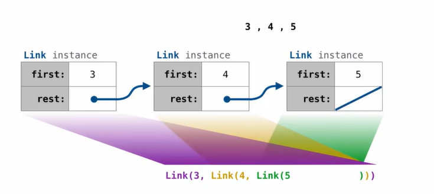
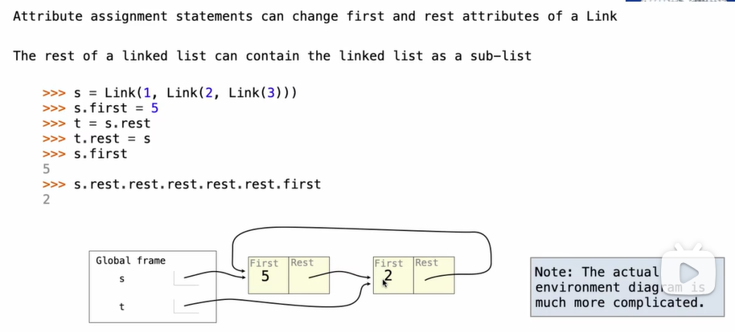

# Composition

## Linked List

### Linked List Structure

A linked list is either empty or a first value and the rest of the linked list.




### Linked List Class

Linked list class: attributes are passed to `__init__`

```python
class Link:
    
    empty = () # some zero-length sequence
    
    def __init__(self, first, rest=empty):
        assert rest is Link.empty or isinstance(rest, Link)
        self.first = first
        self.rest = rest
   # help(isinstance): Return whether an object is an instnce of a class or of a subclass thereof
	
    def __repr__(self):
        if self.rest:
            rest_repr = ', ' + repr(self.rest)
        else:
            rest_repr = ''
        return 'Link(' + repr(self.first) + rest_repr + ')'
    
    def __str__(self):
        string = '<'
        while self.rest is not Link.empty:
            string += str(self.first) + ' '
            self = self.rest
        return string + str(self.first) + '>'

def square(x):
    return x * x

def odd(x):
    return x % 2 == 1

def range_link(start, end):
    """Return a Link containing consecutive integers from start to end.
	
	>>> range_link(3, 6)
	Link(3, Link(4, Link(5)))
	"""
    if start >= end:
        return Link.empty
    return Link(start, range_link(start+1, end))

def map_link(f, s):
    """Return a Link that contains f(x) for each x in Link s.

	>>> map_link(square, range_link(3, 6))
	Link(9, Link(16, Link(25)))
	"""
    if s is Link.empty:
        return s
    else:
        return Link(f(s.first), map_link(f, s.rest))

def filter_link(f, s):
    """Return a Link that contains only elements x of Link s for which f(x) is a true value.
    
    >>> filter_link(odd, range_link(3, 6))
    Link(3, Link(5))
    """
    if s is Link.empty:
        return s
    filtered_rest = filter_link(f, s.rest)
    if f(s.first):
        return Link(s.first, filtered_rest)
    else:
        return filtered_rest
```

## Linked List Processing


## Linked Lists Mutation

### Linked List Can Change



## Linked List Mutation Example

### Adding to an Ordered List

```python
# my solution:
def add(s, v):
    """Add v to an ordered list s with no repeats, returning modified s.
    (Note: If v is already in s, don't modify s, but still return it.)
    
    >>> s = Link(1, Link(3, Link(5)))
    >>> add(s, 2)
    Link(1, Link(2, Link(3, Link(5))))
    >>> add(s, 2)
    Link(1, Link(2, Link(3, Link(5))))
    """
    if s is Link.empty:
        return Link(v, s)
    if s.first == v:
        return s
    elif s.first > v:
        return Link(v, s)
    else:
        return Link(s.first, add(s.rest, v))   
# john's solution:
def add(s, v):
    """Add v to s, returning modified s.
    
	>>> s = Link(1, Link(3, Link(5)))
	add(s, 0)
	Link(0, Link(1, Link(3, Link(5))))
	add(s, 3)
	Link(0, Link(1, Link(3, Link(5))))
	add(s, 4)
	Link(0, Link(1, Link(3, Link(4,Link(5)))))
	add(s, 6)
	Link(0, Link(1, Link(3, Link(4,Link(5, Link(6))))))
	"""
    assert s is not List.empty
    if s.first > v:
        s.first, s.rest = v, Link(s.first, s.rest)
	elif s.first < v and empty(s.rest):
        s.rest = Link(v)
    elif s.first < v:
        add(s.rest, v)
    return s # when s.first == v or ...
```

## Tree Class

Data Abstraction vs Python's Object System

It' s easier for the object system to build a tree(no longer have to think of a way of putting label and branches together) and access the label and branches. However, the usage is just the same, for instance, a  fib_tree.

```python
class Tree:
    def __init__(self, label, branches=[]):
        self.label = label
        for branch in branches:
            assert isinstance(branch, Tree)
        self.branches = list(branches)
    
    def __repr__(self):
        if self.branches:
            branch_str = ', ' + repr(self.branches)
        else:
            branch_str = ''
        return 'Tree({0}{1})'.format(repr(self.label), branch_str)
    
    def __str__(self):
        return '\n'.join(self.indented())
    
    def indented(self):
        lines = []
        for b in self.branches:
            for line in b.indented():
                lines.append('  ' + line)
        return [str(self.label)] + lines
    
    def is_leaf(self):
        return not self.branches

def fib_tree(n):
    if n == 0 or n == 1:
        return Tree(n)
    else:
        left = fib_tree(n-2)
        right = fib_tree(n-1)
        fib_n = left.label + right.label
        return Tree(fib_n, [left, right])
    
def leaves(t):
    """Return a list of leaf labels in Tree."""
    if t.is_leaf():
        return [t.label]
    else:
        all_leaves = []
        for b in t.branches:
            all_leaves.extend(leaves(b))
        return all_leaves
    
def height(t):
    """Return the number of transitions in the longest path in T."""
    if t.is_leaf():
        return 0
    else:
        return 1 + max([height(b) for b in t.branches])
```


## Tree Mutation

### Pruning Trees

Removing subtrees from a tree is called *pruning*

Prune branches before recursive processing


```python
def prune(t, n):
    """Prune all sub-trees whose label is n."""
    t.branches = [b for b in t.branches if b.label != n]
    for b in t.branches:
        prune(b, n)
```

