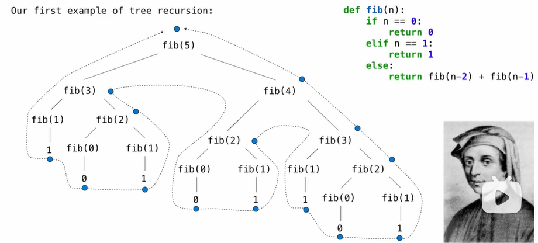
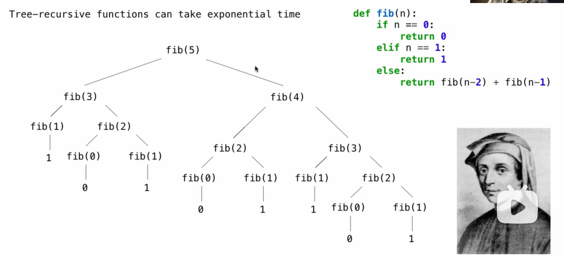
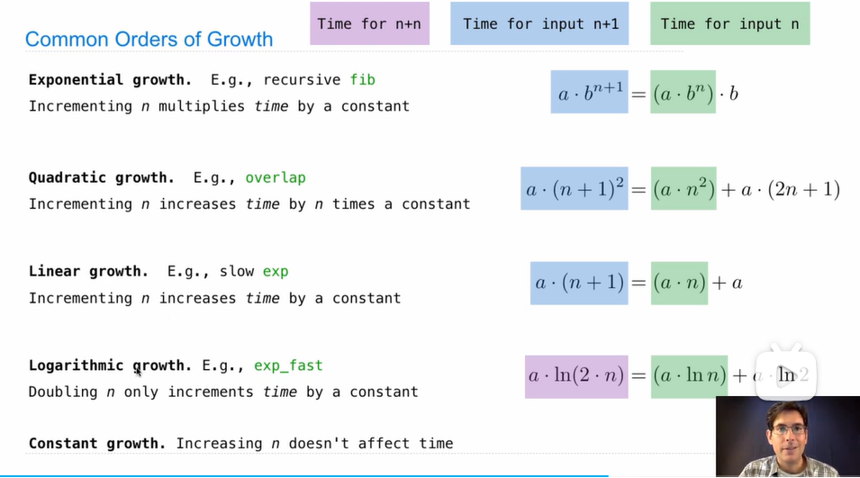
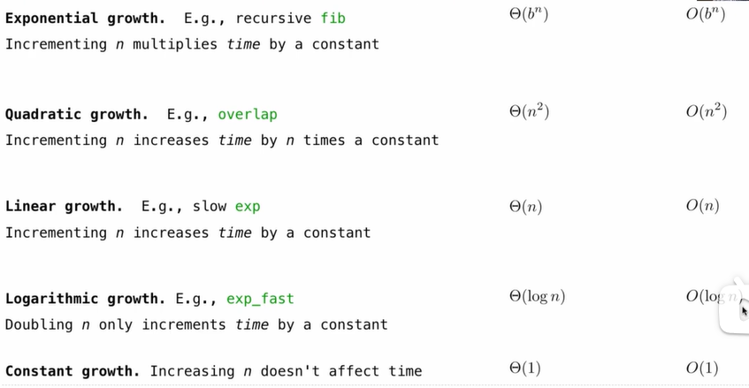
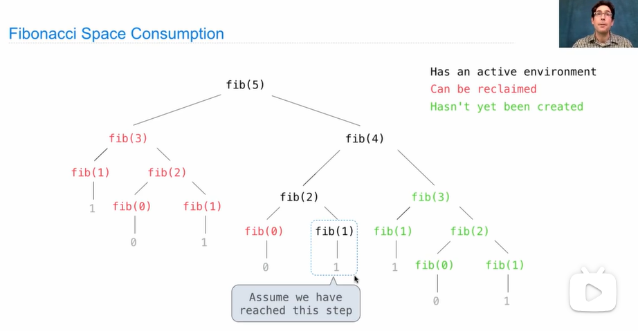

# Efficiency

## Measuring efficiency

fib example:



```python
def fib(n):
    if n == 0 or n == 1:
        return n
    else:
        return fib(n-2) + fib(n-1)
    
def count(f):
    def counted(n):
        counted.call_count += 1
        return f(n)
    counted.call_count = 0
    return count

>>> fib = count(fib)
>>> fib(5)
15
```


## Memoization

**Idea:** Remember the results that have been computed before


```python
def memo(f):
    cache = {} # Keys are arguments that map to return values
    def memoized(n):
        if n not in cache:
            cache[n] = f(n)
        return f(n)
    return memoized # Same behavior as f, if f is a pure function

>>> fib = count(fib)
>>> counted_fib = fib
>>> fib = memo(fib)
>>> fib = count(fib)
>>> fib(30)
832040
>>> fib.call_count
59
>>> counted_fib.call_count
31
```

Pure function:

1. Same inputs with Same outputs.
2. The outputs of the function has nothing to do with the indicative information(except the inputs) or I/O devices.
3. The function cannot have an impact, like changing the environments.

## Exponentiation

**Goal:** one more multiplication lets us double the problem size


### Linear time:

- Doubling the input **doubles** the time
- 1024x the input takes 1024x as much time

### Logarithmic time:

- Doubling the input **increases** the time by a constant C
- 1024x the input increases the time by only 10 times C

## Orders of Growth

### Quadratic Time

Functions that process all pairs of values in a sequence of length n take quadratic time


### Exponential Time



### Common Order of Growth



## Order of Growth Notation

The Big Theta and Big O Notation:

The Big Theta is used for the lower bound execution time, while the Big O is used for the upper bound.



## Space

### The consumption of Space

Which environment frames do we need to keep during evaluate?

At any moment there is a set of active environments

Values and frames in active environments consume memory

Memory that is used for other values and frames can be recycled

**Active environments:**

- Environments for any function calls currently being evaluated
- Parent environments of functions named in active environments

```python
def count_frames(f):
    def counted(n):
        counted.open_count += 1
        if counted.open_count > count.max_count:
            counted.max_count = counted.open_count
        result = f(n)
        counted.open_count -= 1
        return result
    counted.open_count = 0
    counted.max_count = 0
    return counted

def fib(n):
    if n == 0 or n == 1:
        return n
    else:
        return fib(n-2) + fib(n-1)
    
>>> fib = count_frames(fib)
>>> fib(20)
6765
>>> fib.open_count
0
>>> fib.max_count
20
```



