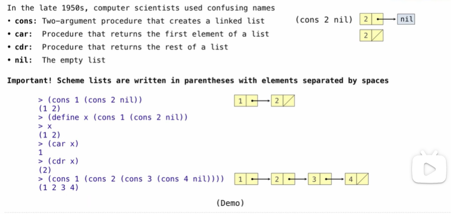
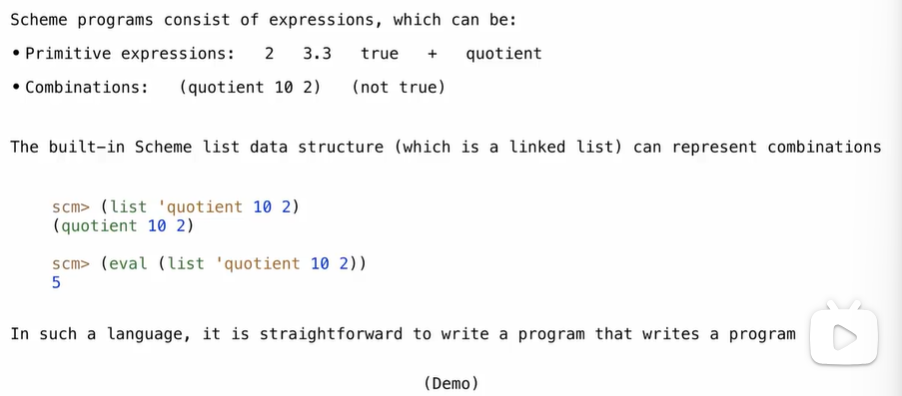
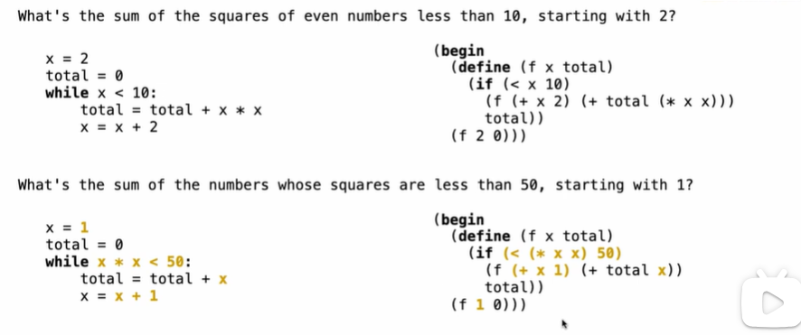

# Scheme

## Scheme is a Dialect of Lisp

## Scheme Fundamentals


```scheme
scm> 2
2
scm> (+ 1 2 3 4)
10
scm> (+)
0
scm> (*)
1
scm> (* 1 2 3 4)
24
scm> (number? 3)
#t
scm> (number? +)
#f
scm> (integer? )
scm> (zero? )
```

## Special Forms


```scheme
(define (square x) (* x x))

(define (average x y)
  (/ (+ x y) 2))

(define (sqrt x)
  (define (update guess)
    (if (= (square guess) x)
        guess
        (update (average guess (/ x guess)))))
  (update 1))

```

## Lambda Expressions


```scheme
(define (line) (fd 50))
(define (twice fn) (fn) (fn))
(define (repeat k fn)
  (fn)
  (if (> k 1) (repeat (- k 1) fn)))
(define (tri fn)
  (repeat 3 (lambda () (fn) (lt 120))))
(define (sier d k)
  (tri (labmda () (if (= d 1) (fd k) (leg d k)))))
(define (leg d k)
  (sier (- d 1) (/ k 2))
  (penup) (fd k) (pendown))
```

## Cond & Begin


while using cond, the 'else' can be omitted, and if you want to use it ,you can put a single one at last

## Let Expression


## Scheme Lists -- Linked Lists



```scheme
> (define s (cons 1 (cons 2 nil)))
> s
(1 2)
> (cons (cons 4 (cons 3 nil)) s)
((4 3) 1 2)
> (cons s (cons s nil))
((1 2) (1 2))
> (list? s)
#t
> (list? nil)
#t
> (null? nil)
#t
> (null? s)
#f
> (list 1 2 3 4)
(1 2 3 4)
```

## Symbolic Programming


## A Scheme Expression is a Scheme List



```scheme
(define (fact n)
  (if (= n 1) 1 (* n (fact (- n 1)))))
(define (fact-exp n)
  (if (= n 1) 1 (list '* n (fact-exp (- n 1)))))
(define (fib n)
  (if (<= n 1) n (+ (fib (- n 1)) (fib (- n 2)))))
(define (fib-exp n)
  (if (<= n 1) n (list '+ (fib-exp (- n 1)) (fib-exp (- n 2)))))
```

## Quasiquotation


## Example: While Statements



```scheme
(define (sum-while initial-x condition add-to-initial update-x)
  (begin
   (define (f x total)
     (if ,condition
         (f ,update-x (+ total ,add-to-total))
         total))
   (f ,initial-x 0)))
```

