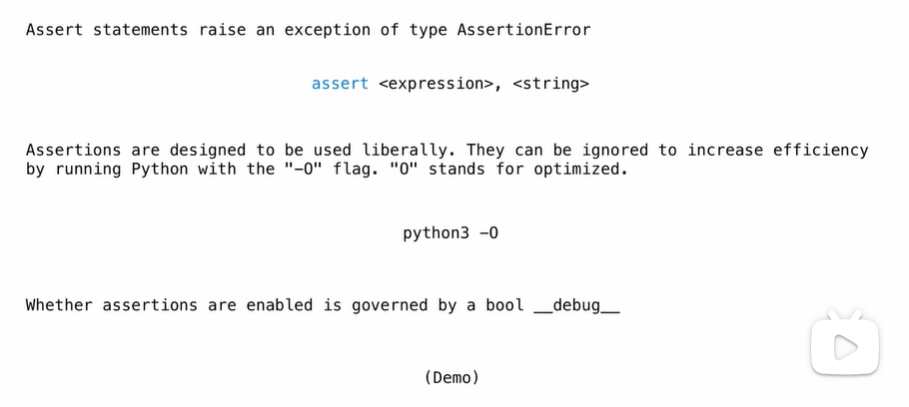

# Exception

## Exceptions

Python raises an exception whenever an error occurs.

Exceptions can be handled by the program, preventing the interpreter from halting.

Unhandled exceptions will cause Python to halt execution and print a *stack* trace.

**Mastering exceptions:**

Exceptions are objects! They have classes with constructors.

They enable *non-local* continuations of control:

​	If f calls g and g calls h, exceptions can shift control from h to f without waiting for g to return.

## Raising an exception

### Assert Statements



```python
$ python3
>>> assert False, 'Error'
AssertionError: Error
$ python3 -O
>>> __debug__
False
>>> assert False, 'Error'
>>> 
```

### Raise Statements


```python
>>> raise TypeError('Bad argument')
TypeError: Bad argument
```

## Try Statement


```python
>>> try:
    	x = 1/0 # here will occur a ZeroDivisionError, and x is bound to none because of the error
    except ZeroDivisionError as e:
        print('handling a', type(e))
        x = 0 # make sure of x is bound to something after executing the try and except
```

**Multiple try statements: ** Control jumps to the except suite fo the most recent try statement that handles that type of exception

``` python
def invert(x):
    y = 1/x
    print('Never printed if x is 0')
    return y

def invert_sate(x):
    try:
        return invert(x)
    except ZeroDivisionError as e:
        print('hendled', e)
        return 0
```

## Reducing a Sequence to a Value


```python
from operator import add, mul, turediv

def divide_all(n, ds):
    try:
        return reduce(turediv, ds, n)
    except ZeroDivisionError:
        return float('inf')
    
def reduce(f, s, initial):
    for x in s:
        initial = f(initial, x)
   	return initial

def reduce(f, s, initial):
    if not s:
        return initial
    else:
        first, rest = s[0], s[1:]
        return (f, rest, f(initial, first))
```

