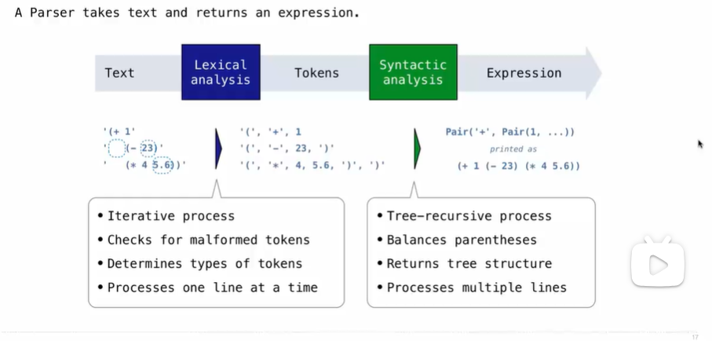

# Calculator

## Programming Languages

## Metalinguistic(元语言) Abstraction

## Parsing(对句子作语法分析)

lexical：词汇的

## Recursive Syntactic(句法) Analysis

A predictive recursive descent parser inspects only *k* tokens to decide how to proceed, for some fixed *k*.

## Calculator

### The Pair Class

### Calculator Syntax

### Calculator Semantics(语义学)

### The Eval Function

### Applying Built-in Operators

### Read-Eval-Print Loop

### Raising Exceptions

