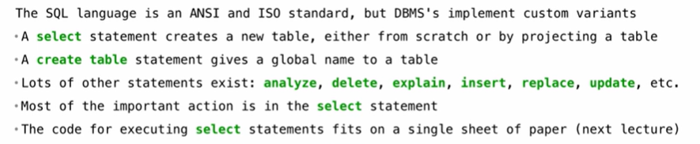
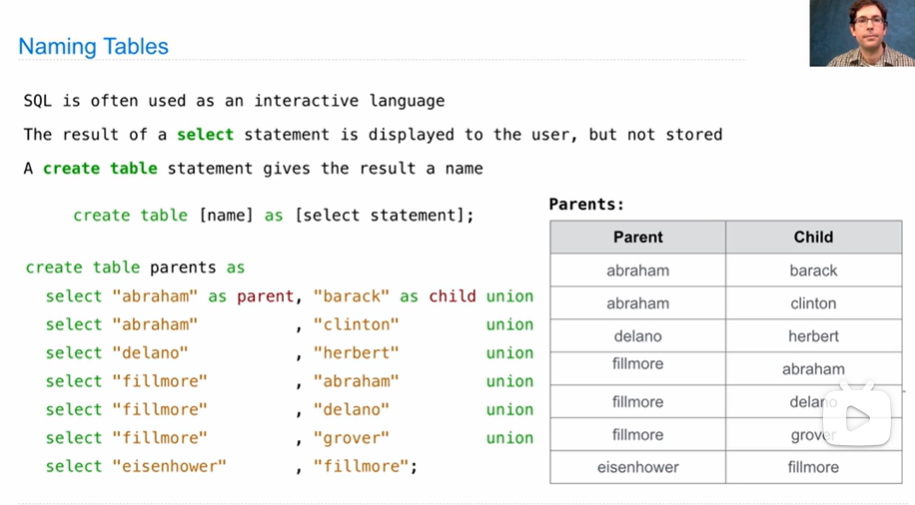

# Declaring Programming

## Database Management Systems

A table is a collection of records, which are rows that have a value for each column.

The Structured Query Language(SQL) is really popular.

SQL is a <u>declarative language</u>

> declarative language


In declarative language, it's up to the interpreter to choose how to get the desired result, so an import thing for the interpreter is how to do the work the most efficiently.

```sql
create table cities as
	select 38 as latitude, 122 as longtitude, "Berkeley" as name;
```


when you union a table, the order is not guaranteed.

## SQL




*Note: to use union, u do need tables that have the same number of columns and same type of data in each column, but don't need to have the same name of the column, for ONLY the first selected table's name will be used.*




