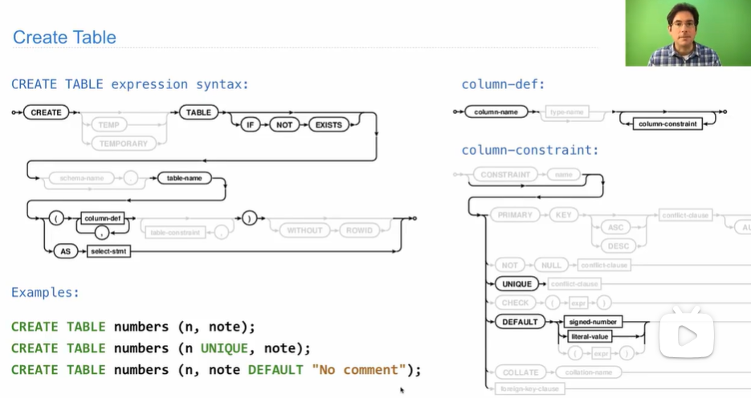
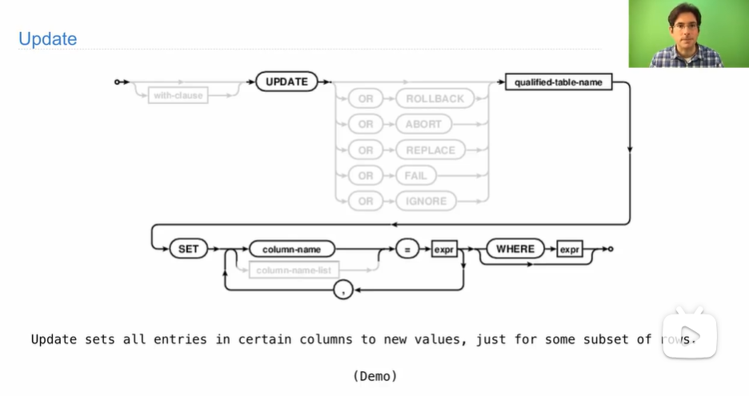

# Database

## Create Table and Drop Table




## Modifying the table

**Insert**


**Update**




Note: not equivalent to drop a table; if you delete all rows in a table, the table still exists.

## Python and SQL

```python
import sqlite3

db = sqlite3.connection("n.db")
db.execute("CREATE TABLE nums AS SELECT 2 UNION SELECT 3;")
db.execute("INSERT INTO nums VALUE (?), (?), (?);", range(4, 7))
print(db.execute("SELECT * FROM nums;").fetchall())
# db.execute("SELECT * FROM nums;") returns a cursor object
db.commit()
```

## SQL Injection Attack


## Database Connections